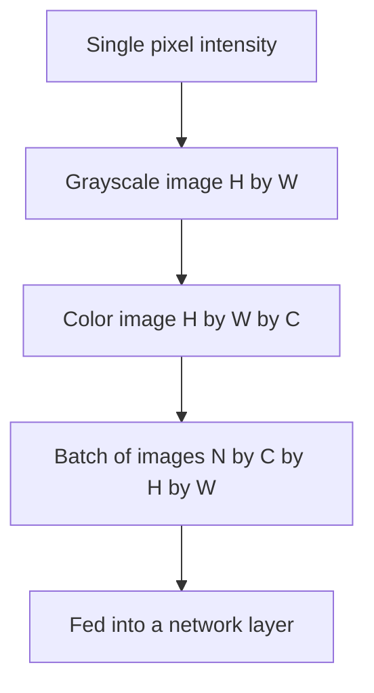

# Lecture 1 — An image is a grid of numbers

A photograph is a picture to you and a **tensor of numbers** to a computer. That reframe is the whole foundation of computer vision: everything a vision system does is arithmetic on a grid of intensities. Get fluent here and the rest of the course reads cleanly.

## Pixels, resolution, and value range

A grayscale image is a 2-D array of shape `(H, W)` — height rows, width columns. Each entry is a **pixel**, an intensity. In the most common encoding each pixel is an unsigned 8-bit integer in `[0, 255]`: `0` is black, `255` is white. Many libraries also use `float32` in `[0, 1]`. Confusing the two ranges is the single most common beginner bug — a `float` image displayed as if it were `uint8` looks all black.

```python
import numpy as np
from PIL import Image
img = np.asarray(Image.open("cat.jpg").convert("L"))  # L = grayscale
print(img.shape, img.dtype, img.min(), img.max())      # (H, W) uint8 0 255
```

## Color adds a channel axis

A color image is 3-D: `(H, W, C)` where `C = 3` for the red, green, and blue **channels**. Stack three intensity grids and you have color. A pixel is now a length-3 vector `[R, G, B]`. A batch of images for a network is 4-D: `(N, C, H, W)` in PyTorch convention (channels *before* spatial dims — the opposite of Pillow/OpenCV's `(H, W, C)`). Half of all vision bugs are a channel axis in the wrong place; print shapes constantly.


*An image's shape grows from one pixel to a full training batch.*

## Channel order gotchas

- **Pillow** gives you RGB. **OpenCV** gives you **BGR** — its historical quirk. Load a Pillow-RGB image, hand it to OpenCV code expecting BGR, and your reds and blues swap.
- **PyTorch / torchvision** want `(C, H, W)`, float, usually normalized. Pillow gives `(H, W, C)`, uint8. `torchvision.transforms` bridges the two.

## Resolution and aspect ratio

More pixels means more detail and more compute. Networks want a fixed input size, so you will **resize** constantly — and resizing changes aspect ratio unless you letterbox or crop. Downsizing throws away information you can never recover; keep the original around.

## Why start here

Every operation for the next twelve weeks — filtering, convolution, feature maps, attention over patches — is arithmetic on this grid. If you are hazy on shape, dtype, channel order, and value range, every later bug hides here. So: load images, print their shapes, look at their histograms, and know your numbers.

**Takeaway:** an image is a grid of numbers — `(H, W)` for gray, `(H, W, 3)` for color, `(N, C, H, W)` for a PyTorch batch. Know your dtype (`uint8` 0–255 vs `float` 0–1) and your channel order (RGB vs BGR vs CHW). Print shapes; look at pixels.
