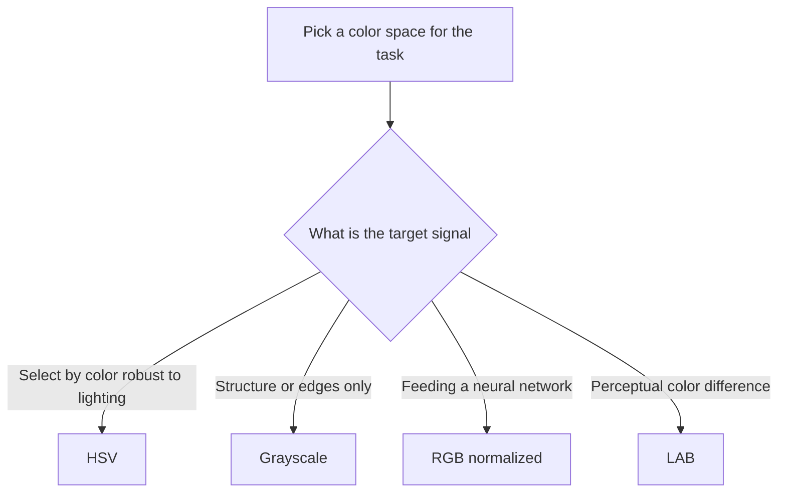

# Lecture 2 — Color spaces and channels

Color feels obvious until you have to compute with it. RGB is only one way to encode color, and it is often the *wrong* one for a given task. Knowing a few color spaces — and when to switch — is a quiet superpower in classical vision.

## RGB: additive light

RGB models color as amounts of **red, green, and blue light** added together. It matches how screens emit and how sensors capture, which is why it is the default. But RGB mixes *color* and *brightness* together in all three channels: a red object in shadow and the same red in sunlight have very different RGB triples, even though it is "the same color." That makes RGB awkward for tasks like "find everything red regardless of lighting."

## Grayscale: throw away color, keep structure

Many classical algorithms — edges, corners, most feature detectors — work on a single intensity channel. Converting RGB to grayscale is a weighted sum that respects human perception (we see green as brightest):

```
gray = 0.299 R + 0.587 G + 0.114 B
```

Grayscale is `(H, W)` — one third the data, and often all the *structure* an algorithm needs. Reach for it whenever color is not the signal.

## HSV: separate color from brightness

**HSV** (hue, saturation, value) re-parameterizes color into: **hue** (which color, an angle 0–360°), **saturation** (how vivid), and **value** (how bright). The win: a single object's *hue* stays roughly constant across lighting changes, while brightness moves into `V`. So "select all the orange pixels" is a clean band in `H`, but a messy blob in RGB.

```python
import cv2
hsv = cv2.cvtColor(bgr, cv2.COLOR_BGR2HSV)
mask = cv2.inRange(hsv, (5, 100, 100), (25, 255, 255))  # an orange band in hue
```

## Other spaces you'll meet

- **LAB** — designed so equal numerical distance ≈ equal *perceived* color difference. Useful for perceptual comparisons.
- **YCbCr** — separates luma (brightness) from chroma; how JPEG and video compress, because the eye cares more about brightness detail.

## The practical rule

Pick the space where your signal is *simplest to describe*. Color-based selection → HSV. Structure/edges → grayscale. Feeding a neural net → usually RGB, normalized, because the network learns whatever mixing it needs. The skill is not memorizing formulas but asking "in which space is my target a simple region?"


*Choosing a color space starts with asking what the target signal actually is.*

**Takeaway:** RGB is not the only color space, and often not the best one. Grayscale keeps structure and drops color; HSV separates hue from brightness so color selection survives lighting changes. Choose the space where your target is simplest, then compute there.
