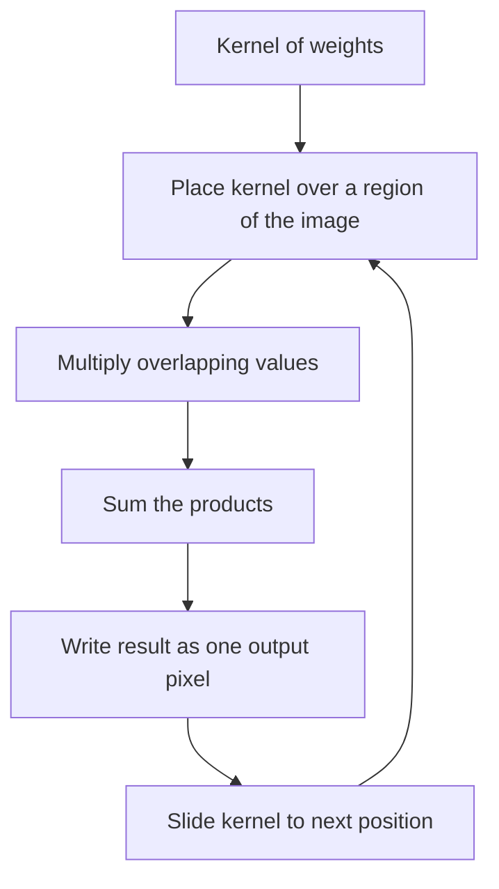

# Lecture 3 — Convolution: the one operation

Convolution is the operation that runs from the oldest image filters to the deepest CNN. Learn it once, by hand, and Week 3's convolutional networks are demystified before you even open torchvision.

## Sliding a kernel over an image

A **kernel** (or filter) is a small grid of numbers — say 3×3. Convolution slides that kernel over every position in the image, and at each position computes a **weighted sum**: multiply the kernel entries by the overlapping pixels and add them up. That single number becomes the output pixel. The kernel's *values* decide what the filter does.


*Convolution repeats multiply, sum, and write for every position the kernel slides to.*

```python
def convolve2d(img, kernel):
    kh, kw = kernel.shape
    pad_h, pad_w = kh // 2, kw // 2
    padded = np.pad(img, ((pad_h, pad_h), (pad_w, pad_w)), mode="edge")
    out = np.zeros_like(img, dtype=float)
    for i in range(img.shape[0]):
        for j in range(img.shape[1]):
            region = padded[i:i+kh, j:j+kw]
            out[i, j] = (region * kernel).sum()
    return out
```

That triple loop is slow but *correct* — it is exactly what a convolution layer computes, just without the optimized C underneath.

## What different kernels do

- **Box blur** — a kernel of all `1/9` (for 3×3) averages each neighborhood, smoothing noise and detail alike.
- **Gaussian blur** — a bell-shaped kernel that weights the center more; smoother, fewer artifacts. The standard denoiser.
- **Sharpen** — `[[0,-1,0],[-1,5,-1],[0,-1,0]]` boosts the center against its neighbors, amplifying local contrast.
- **Sobel (gradient)** — `[[-1,0,1],[-2,0,2],[-1,0,1]]` responds to horizontal intensity change: an **edge detector**, the seed of Week 2.

The magic is that *one* operation, with different weights, does blurring, sharpening, and edge finding. A CNN simply *learns* the weights instead of you choosing them.

## Padding, stride, and output size

- **Padding** adds a border (zeros or edge-replicated) so the output stays the same size and border pixels aren't lost.
- **Stride** is how far the kernel jumps each step; stride 2 halves the output resolution — a cheap downsample.
- Output size for a `k×k` kernel, padding `p`, stride `s` on input `n`: `floor((n + 2p − k)/s) + 1`. You will use this formula constantly when designing networks.

## Convolution vs. correlation

Strictly, mathematical convolution *flips* the kernel before sliding; what most libraries (and every CNN) actually compute is **cross-correlation**, no flip. For symmetric kernels it makes no difference, and for learned kernels the network just learns the flipped version — so everyone says "convolution" and means correlation. Know the distinction so a textbook's flip never confuses you.

**Takeaway:** convolution slides a small kernel over the image and writes a weighted sum at each position. The kernel's values decide the effect — blur, sharpen, or detect edges — and output size follows `floor((n+2p−k)/s)+1`. CNNs are this same operation with *learned* kernels. Build it by hand once and never fear it again.
