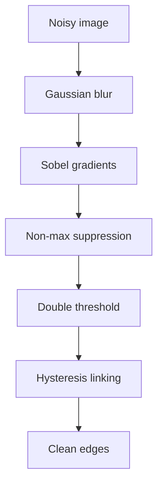

# Lecture 1 — Edges and the Canny pipeline

An **edge** is a place where image intensity changes sharply — the boundary of an object, a shadow, a texture. Edges are the most information-dense pixels in an image: throw away everything but the edges and a human can still recognize the scene. Detecting them well is the foundation of classical vision.

## Edges are gradients

Last week's Sobel filter already found intensity change. The **gradient** at a pixel has a magnitude (how sharp the change) and a direction (which way intensity increases). Compute `gx` and `gy` with Sobel, then:

```
magnitude = sqrt(gx² + gy²)
direction = atan2(gy, gx)
```

Thresholding the magnitude gives a crude edge map — but it is thick, noisy, and threshold-sensitive. Canny fixes all three.

## The Canny pipeline, stage by stage

**John Canny's** 1986 detector is still the default, because it is principled. Five stages:

1. **Blur** with a Gaussian to suppress noise — otherwise every speckle becomes a fake edge.
2. **Gradients** with Sobel: magnitude and direction at each pixel.
3. **Non-maximum suppression** — thin the thick edges: keep a pixel only if it is a local maximum *along the gradient direction*. This turns fat ridges into one-pixel-wide lines. (This is a cousin of the non-max suppression you will use for object detection in Week 6 — same idea, different domain.)
4. **Double threshold** — classify gradient pixels as *strong* (above a high threshold), *weak* (between), or *suppressed* (below a low threshold).
5. **Hysteresis** — keep weak edges *only if* they connect to a strong edge. This links real contours while dropping isolated noise.


*The five Canny stages turning a noisy image into thin connected edges.*

```python
import cv2
edges = cv2.Canny(gray, threshold1=100, threshold2=200)
```

## Why each stage exists

Every stage answers a failure of the naive threshold: blur kills noise, NMS thins, and hysteresis is the clever part — it says "a faint edge that continues a strong one is probably real, but a faint edge alone is probably noise." Tuning the two thresholds is the main craft; a common heuristic sets the high threshold from the image's median gradient.

## Where edges are used

Edges feed contour detection, shape analysis, document scanning (find the paper's border), lane detection, and as a preprocessing step for classical recognition. They are cheap, need no training, and are interpretable — you can *see* exactly why a pixel was called an edge.

**Takeaway:** an edge is a sharp intensity gradient. Canny turns raw gradients into clean, connected, one-pixel-wide contours through blur → gradient → non-max suppression → double threshold → hysteresis. Each stage fixes a specific failure of naive thresholding. It is still the default edge detector for good reason.
