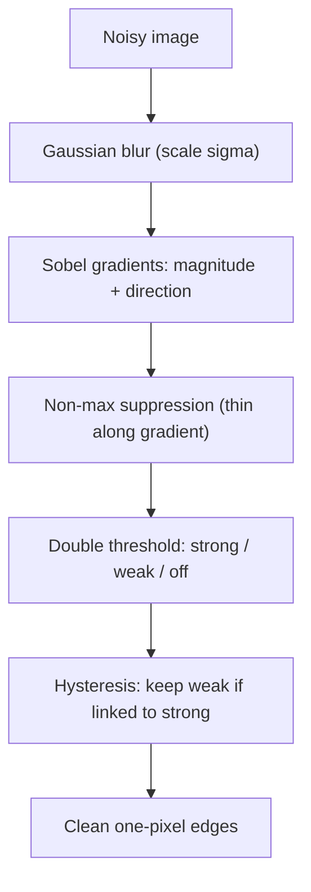

# Lecture 1 — Edges and the Canny pipeline as optimal detection

An **edge** is a place where image intensity changes sharply — the boundary of an object, a
shadow, a material change, a texture. Edges are the most information-dense pixels in an image: throw
away everything but the edges and a human can still recognize the scene. Detecting them *well* is the
foundation of classical vision, and "well" turns out to have a precise, provable meaning.

## Edges are gradients — but thresholding gradients is not enough

Week 1's Sobel filter estimates the image gradient `∇I = (I_x, I_y)`. Its magnitude
`|∇I| = sqrt(I_x^2 + I_y^2)` measures how sharp the change is, and its direction `θ = atan2(I_y, I_x)`
points across the edge (up the intensity slope). Thresholding `|∇I| > τ` gives a crude edge map — but it
is **thick** (a step edge produces a fat ridge of high gradient), **noisy** (every sensor speckle spikes
the gradient), and **threshold-brittle** (one τ over-detects in dark regions and under-detects in bright
ones). Canny's detector fixes all three, and it does so by *deriving* the detector from stated goals
rather than patching a threshold.

## Canny's three optimality criteria

John Canny's 1986 paper ("A Computational Approach to Edge Detection," *IEEE TPAMI* 8(6)) posed edge
detection as an optimization problem for a 1-D step edge in Gaussian noise, and asked for the linear
filter `f` maximizing three criteria simultaneously:

1. **Good detection** — maximize the signal-to-noise ratio so real edges are found and noise is rarely
   mistaken for an edge. Formally, maximize the ratio of the filter's response at the true edge to the
   RMS response to noise.
2. **Good localization** — the detected edge should sit as close as possible to the true edge center.
   Canny measured this as the reciprocal of the standard deviation of the zero-crossing position.
3. **Single response** — one edge should produce exactly one detected maximum; the filter must not
   ring and report the same edge several times.

Criteria 1 and 2 are in tension (a wide filter averages out noise but blurs the location); Canny showed
the optimal `f` is well approximated by the **first derivative of a Gaussian**, and the smoothing scale
σ trades detection against localization. This is *why* Canny begins with Gaussian smoothing and then
differentiates: `d/dx (G_σ * I) = (dG_σ/dx) * I`. The recipe is a theorem, not a habit.

## The pipeline, stage by stage

The practical detector realizes those criteria on a 2-D discrete grid in five stages:

1. **Gaussian blur** at scale σ — suppress noise so speckles do not become edges. σ sets the
   detection/localization trade-off from the theory above: larger σ = more noise immunity, worse
   localization and lost fine detail.
2. **Gradients** with Sobel (or derivative-of-Gaussian directly): magnitude and orientation per pixel.
3. **Non-maximum suppression (NMS)** — the single-response criterion made discrete. Keep a pixel only
   if its gradient magnitude is a local maximum *along the gradient direction* (compare to the two
   neighbours interpolated across the edge). This thins fat ridges to one-pixel-wide lines. (This is a
   cousin of the box NMS you will use for object detection in Week 6 — same "keep only the local peak"
   idea, different domain.)
4. **Double threshold** — classify surviving pixels as *strong* (magnitude ≥ high threshold),
   *weak* (between low and high), or *suppressed* (below low).
5. **Hysteresis linking** — keep a weak edge pixel *only if* it is connected (via an 8-neighbour path
   of edge pixels) to a strong edge. This links genuine faint contours while dropping isolated noise.


*The five Canny stages turning a noisy image into thin, connected edges — each stage discretizes one of
Canny's optimality criteria.*

```python
import cv2, numpy as np
blurred = cv2.GaussianBlur(gray, (5, 5), 1.4)
edges = cv2.Canny(blurred, threshold1=100, threshold2=200)  # low, high
```

## Why hysteresis is the clever part

Hysteresis is the discrete answer to "a faint edge continuing a strong one is probably real, but a
faint edge standing alone is probably noise." A single threshold forces an impossible choice: set it
low and admit noise, set it high and fragment real contours into dashes. The double threshold plus
connectivity keeps the sensitivity of a low threshold *only where* there is corroborating strong
evidence. A robust heuristic sets the high threshold from the image's median gradient (e.g.
`high = 1.33 * median`, `low = 0.66 * median`) so the detector adapts per image instead of using a
fixed pair — the "auto-Canny" recipe.

## Worked micro-example (1-D)

Take a noiseless 1-D step `[0,0,0,10,10,10]`. The gradient (central difference) is `[·,0,5,5,0,·]` — a
*two-pixel* ridge of equal height, the "thick edge" problem. NMS along the gradient keeps only the
local maximum; when the two are tied, sub-pixel interpolation or a consistent tie-break yields a single
retained pixel — the single-response criterion in action. Add noise and the low threshold would admit
spurious ±1 gradients; hysteresis drops them because they connect to nothing strong.

## Where edges are used, and their honest limits

Edges feed contour and shape analysis, document scanning (find the page border), lane detection, and
classical registration. They are cheap, training-free, and *interpretable* — you can see exactly why a
pixel was called an edge. Their limit: an edge map is a low-level cue with no semantics. It cannot tell
a shadow boundary from an object boundary; that requires the higher-level features and, later, the
learned representations of the coming weeks. See Szeliski, *Computer Vision: Algorithms and
Applications* (2nd ed., 2022), §7.2, for the full treatment.

## Common pitfalls

- **Skipping the blur.** Running Canny on a raw noisy image detects the noise. σ is not optional; it is
  the knob from Canny's detection/localization theory.
- **Fixed thresholds across images.** Lighting changes shift the gradient distribution; adapt the
  thresholds to the image (median-based) or the same τ over- and under-detects.
- **Expecting closed contours.** Canny gives thin edges, not closed regions. Gaps at low-contrast spots
  are inherent; contour-closing or the Hough transform is a separate step.

**Takeaway:** an edge is a sharp intensity gradient, but a *good* edge detector is the solution to a
stated optimization problem. Canny derived the optimal 1-D detector (first-derivative-of-Gaussian) from
three criteria — detection, localization, single response — and the five-stage pipeline
(blur → gradient → NMS → double threshold → hysteresis) is that theorem discretized. Each stage answers
one criterion; that is why it is still the default after nearly four decades.
