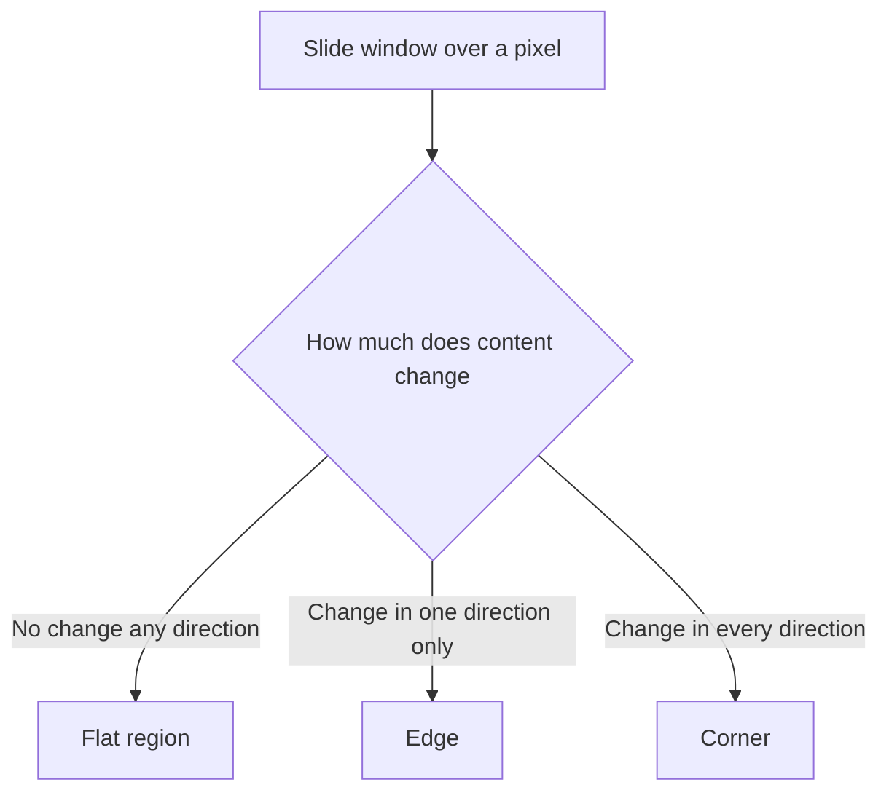

# Lecture 2 — Corners, keypoints, and why they matter

Edges tell you *where boundaries are*, but an edge is ambiguous along its length — slide along an edge and it looks the same, so you cannot pin an exact location. **Corners** solve this: a corner is a point where intensity changes in *two* directions, so it is locatable and repeatable across views. Corners are the raw material of matching, tracking, and 3-D reconstruction.

## The Harris corner idea

Consider sliding a small window around a pixel and measuring how much the image content *changes* as you shift:

- **Flat region:** shifting any direction changes nothing → not a feature.
- **Along an edge:** shifting along the edge changes little; across it changes a lot → an edge, locatable in one direction only.
- **At a corner:** shifting *any* direction changes a lot → a corner, locatable in both directions.

**Harris** formalizes this with the *structure tensor* — a 2×2 matrix of summed gradient products in the window. Its two eigenvalues describe the change in two directions: both small = flat, one large = edge, **both large = corner**. Harris computes a cheap response `R = det(M) − k·trace(M)²` that is large and positive only at corners, avoiding the actual eigenvalue computation.


*Sliding a window over a pixel classifies it as flat, edge, or corner.*

```python
import cv2, numpy as np
gray = np.float32(gray)
R = cv2.cornerHarris(gray, blockSize=2, ksize=3, k=0.04)
corners = R > 0.01 * R.max()   # threshold the response
```

## From corners to keypoints

A raw corner is just a location. A **keypoint** is a corner enriched with:
- **Scale** — over what neighborhood size is it a corner? (A corner at one zoom may vanish at another.) Scale-invariant detectors search across blurred/resized versions of the image.
- **Orientation** — the dominant gradient direction around it, so the description can be rotated to a canonical frame.

This is what makes keypoints **repeatable**: detect the same physical point as a keypoint whether the photo is zoomed, rotated, or shifted. Repeatability is the whole game — a feature you can't re-find in another view is useless for matching.

## Detectors you'll meet

- **Harris / Shi-Tomasi** — corner detectors, fast, no scale invariance on their own.
- **SIFT** — scale-invariant, rotation-invariant, robust; the classic, now patent-free.
- **ORB** — a fast, free SIFT alternative (Oriented FAST + rotated BRIEF); the default in OpenCV for real-time work.

**Takeaway:** corners are points locatable in two directions, found by looking at how a window's content changes when shifted (Harris' structure tensor and its two eigenvalues). A keypoint adds scale and orientation so it is repeatable across zoom and rotation. Repeatable keypoints are what make matching possible.
