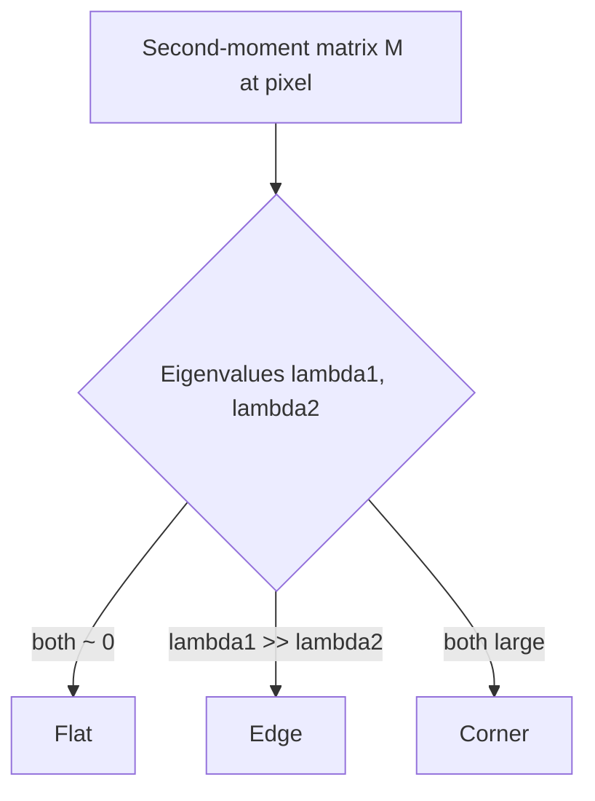

# Lecture 2 — Corners, the structure tensor, and scale-space keypoints

Edges tell you *where boundaries are*, but an edge is ambiguous along its length — slide along it
and it looks the same, so you cannot pin an exact location (the **aperture problem**). **Corners** solve
this: a corner is a point where intensity changes in *two* directions, so it is locatable and repeatable
across views. Corners are the raw material of matching, tracking, and 3-D reconstruction, and the machine
that finds them is one clean piece of linear algebra: the second-moment matrix.

## The auto-correlation and the second-moment (structure) tensor

Consider shifting a small window `w` around a pixel by `(u, v)` and measuring the sum of squared
intensity differences (SSD) the shift induces:

    E(u, v) = Σ_{(x,y)} w(x,y) [ I(x+u, y+v) - I(x,y) ]^2.

A first-order Taylor expansion `I(x+u, y+v) ≈ I + I_x u + I_y v` gives the quadratic form

    E(u, v) ≈ [u v] M [u v]^T,   with   M = Σ w(x,y) [[I_x^2, I_x I_y], [I_x I_y, I_y^2]].

`M` is the **second-moment matrix** (a.k.a. structure tensor): a window-weighted sum of gradient outer
products. It is symmetric positive semi-definite, so it has two real non-negative eigenvalues
`λ1 ≥ λ2 ≥ 0` with orthogonal eigenvectors. Those eigenvalues are the local intensity-change energy
along the two principal directions:

- **Flat region:** `λ1 ≈ λ2 ≈ 0` — shifting any direction changes nothing → not a feature.
- **Edge:** `λ1 ≫ λ2 ≈ 0` — change in one direction only → locatable across the edge, not along it.
- **Corner:** `λ1 ≳ λ2 ≫ 0` — change in *every* direction → precisely locatable in two directions.

## The Harris response — eigenvalues without the eigen-decomposition

Computing eigenvalues per pixel is wasteful. Harris & Stephens (1988, "A Combined Corner and Edge
Detector," *Alvey Vision Conference*) noted that the two invariants you need are already the trace and
determinant:

    det(M) = λ1 λ2,     trace(M) = λ1 + λ2.

They defined the **corner response**

    R = det(M) - k * trace(M)^2,   k ∈ [0.04, 0.06].

`R` is large and positive only when *both* eigenvalues are large (corner), strongly negative when one
dominates (edge), and small when both are tiny (flat). No square roots, no per-pixel eigen-solve. The
Shi-Tomasi variant (1994, "Good Features to Track," *CVPR*) instead uses `R = min(λ1, λ2)` directly,
which is slightly more stable for tracking; the Noble variant uses `det(M) / (trace(M) + ε)`.


*The eigenvalues of the structure tensor classify a pixel; Harris' R = det - k*trace^2 reads them cheaply.*

```python
import cv2, numpy as np
gray = np.float32(gray)
R = cv2.cornerHarris(gray, blockSize=2, ksize=3, k=0.04)   # M window, Sobel size, k
corners = R > 0.01 * R.max()                               # threshold the response
```

## Harris is rotation-invariant but not scale-invariant

Because `R` depends only on eigenvalues (rotation-invariant quantities), Harris corners survive image
rotation. But they are **not** scale-invariant: a corner at one zoom becomes a smooth curve at another,
and the fixed window size `w` picks a fixed scale. A checkerboard corner detected at 1× may vanish at
0.25×. Scale invariance is exactly what keypoint detectors add.

## From corners to keypoints: scale and orientation

A raw corner is just a location `(x, y)`. A **keypoint** enriches it with:
- **Scale** `σ` — the neighbourhood size at which the point is maximally distinctive. Scale-invariant
  detectors search a *scale-space* (the image blurred/subsampled across a pyramid) and select the scale
  where a normalized response peaks — this is Lindeberg's automatic scale selection, made rigorous in
  Lecture 4.
- **Orientation** `θ` — the dominant local gradient direction, computed from a gradient-orientation
  histogram in the keypoint's neighbourhood. Rotating the descriptor to this canonical angle buys
  rotation invariance.

A keypoint that carries `(x, y, σ, θ)` is **repeatable**: the same physical 3-D point is re-detected as
a keypoint whether the photo is zoomed, rotated, or shifted. Repeatability is the whole game — a feature
you cannot re-find in another view is useless for matching. It is measured with the *repeatability
score*: the fraction of keypoints in image A whose corresponding location in image B is also detected,
under a known transform (Mikolajczyk & Schmid, 2005, "A performance evaluation of local descriptors,"
*IEEE TPAMI*, the standard benchmark).

## Detectors you'll meet

- **Harris / Shi-Tomasi** — corner detectors, fast, rotation-invariant, no built-in scale invariance.
- **FAST** (Rosten & Drummond, 2006) — a machine-learned corner test (a pixel is a corner if enough of a
  16-pixel Bresenham ring is uniformly brighter/darker); extremely fast, the "F" in ORB.
- **SIFT** (Lowe, 2004) — scale- and rotation-invariant blob detector via Difference-of-Gaussian; the
  gold standard, now patent-free.
- **ORB** (Rublee et al., 2011, *ICCV*) — Oriented FAST + rotated BRIEF; a fast, free, real-time default
  in OpenCV.

## Common pitfalls

- **Using `k` outside its range.** Very small `k` over-detects (edges leak in as corners); too large
  suppresses real corners. The `[0.04, 0.06]` band is empirically well-behaved.
- **Forgetting Harris has no scale.** For multi-scale matching you must use a scale-space detector
  (SIFT/ORB), not raw Harris.
- **Non-maximum suppression on the response.** Thresholding `R` alone yields clusters; apply spatial NMS
  (keep local maxima of `R`) so each corner is one keypoint.

**Takeaway:** a corner is a point locatable in two directions, and the structure tensor
`M = Σ w ∇I ∇I^T` captures exactly that — its eigenvalues are the change energy in the two principal
directions. Harris reads them cheaply as `R = det(M) - k*trace(M)^2`. A *keypoint* adds scale and
orientation so it is repeatable across zoom and rotation; repeatability, measured against a known
transform, is what makes matching possible.
