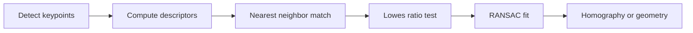

# Lecture 3 — Descriptors and matching two images

A keypoint says *where* an interesting point is. A **descriptor** says *what it looks like* — a compact vector summarizing the local appearance so you can recognize the same physical point in another image. Detect + describe + match is the classical recognition pipeline, and it still powers panorama stitching, visual localization, and structure-from-motion.

## What a descriptor encodes

Around each keypoint, take a patch, rotate it to the keypoint's canonical orientation (for rotation invariance), and summarize its appearance as a vector:

- **SIFT descriptor** — a 128-D vector of gradient-orientation histograms over a 4×4 grid of sub-regions. Robust to lighting, small rotation, and scale.
- **ORB / BRIEF descriptor** — a 256-**bit** binary string from intensity comparisons between sampled point pairs. Tiny and blazing fast to compare (Hamming distance = XOR + popcount).

The design goal is that the *same physical point*, seen in two images, produces two *similar* descriptors, while different points produce dissimilar ones. Similarity is distance in descriptor space.

## Matching

To match image A to image B: for each descriptor in A, find its nearest descriptor in B (smallest L2 distance for SIFT, smallest Hamming distance for ORB). But nearest-neighbor alone yields many false matches in repetitive scenes.

## Lowe's ratio test — the key filter

David Lowe's insight: a match is trustworthy only if the *best* neighbor is clearly better than the *second-best*. Compute both, and keep the match only if `distance(best) < 0.75 × distance(second_best)`. A true match stands out; an ambiguous point has two roughly-equal candidates and is rejected. This one test removes most false matches.

```python
import cv2
orb = cv2.ORB_create()
k1, d1 = orb.detectAndCompute(img1, None)
k2, d2 = orb.detectAndCompute(img2, None)
bf = cv2.BFMatcher(cv2.NORM_HAMMING)
matches = bf.knnMatch(d1, d2, k=2)
good = [m for m, n in matches if m.distance < 0.75 * n.distance]  # ratio test
```

## From matches to geometry

Good matches let you estimate the **geometric relationship** between two views — a homography (for stitching a panorama) or a fundamental matrix (for 3-D). **RANSAC** robustly fits that model while discarding remaining outliers, because even after the ratio test a few bad matches survive. This detect → describe → match → RANSAC pipeline is how phones stitch panoramas and how robots localize.


*The detect to describe to match to RANSAC pipeline behind panorama stitching and localization.*

## Why classical still matters

These methods need **no training data**, run in **real time on a CPU**, and are **interpretable** — you can see exactly which points matched. A CNN feature can beat them on hard recognition, but for geometry, speed, and small-data problems, classical features are often the right, honest choice. Knowing both means picking the right tool instead of defaulting to deep learning.

**Takeaway:** a descriptor is a vector summarizing a keypoint's local appearance so the same point can be re-found across views. Match by nearest descriptor, filter with Lowe's ratio test, and fit geometry with RANSAC. This training-free, real-time, interpretable pipeline still ships in production — deep learning did not delete it.
