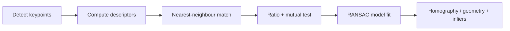

# Lecture 3 — Descriptors, matching, and robust correspondence

A keypoint says *where* an interesting point is. A **descriptor** says *what it looks like* — a
compact vector summarizing the local appearance so you can recognize the same physical point in another
image. Detect + describe + match + fit is the classical recognition-by-geometry pipeline, and it still
powers panorama stitching, visual localization, and structure-from-motion.

## What a descriptor encodes — and why it is invariant

Around each keypoint you take a patch, rotate it to the keypoint's canonical orientation (rotation
invariance) and resize it by the keypoint's scale (scale invariance), then summarize appearance:

- **SIFT descriptor** (Lowe, 2004) — a **128-D** vector: a 4×4 spatial grid of cells, each an 8-bin
  histogram of gradient orientations (4·4·8 = 128), weighted by gradient magnitude and a Gaussian
  window, then L2-normalized, clamped at 0.2, and renormalized. The histogram gives tolerance to small
  spatial shifts; magnitude-normalization gives contrast (multiplicative-illumination) invariance; the
  0.2 clamp limits the influence of large gradients (non-linear illumination). Robust to lighting, small
  rotation, small viewpoint change, and scale.
- **ORB / BRIEF descriptor** (Calonder et al., 2010; Rublee et al., 2011) — a **256-bit** binary string,
  each bit the sign of an intensity comparison between a fixed, learned pair of sampled points in the
  (oriented, smoothed) patch. Compared with the Hamming distance (XOR + popcount) — a few CPU
  instructions — so it is tiny and blazing fast. ORB rotates the sampling pattern by the keypoint
  orientation ("rotated BRIEF") and picks decorrelated, high-variance test pairs by a greedy learning
  procedure.

The design goal is invariance with discrimination: the *same physical point* seen in two images should
produce two *similar* descriptors, while different points produce dissimilar ones. Similarity is a
distance in descriptor space — **L2** for SIFT (real-valued), **Hamming** for ORB (binary).

## Matching — and why nearest-neighbour alone fails

To match image A to image B: for each descriptor in A, find its nearest descriptor in B. Brute force is
`O(N_A · N_B)`; for large sets, approximate nearest-neighbour structures (a KD-tree for SIFT, or LSH /
multi-probe hashing for binary ORB — FLANN implements both) trade a little accuracy for large speedups.
But nearest-neighbour alone yields many false matches: repetitive texture (bricks, windows, foliage)
produces many near-identical descriptors, so the "nearest" is often not the correct one.

## Lowe's ratio test — the key filter

Lowe's insight: a match is trustworthy only if the *best* neighbour is clearly better than the
*second-best*. Compute both nearest neighbours `m1, m2` and keep the match only if

    distance(m1) < ρ · distance(m2),   ρ ≈ 0.7–0.8.

A true, distinctive match stands out from its runner-up; an ambiguous point has two roughly-equal
candidates and is rejected. Lowe (2004) reports this single test eliminates ~90% of false matches while
discarding only ~5% of correct ones on his data. Complement it with a **mutual (cross-check)** test —
keep a match only if A→B's nearest is also B→A's nearest — which removes many-to-one collisions.

```python
import cv2
orb = cv2.ORB_create(nfeatures=2000)
k1, d1 = orb.detectAndCompute(img1, None)
k2, d2 = orb.detectAndCompute(img2, None)
bf = cv2.BFMatcher(cv2.NORM_HAMMING)
matches = bf.knnMatch(d1, d2, k=2)
good = [m for m, n in matches if m.distance < 0.75 * n.distance]  # ratio test
```

## From matches to geometry — and why RANSAC is still needed

Good matches let you estimate the **geometric relationship** between two views: a **homography** (an
8-DoF projective map, valid for a planar scene or a pure-rotation panorama) or a **fundamental /
essential matrix** (for general 3-D). Even after the ratio and mutual tests, a few outliers survive, and
least-squares fitting is not robust — one gross outlier can wreck the estimate. **RANSAC** (Fischler &
Bolles, 1981) fits the model from random minimal samples, scores each hypothesis by its inlier count,
and keeps the best — discarding outliers by consensus. Lecture 5 derives its iteration budget.


*The detect -> describe -> match -> filter -> RANSAC pipeline behind panorama stitching and localization.*

## Why classical still matters — honestly

These methods need **no training data**, run in **real time on a CPU**, are **interpretable** (you can
see exactly which points matched), and give **geometrically exact** correspondences with sub-pixel
localization. A learned feature can beat them on wide-baseline, low-texture, or extreme-illumination
matching (Lecture 5), but for geometry, speed, and small-data problems, classical features are often the
right, honest choice. Knowing both means picking the tool instead of defaulting to deep learning.

## Common pitfalls

- **Comparing SIFT and ORB with the same distance.** SIFT needs L2, ORB needs Hamming — using the wrong
  metric silently destroys matching.
- **A too-loose ratio.** ρ near 0.9 admits ambiguous matches; if every match line is a wild diagonal,
  tighten ρ or the images do not overlap.
- **Skipping RANSAC.** The ratio test filters *appearance* ambiguity; it does not enforce *geometric*
  consistency. Outliers that happen to be distinctive still need RANSAC.

**Takeaway:** a descriptor is a vector summarizing a keypoint's local appearance so the same point can be
re-found across views — SIFT's 128-D gradient histograms (L2) or ORB's 256-bit intensity tests (Hamming),
each engineered for rotation and illumination invariance. Match by nearest neighbour, filter ambiguity
with Lowe's ratio and mutual tests, then enforce geometry with RANSAC. This training-free, real-time,
interpretable pipeline still ships in production; deep learning did not delete it.
