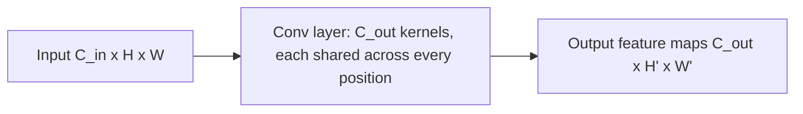

# Lecture 1 — Why convolution, not fully-connected

You could flatten a 28×28 image into a 784-vector and feed it to a fully-connected (dense) network — and for tiny images it even works. But it is the *wrong* architecture, and understanding why is the key to all of vision deep learning.

## The problem with dense layers on images

- **Parameter explosion.** A dense layer from a 224×224×3 image (150,528 inputs) to just 1,000 hidden units needs *150 million* weights — in one layer. Unlearnable and un-trainable on normal data.
- **No spatial structure.** Flattening destroys the grid. The network has no idea that two pixels are neighbors; it must relearn adjacency from scratch.
- **No translation invariance.** A cat in the top-left and the same cat in the bottom-right are, to a dense net, completely unrelated input patterns. It would need to learn "cat" separately at every location.

## Convolution's three fixes

A convolution layer applies the same small kernel across the whole image. That gives three properties, each solving one problem above:

1. **Local connectivity.** Each output pixel depends only on a small neighborhood (the kernel's receptive field), matching how visual structure is local — an edge is a local pattern.
2. **Weight sharing.** *One* kernel is reused at every position, so a 3×3×3 filter is 27 weights regardless of image size. Parameters drop by orders of magnitude.
3. **Translation equivariance.** Because the same kernel slides everywhere, a feature detected in one location is detected in any location. Move the cat, the "cat-ear" filter still fires — just elsewhere in the feature map.

## A convolution layer, precisely

A conv layer has `C_out` kernels, each of shape `(C_in, k, k)`. Each kernel convolves over all input channels and produces one output **feature map** (one channel of the output). So a layer turns `(C_in, H, W)` into `(C_out, H', W')`. The learnable parameters are the kernel weights plus one bias per output channel — and there are far fewer than a dense layer would need.


*One shared kernel per output channel turns an input volume into a stack of feature maps.*

```python
import torch.nn as nn
conv = nn.Conv2d(in_channels=3, out_channels=16, kernel_size=3, padding=1)
# input (N, 3, 32, 32) -> output (N, 16, 32, 32)
```

## This is Week 1, learned

The operation is *exactly* the convolution you hand-coded in Week 1 — slide a kernel, weighted sum. The only difference: instead of you picking blur/sharpen/Sobel weights, backprop *learns* the weights that minimize the loss. The first layer typically learns edge and color-blob detectors that look strikingly like the Gabor and Sobel filters engineers used to hand-design. The network rediscovers classical vision on its own.

**Takeaway:** dense layers on images explode in parameters and ignore spatial structure. Convolution fixes this with local connectivity, weight sharing, and translation equivariance — the same slide-a-kernel operation from Week 1, but with *learned* kernels. That is why every image network is convolutional (or, later, patch-based).
