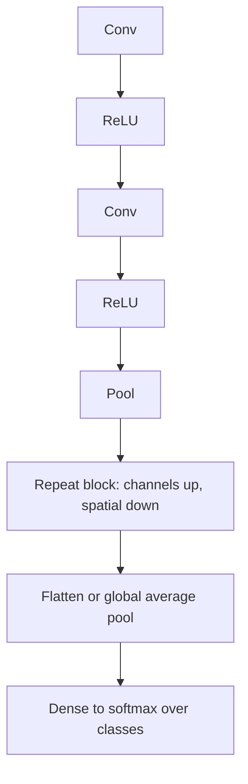

# Lecture 2 — Pooling, channels & receptive fields

A conv layer sees only a small neighborhood. To recognize a whole object, the network must combine information across the image — and it does this by getting *deeper* and *coarser* through pooling. This lecture is the anatomy of a CNN.

## Channels are feature detectors

Each output channel of a conv layer is one **feature map** — the response of one learned filter across the image. Early layers have channels that fire on edges and colors; deeper layers have channels that fire on textures, then parts, then whole objects. "16 channels" means "16 different learned feature detectors run in parallel." Depth increases the number of channels while shrinking spatial size — the network trades *where* for *what*.

## Pooling: shrink space, keep signal

**Pooling** downsamples a feature map. **Max pooling** with a 2×2 window and stride 2 keeps the strongest response in each 2×2 block, halving height and width:

```python
pool = nn.MaxPool2d(kernel_size=2, stride=2)   # (N,C,32,32) -> (N,C,16,16)
```

Why pool?
- **Reduces computation** as you go deeper.
- **Grows the receptive field** — after pooling, each pixel summarizes a larger region of the original image.
- **Adds a little translation invariance** — the max in a block is the same whether the feature is at the block's left or right.

Modern nets sometimes replace pooling with **strided convolutions** (a conv with stride 2 both filters and downsamples), but the goal is identical: reduce resolution, increase abstraction. **Average pooling** (and *global* average pooling at the end) is the other common variant.

## Receptive field: how much a neuron sees

The **receptive field** of a neuron is the region of the *original image* that influences it. A single 3×3 conv sees 3×3 input pixels. Stack another 3×3 conv and each neuron now sees 5×5. Add pooling and the field grows fast. Deep in the network, one neuron's receptive field can cover the whole image — which is exactly what you need to say "this is a cat," a global judgment. **Stacking small (3×3) convs to grow the receptive field** — instead of one huge kernel — is cheaper and more expressive, the core insight of VGG.

## The classic CNN shape

```
[Conv -> ReLU -> Conv -> ReLU -> Pool]  (repeat, channels up, spatial down)
-> Flatten (or global average pool)
-> Dense -> softmax over classes
```

Spatial dimensions shrink (32→16→8→4) while channel count grows (3→16→32→64). By the end you have a small grid of rich features summarizing the whole image, which a final dense layer maps to class scores. This shape — convolutional feature extractor, then a classifier head — is the template for the entire course.


*The classic CNN shape: conv and ReLU blocks with pooling, repeated, then a classifier head.*

**Takeaway:** channels are parallel learned feature detectors; pooling (or strided conv) shrinks space while growing the receptive field so deep neurons see the whole image. A CNN alternates conv+pool blocks, trading spatial resolution for feature richness, ending in a classifier head. Stack small convs to see big.
