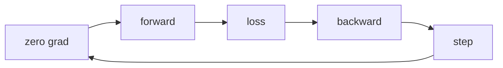

# Lecture 3 — Training a CNN that works

You have the pieces. Now assemble and *train* a CNN — and meet the practical realities that decide whether it learns anything: normalization, augmentation, and honest evaluation. Your [C53 Crunch Nets](../C53-CRUNCH-NETS/) training loop carries over directly.

## The data pipeline

Images need preprocessing before the network:
- **Normalize** — scale pixels to a standard range (often per-channel mean 0, std 1 using dataset statistics). Un-normalized inputs train slowly or not at all, exactly as in C53.
- **Batch** with a `DataLoader` — vision datasets are large, so you stream mini-batches from disk.

```python
from torchvision import datasets, transforms
tf = transforms.Compose([
    transforms.ToTensor(),                       # (H,W,C) uint8 -> (C,H,W) float [0,1]
    transforms.Normalize((0.5,)*3, (0.5,)*3),    # to roughly [-1,1]
])
train = datasets.CIFAR10(root=".", train=True, download=True, transform=tf)
loader = torch.utils.data.DataLoader(train, batch_size=64, shuffle=True)
```

## Data augmentation: free regularization

Images have a superpower text lacks: you can generate *plausible new training examples* by transforming existing ones. Random crops, horizontal flips, small rotations, and color jitter teach the network that a cat is a cat regardless of position, mirror, or lighting. Augmentation is one of the most effective anti-overfitting tools in vision — and it is essentially free.

```python
train_tf = transforms.Compose([
    transforms.RandomCrop(32, padding=4),
    transforms.RandomHorizontalFlip(),
    transforms.ToTensor(),
    transforms.Normalize((0.5,)*3, (0.5,)*3),
])
```

*Only augment training data*, never validation/test — you evaluate on clean images. And only use *label-preserving* transforms: a horizontal flip keeps a cat a cat, but a vertical flip might not (a '6' becomes a '9').

## The training loop and honest evaluation

The loop is C53's, unchanged: `zero_grad → forward → loss → backward → step`, with `CrossEntropyLoss` for classification and an optimizer like Adam or SGD-with-momentum. What matters for vision:


*One training step, repeated every batch: the unchanged C53 loop applied to images.*

- **A held-out validation/test set.** Report accuracy on images the network never trained on. A CNN can memorize CIFAR-10 — training accuracy near 100% with validation accuracy far lower is overfitting, not skill.
- **Track both curves.** Plot training and validation accuracy together; the gap is your overfitting gauge.
- **A confusion matrix**, not just accuracy — see *which* classes it confuses (cats vs. dogs, 4 vs. 9). That is where the real understanding is.

## What to expect

A small CNN with augmentation reaches ~99% on MNIST and ~75–85% on CIFAR-10 — and crucially *beats a fully-connected baseline by a wide margin*, proving convolution's structural advantage. If your CNN doesn't beat a dense net on images, something is wrong (bad normalization, no augmentation, a shape bug — print shapes).

**Takeaway:** train a CNN with the C53 loop plus vision essentials — normalize inputs, augment training data with label-preserving transforms, and evaluate honestly on held-out images with both curves and a confusion matrix. A small CNN should clearly beat a dense baseline; that gap is convolution earning its keep.
