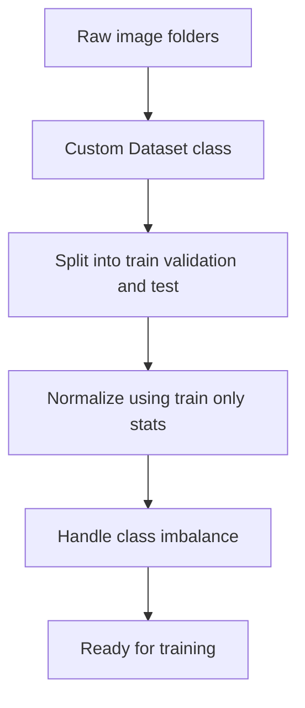

# Lecture 1 — The data pipeline is half the job

In real vision projects, more time goes into the *data pipeline* than the model. Garbage in, garbage out is not a cliché here — a subtle data bug (a leaked test image, a mislabeled class, an unnormalized channel) silently caps your model far below its potential. Build the pipeline deliberately.

## From folders to tensors

Real datasets arrive as folders of images. torchvision's `ImageFolder` reads a directory where each subfolder is a class:

```
data/train/cat/*.jpg
data/train/dog/*.jpg
```

For anything custom, subclass `Dataset` and implement `__len__` and `__getitem__` (returning an image tensor and a label). This is where you apply transforms, and where subtle bugs live.

```python
from torch.utils.data import Dataset
class PetDataset(Dataset):
    def __init__(self, paths, labels, transform):
        self.paths, self.labels, self.transform = paths, labels, transform
    def __len__(self):
        return len(self.paths)
    def __getitem__(self, i):
        img = Image.open(self.paths[i]).convert("RGB")
        return self.transform(img), self.labels[i]
```

## The three splits, and the cardinal sin

Split into **train / validation / test**:
- **Train** — the model learns on it.
- **Validation** — you tune hyperparameters and pick the best checkpoint against it.
- **Test** — touched *once*, at the very end, to report the honest number.

The cardinal sin is **leakage**: any information from validation/test reaching training. Common leaks in vision: the *same photo* (or near-duplicate) in both train and test; fitting the normalization statistics on the whole dataset instead of train only; augmenting the test set. Leakage produces beautiful, fake results that collapse in the real world. Split *before* you do anything else, and split by *group* when images cluster (multiple photos of the same individual must all land in one split).

## Normalization and resizing

- **Resize** to the network's expected input (e.g. 224×224), by cropping or letterboxing. Decide consciously — center-crop can cut off the object.
- **Normalize** per channel using **training-set** statistics (or the standard ImageNet means/stds when using a pretrained backbone next week). Never compute stats on test data.

## Class imbalance

Real datasets are rarely balanced. If 90% of images are one class, a naive model predicts that class and looks 90% accurate while being useless (the Week-2 accuracy trap, returning). Handle it with a **weighted loss** (`CrossEntropyLoss(weight=...)`), **oversampling** the minority via a `WeightedRandomSampler`, or heavier augmentation of rare classes — and always report *per-class* metrics so imbalance can't hide.


*The data pipeline stages in order, from raw folders to a training ready dataset.*

**Takeaway:** the data pipeline is where projects are won or lost. Build a clean `Dataset`, split into train/val/test with no leakage (watch for duplicates and group structure), normalize with train-only stats, and handle class imbalance explicitly. A perfect model on a leaked split is worth nothing.
