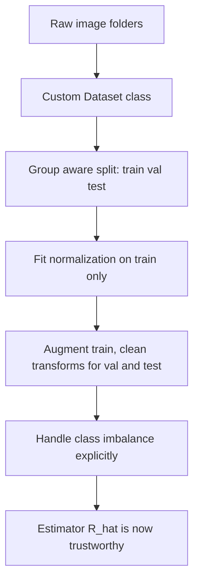

# Lecture 1 — The data pipeline is half the job: splitting as experiment design

In real vision projects more effort goes into the **data pipeline** than the model, and for a
principled reason: your reported accuracy is a *statistical estimate of population risk*, and the pipeline is
what determines whether that estimate is unbiased. A subtle data bug — a leaked test image, a mislabeled
class, an unnormalized channel, a group of near-duplicates split across train and test — does not merely add
noise; it *biases* the estimate, usually optimistically, and the bias survives no matter how much data you
have. Build the pipeline as if you were designing an experiment, because you are.

## From folders to tensors

Real datasets arrive as folders of images. torchvision's `ImageFolder` reads a directory where each subfolder
is a class:

```
data/train/cat/*.jpg
data/train/dog/*.jpg
```

For anything custom, subclass `Dataset` and implement `__len__` and `__getitem__` returning `(image_tensor,
label)`. This is where transforms are applied and where subtle bugs live.

```python
from torch.utils.data import Dataset
from PIL import Image

class PetDataset(Dataset):
    def __init__(self, paths, labels, transform):
        self.paths, self.labels, self.transform = paths, labels, transform
    def __len__(self):
        return len(self.paths)
    def __getitem__(self, i):
        img = Image.open(self.paths[i]).convert("RGB")
        return self.transform(img), self.labels[i]
```

## The estimation view: what test accuracy actually is

Let `(x, y)` be drawn i.i.d. from an unknown distribution `D`. The quantity you care about is the population
risk `R(θ) = E_{(x,y)~D}[ 1(f(x;θ) ≠ y) ]` (the true error rate). You cannot compute it. What you compute on a
held-out test set `T = {(x_i, y_i)}_{i=1}^m` is the empirical test error

    R̂_T(θ) = (1/m) Σ_i 1(f(x_i;θ) ≠ y_i),

an *estimator* of `R(θ)`. Two conditions make `R̂_T` a good estimate: the test examples must be (i) drawn from
the same `D` the model will face, and (ii) *independent of the training process*. Every pipeline sin below
breaks one of these — which is exactly why they are fatal.

## The three splits, and the cardinal sin

Split into **train / validation / test**:
- **Train** — the model fits it (`argmin R̂_train`).
- **Validation** — you tune hyperparameters and select the checkpoint against it. Because you *optimize over*
  the validation set, `R̂_val` is itself optimistically biased — after enough tuning it is no longer an honest
  estimate of `R`. This is why the test set exists.
- **Test** — touched **once**, at the very end, to report the number.

The cardinal sin is **leakage**: any information from validation/test reaching training. In vision the common
forms are: the *same photo* or a near-duplicate in both train and test (webscraped datasets are riddled with
these); fitting normalization statistics on the whole dataset instead of train only; augmenting the test set;
or selecting the model on the test set (a slow leak through repeated evaluation). Leakage does not add
variance — it *removes* the independence in condition (ii), so `R̂_T` becomes a biased, over-optimistic
fiction that collapses in deployment. Recht et al. (2019), "Do ImageNet Classifiers Generalize to ImageNet?",
built a fresh test set by the original protocol and measured accuracy drops of 3–15 points — a sobering
demonstration that even famous benchmarks carry estimation bias.

## Group-structured data: the leak you cannot see

Split **before** you do anything else, and split **by group** when images cluster. If a dataset has 20 photos
of the *same* dog, an i.i.d.-per-image random split scatters them across train and test; the model then
"recognizes" the test photo because it memorized that individual, not the concept. The fix is
**grouped/blocked splitting**: assign whole groups (an individual, a photo session, a patient, a camera) to a
single split. In `scikit-learn` this is `GroupShuffleSplit`/`GroupKFold`. This is *the* silent leak in medical
imaging (all slices of one patient must stay together) and in wildlife/face datasets. When in doubt, ask "what
is the unit I want to generalize to?" and split on that unit.

## Normalization and resizing — fit on train only

- **Resize** to the network's input (e.g. 224×224) by cropping or letterboxing. Choose consciously: a naive
  center-crop can amputate the object; aspect-ratio-preserving resize + pad avoids distortion.
- **Normalize** per channel using **training-set** statistics `x' = (x − μ_train)/σ_train`, or the standard
  ImageNet means/stds when you use a pretrained backbone (Week 5). Computing `μ, σ` over the full dataset
  including test leaks target-adjacent information; fit preprocessing on train, then apply the *fixed*
  transform to val/test.

## Class imbalance, previewed

Real datasets are rarely balanced. If 90% of images are one class, a model that always predicts it scores 90%
accuracy while being useless — the Week-2 accuracy trap, returning. Handle it with a **weighted loss**
(`CrossEntropyLoss(weight=...)`), **oversampling** the minority via a `WeightedRandomSampler`, or targeted
augmentation of rare classes — and *always* report per-class metrics so imbalance cannot hide. Lecture 5 treats
the long-tailed case in depth.


*The pipeline stages that keep the test estimate an unbiased estimate of population risk.*

## Common pitfalls

- **Random splitting grouped data.** The most common invisible leak; recall drops in production with no
  warning. Split on the unit you want to generalize to.
- **Fitting anything on the full dataset.** Normalization, PCA, class weights, augmentation policies — all must
  be fit on train only.
- **Touching the test set more than once.** Every peek and re-tune is a slow leak; treat it as single-use.

**Takeaway:** the pipeline is where projects are won or lost because it decides whether your accuracy is an
honest estimate of population risk. Build a clean `Dataset`, split by *group* before doing anything else, fit
normalization on train only, and handle imbalance explicitly. A perfect model on a leaked split is worth
nothing — and the leak is usually invisible until deployment.
