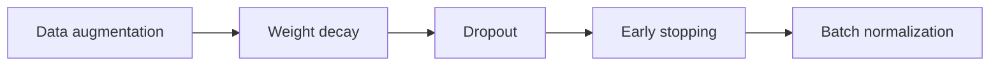

# Lecture 2 — Metrics that tell the truth, and regularization

A classifier's headline accuracy is the *least* informative number about it. Professional evaluation means picking metrics that expose failure, and regularization means deliberately trading a little training performance for a lot of generalization.

## Metrics beyond accuracy

- **Accuracy** — fraction correct. Fine for balanced data, misleading otherwise.
- **Per-class precision and recall** — precision: of images predicted class X, how many were X? Recall: of true class-X images, how many did we catch? These expose *which* classes the model handles well.
- **Confusion matrix** — the full picture: which classes get mistaken for which. Cats↔dogs, huskies↔wolves. This single table drives most error analysis.
- **Top-k accuracy** — for many-class problems (ImageNet's 1000 classes), "is the true class in the top 5?" is a fairer, standard metric.
- **Macro vs. micro averaging** — macro treats every class equally (good when you care about rare classes); micro weights by frequency.

Pick metrics that match what you *care about*. A medical screen weights recall (don't miss a disease); a spam filter weights precision (don't flag good mail). The metric is a values statement.

## Regularization: the overfitting toolbox

Overfitting — great on training, poor on held-out — is the default failure. The toolbox:

- **Data augmentation** (Week 3) — usually the single most effective; more effective data beats every other trick.
- **Weight decay (L2)** — penalize large weights, nudging the model toward simpler functions. Set via the optimizer's `weight_decay`.
- **Dropout** — randomly zero activations during training so the network can't rely on any single unit; a strong regularizer for the dense head.
- **Early stopping** — track validation loss and keep the checkpoint from *before* it started rising. Free, and it prevents the model from memorizing.
- **Batch normalization** — normalizes activations per batch; stabilizes and speeds training and has a mild regularizing effect.

*The rough order to reach for regularization tools, most effective first.*

The discipline: watch the **train-vs-validation gap**. A large gap → overfitting → add regularization or data. Both losses high and close → underfitting → more capacity or longer training. You *diagnose* from the two curves, then act.

**Takeaway:** accuracy alone lies; report per-class precision/recall, a confusion matrix, and top-k, chosen to match what you care about. Regularize with augmentation first, then weight decay, dropout, and early stopping — and drive every decision from the train-vs-validation gap. Metrics are a values statement; pick them on purpose.
