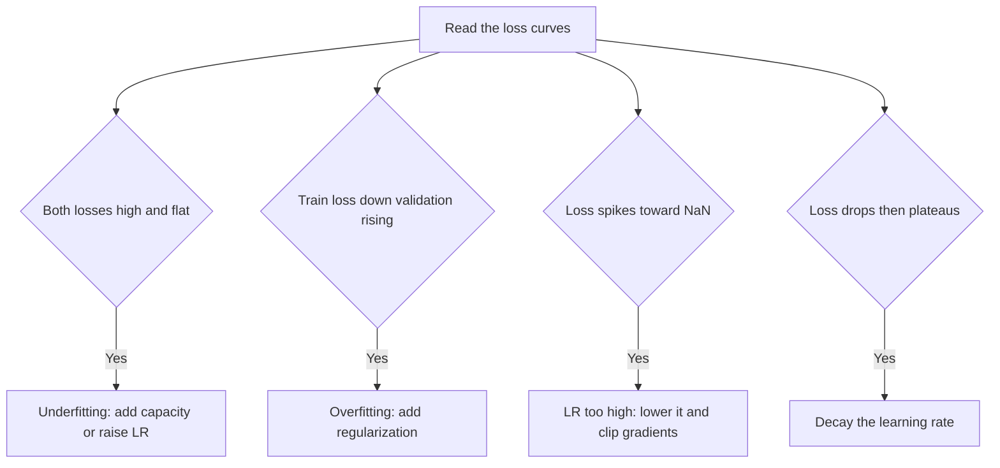

# Lecture 3 — Learning rates, schedules & diagnosing training

Two models with identical architecture can differ wildly in accuracy purely from *how* they were trained. The learning rate is the most important hyperparameter in deep learning, and reading a loss curve is the most valuable diagnostic skill. This lecture is that craft.

## The learning rate, revisited

From C53: too high diverges, too low crawls. In vision, with deeper nets and batch norm, a good practice is:

- **Find a sane rate** with a quick sweep, or an **LR-range test** (increase LR each batch and watch where loss stops improving and starts exploding — pick just below the explosion).
- **Schedule it down** over training. Common schedules: **step decay** (drop 10× at set epochs), **cosine annealing** (smoothly decay to near zero), and **warmup** (start tiny, ramp up over the first few epochs — essential for large batches and Transformers, which you'll meet in Week 10).

```python
opt = torch.optim.SGD(model.parameters(), lr=0.1, momentum=0.9, weight_decay=5e-4)
sched = torch.optim.lr_scheduler.CosineAnnealingLR(opt, T_max=epochs)
# ... each epoch: train, then sched.step()
```

A schedule matters: a high rate early explores fast; a low rate late refines. Constant LR usually leaves accuracy on the table.

## Optimizers

**SGD with momentum** is the classic vision workhorse — often the best final accuracy with a good schedule. **Adam / AdamW** converge faster with less tuning and are the default for Transformers. AdamW (Adam with decoupled weight decay) is a safe modern default. Try SGD+momentum when chasing the last point of accuracy.

## Reading the loss curve — a diagnostic table

The training/validation loss curves are a readout of what's wrong:

- **Both losses high, flat** → underfitting or LR too low: more capacity, more epochs, or higher LR.
- **Training loss down, validation loss rising** → overfitting: more augmentation/regularization/data, or early-stop.
- **Loss spikes to NaN or explodes** → LR too high, or bad normalization: lower LR, add gradient clipping, check inputs.
- **Loss drops then plateaus** → decay the LR (schedule), or you've hit the model's ceiling.
- **Wild, noisy validation** → batch too small or LR too high; validation set too small to be stable.


*Reading the shape of the loss curves to pick the right fix.*

## The debugging mindset

When a model won't learn, don't randomly change things. **Overfit a tiny subset first** — a good model should reach ~100% training accuracy on 10 images; if it can't, you have a bug (bad labels, broken loss, wrong shapes), not a tuning problem. Then scale up. This one habit — *can it memorize a handful?* — saves days.

**Takeaway:** the learning rate and its schedule (warmup + cosine or step decay) often matter more than the architecture. Read the train/validation curves as a diagnostic — each shape points to a specific fix — and always sanity-check by overfitting a tiny subset before blaming hyperparameters. Disciplined training beats a fancier model.
