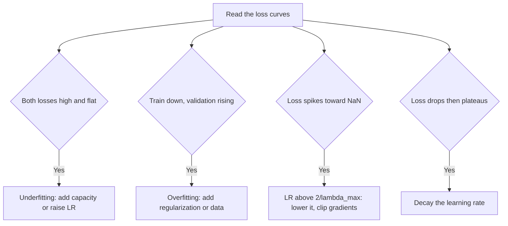

# Lecture 3 — Learning rates, schedules & diagnosing training

Two models with identical architecture can differ wildly in accuracy purely from *how* they were
trained. The learning rate is the single most important hyperparameter in deep learning, and reading a loss
curve is the most valuable diagnostic skill you own. This lecture is that craft, with enough theory to make the
recipes non-arbitrary.

## The learning rate and the step-size ceiling

From C53/Week 1: too high diverges, too low crawls — and the boundary is not folklore. On a locally quadratic
loss with Hessian `H` (curvature), gradient descent contracts error along each eigen-direction by `|1 − η λ_i|`
per step, so it converges only if `η < 2/λ_max`, where `λ_max` is the largest curvature. Push `η ≥ 2/λ_max` and
the stiff direction *amplifies* each step — the loss explodes. Deep nets are non-convex, so this is local, but
it is exactly why "the loss went to NaN" is almost always "the learning rate was above the local `2/λ_max`
cliff." In practice you find a good rate with a quick sweep or an **LR-range test** (Smith, 2017): ramp the LR
up each batch and watch where loss stops improving and starts exploding; pick just below the explosion.

## Schedules: high early, low late

A schedule decays the LR over training so you *explore* fast early and *refine* precisely late:

- **Step decay** — drop 10× at set epochs.
- **Cosine annealing** (Loshchilov & Hutter, 2017) — smoothly decay to near zero over training; a strong,
  low-fuss default.
- **Warmup** — start with a tiny LR and ramp up over the first few epochs; essential for large-batch training
  and for Transformers (Week 10), where a cold high LR destabilizes the early, high-variance gradients.

```python
opt = torch.optim.SGD(model.parameters(), lr=0.1, momentum=0.9, weight_decay=5e-4)
sched = torch.optim.lr_scheduler.CosineAnnealingLR(opt, T_max=epochs)
# each epoch: train ...; then sched.step()
```

A constant LR usually leaves accuracy on the table: too high to settle at the end, too low to move at the start.

## Optimizers

**SGD with momentum** is the classic vision workhorse — with a good schedule it often reaches the best final
accuracy and generalizes well. Momentum `v ← μ v + ∇L; θ ← θ − η v` accumulates a velocity that damps
oscillation across steep directions and accelerates along consistent ones (a discrete heavy-ball method).
**Adam/AdamW** (Kingma & Ba, 2015; Loshchilov & Hutter, 2019) adapt a per-parameter step from running gradient
moments; they converge fast with little tuning and are the default for Transformers. Prefer **AdamW** (decoupled
weight decay) over plain Adam so the L2 penalty is not distorted by the adaptive scaling. Reach for SGD+momentum
when chasing the last point of accuracy on a CNN; reach for AdamW when you want robustness and speed. (Lecture 4
derives *why* these behave differently.)

## Reading the loss curve — a diagnostic table

The training/validation curves are a readout of what is wrong:

- **Both losses high, flat** → underfitting or LR too low: more capacity, more epochs, or higher LR.
- **Training loss down, validation loss rising** → overfitting: more augmentation/regularization/data, or
  early-stop.
- **Loss spikes to NaN or explodes** → LR above the local `2/λ_max`, or bad normalization: lower LR, add
  gradient clipping, check inputs for NaNs/unnormalized channels.
- **Loss drops then plateaus** → decay the LR (schedule), or you have hit the model's ceiling.
- **Wild, noisy validation** → batch too small, LR too high, or a validation set too small to be a stable
  estimator (recall Lecture 2's error bars).


*The shape of the curves points to a specific fix.*

## The debugging mindset

When a model will not learn, do not randomly change things. **Overfit a tiny subset first** — a correct model
should reach ~100% training accuracy on 10 images; if it cannot, you have a *bug* (bad labels, broken loss,
wrong tensor shapes, a detached graph), not a tuning problem. Then scale up. This one habit — *can it memorize a
handful?* — saves days, and it is the fastest way to separate a code bug from a hyperparameter issue. Karpathy's
"A Recipe for Training Neural Networks" (2019) is the canonical checklist for this discipline.

**Takeaway:** the learning rate and its schedule (warmup + cosine or step decay) often matter more than the
architecture; the divergence cliff sits at the local `2/λ_max`. Read the train/validation curves as a
diagnostic — each shape maps to a specific fix — and always sanity-check by overfitting a tiny subset before
blaming hyperparameters. Disciplined training beats a fancier model.
