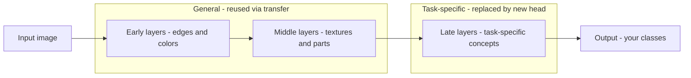

# Lecture 1 — Why transfer learning works

Transfer learning is the reason a hobbyist with 300 photos can build a classifier that rivals a research lab's. The idea: a network trained on a huge, diverse dataset learns *general* visual features that are useful far beyond its original task. Understanding *why* tells you *when* it will and won't work.

## Features are hierarchical and general

Recall from Week 3 that a CNN builds a hierarchy: early layers learn edges and colors, middle layers learn textures and simple parts, late layers learn task-specific object concepts. The crucial observation: **the early and middle features are nearly universal.** Edges, corners, and textures are useful for classifying cats, tumors, satellite crops, or circuit boards. Only the last layers are specialized to "the 1000 ImageNet classes."


*The CNN feature hierarchy: early and middle layers stay general across tasks, only the late layers are task-specific.*

So a network trained on ImageNet has, in its early and middle layers, a general-purpose *visual feature extractor* — one you'd never be able to train from your 500 images, because it took a million images to learn. Transfer learning **keeps that feature extractor** and only relearns the task-specific top.

## The mechanics

A pretrained classifier is a **backbone** (the convolutional feature extractor) plus a **head** (the final classifier for its original classes). To transfer:

1. Load the pretrained weights.
2. Replace the head with a new one sized to *your* number of classes (its weights start random).
3. Train — either just the new head (feature extraction) or the whole thing (fine-tuning).

```python
import torchvision.models as models, torch.nn as nn
model = models.resnet18(weights="IMAGENET1K_V1")
model.fc = nn.Linear(model.fc.in_features, num_classes)  # new head
```

## Why it beats training from scratch

- **Far less data.** You're not learning to see from zero — you're adapting an expert.
- **Far less compute and time.** Convergence in minutes, not days.
- **Better generalization on small data.** The pretrained features are a strong, well-regularized starting point that small-data training-from-scratch can't match.

## Where transfer breaks down

Transfer is strongest when your task's images resemble the pretraining images. ImageNet is natural photos, so pets, vehicles, and everyday scenes transfer beautifully. It transfers *less* well to very different domains — medical scans, satellite imagery, microscopy, line drawings — because the low-level statistics differ. It still usually helps (edges are edges), but you'll fine-tune more and gain less. Knowing this saves you from over-trusting a backbone on out-of-domain data.

**Takeaway:** transfer works because early/middle CNN features (edges, textures, parts) are general across tasks, and only the final layers are task-specific. Keep the pretrained feature extractor, swap the head, and adapt. It slashes the data and compute you need — most dramatically when your images resemble the pretraining domain, less so for exotic domains like medical or satellite.
