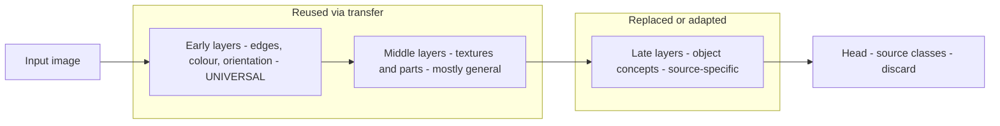

# Lecture 1 — Why transfer works: the geometry of learned representations

Transfer learning is the reason a hobbyist with 300 photos can build a classifier that rivals a
research lab's. The claim is that a network trained on a huge, diverse dataset learns a *general* visual
representation useful far beyond its original task. This lecture makes that claim precise — what "general"
means, how far it extends, and where it stops — because understanding *why* transfer works tells you exactly
*when* it will and will not.

## The representation is a hierarchy, general-to-specific

Recall from Week 3 that a CNN builds a feature hierarchy: early layers detect edges, colours, and
orientations; middle layers compose these into textures and simple parts; late layers assemble parts into
task-specific object concepts. Two empirical facts make this the foundation of transfer.

First, **the early filters are nearly universal.** Visualize the first-layer kernels of almost any deep
vision model — AlexNet, VGG, a ResNet, even a randomly seeded model after a little training — and you find
Gabor-like oriented edge detectors and colour-opponent blobs (Zeiler & Fergus, 2014, "Visualizing and
Understanding Convolutional Networks", ECCV). These are the same features classical vision engineered by
hand (Week 2). Edges and textures are useful for cats, tumors, satellite crops, and circuit boards alike,
because they are properties of *natural images*, not of the 1000 ImageNet classes.

Second, **transferability decreases with depth, and it is measurable.** Yosinski, Clune, Bengio & Lipson
(2014, "How transferable are features in deep neural networks?", NeurIPS) ran the definitive experiment:
train a network on one half of ImageNet's classes, then transfer the first `k` layers to the other half and
retrain the rest. As `k` grows — as you reuse deeper layers — two effects appear. Early layers transfer with
almost no loss. Deeper layers transfer worse, for two distinct reasons they carefully separated: (i)
**specificity**, the features have become tuned to the source classes, and (ii) **co-adaptation**, deeper
layers are fragilely entangled with the layers around them, so splitting the network mid-stack breaks a
delicate interaction. Fine-tuning after transfer *heals* both effects — a key motivation for the next
lecture.


*The hierarchy: early/middle layers stay general; late layers specialize to the pretraining classes and transfer worse.*

## A statistical reading

Why should features estimated on distribution `D_S` (ImageNet) help on a different distribution `D_T` (your
task)? Because they are, in effect, a *strong, low-variance prior* on the space of useful image features.
Learning a good edge detector from 500 images is a high-variance estimation problem — you would overfit.
ImageNet's million-plus images estimate those same shared, low-level features with tiny variance; borrowing
them is borrowing an estimate you could never afford yourself. Formally, transfer reduces the *estimation
error* (Week-1 bias-variance language) of the reused sub-network to near zero, leaving you only the much
smaller problem of fitting the task-specific top on your data. This is why transfer helps *most* on small
target datasets and why its advantage over from-scratch training shrinks as your own data grows.

## The mechanics

A pretrained classifier is a **backbone** (the convolutional or transformer feature extractor) plus a
**head** (the final classifier for its original classes). To transfer:

1. Load the pretrained weights.
2. Replace the head with one sized to *your* number of classes (its weights start random).
3. Train — either just the head (feature extraction, Lecture 2) or some/all of the backbone too (fine-tuning).

```python
import torchvision.models as models, torch.nn as nn
weights = models.ResNet50_Weights.IMAGENET1K_V2
model = models.resnet50(weights=weights)
model.fc = nn.Linear(model.fc.in_features, num_classes)  # new head, random init
preprocess = weights.transforms()                        # the EXACT preprocessing (Lecture 3)
```

## Why it beats training from scratch

- **Far less data.** You adapt an expert instead of learning to see from zero.
- **Far less compute.** Convergence in minutes, not GPU-days.
- **Better small-data generalization.** The pretrained features are a well-regularized starting point that
  small-data from-scratch training simply cannot match — a fact confirmed at scale by Kornblith, Shlens &
  Le (2019, "Do Better ImageNet Models Transfer Better?", CVPR): transfer accuracy on downstream tasks
  correlates strongly with ImageNet accuracy of the backbone, though the correlation weakens for domains far
  from natural images.

## Where transfer breaks down

Transfer is strongest when the target images resemble the pretraining images, because low-level statistics
(edge frequencies, colour distributions, texture scales) then match. ImageNet is natural photos, so pets,
vehicles, and everyday scenes transfer beautifully. It transfers *less* well to medical scans, satellite and
aerial imagery, microscopy, and line drawings, where those statistics differ (Raghu et al., 2019,
"Transfusion: Understanding Transfer Learning for Medical Imaging", NeurIPS, found that for some medical
tasks large ImageNet backbones offer little over far smaller models trained from scratch). Transfer still
usually helps — edges are edges — but you fine-tune more, gain less, and should extract from *earlier*
(more general) layers when the domain is exotic. Knowing this saves you from over-trusting a backbone
out-of-domain, the theme of Lecture 4.

## Pitfalls

- **Assuming ImageNet accuracy is all that matters.** It predicts transfer well for natural-image targets and
  poorly for distant domains; do not choose a backbone on ImageNet top-1 alone for a satellite task.
- **Reusing too-deep features out-of-domain.** Late layers encode source object concepts; on a distant domain
  they can hurt. Probe multiple depths.

**Takeaway:** transfer works because a deep vision model's early and middle features are general properties of
natural images (empirically: universal Gabor-like first layers, Zeiler & Fergus 2014; measurable
layer-wise transferability, Yosinski et al. 2014), acting as a strong low-variance prior that collapses the
estimation error of the reused sub-network. Only the late, task-specific layers must be relearned. The gain
is largest on small target datasets close to the pretraining domain and smallest — but rarely zero — when the
domain is exotic.
