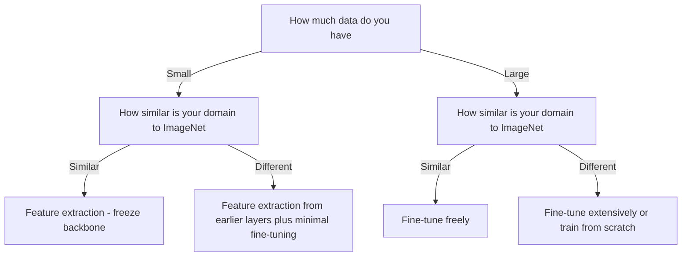

# Lecture 2 — Feature extraction vs. fine-tuning

There is a spectrum between "use the pretrained network untouched" and "retrain everything." Where you sit on it depends on how much data you have and how similar your domain is. This lecture is the decision.

## The two ends

**Feature extraction (freeze the backbone).** Freeze all pretrained weights so they don't update; train *only* the new head. The backbone is a fixed feature extractor; you're just learning a classifier on top of its features.
- **Pros:** very fast, needs little data, near-impossible to overfit the backbone.
- **Cons:** can't adapt the features to your domain, so it caps out lower on dissimilar data.

```python
for p in model.parameters():
    p.requires_grad = False          # freeze backbone
model.fc = nn.Linear(in_feats, num_classes)   # new head trains (requires_grad=True)
```

**Fine-tuning (unfreeze some or all).** Let some or all backbone weights update too, with a **small** learning rate so you nudge the good features rather than destroy them.
- **Pros:** adapts features to your domain; higher ceiling.
- **Cons:** needs more data, slower, and can overfit or "catastrophically forget" the pretrained features if the LR is too high.

## The middle ground: partial fine-tuning

You rarely go all-or-nothing. A common, strong recipe:
1. Freeze the backbone, train the new head to convergence first (so its random weights don't send huge destabilizing gradients back into the pretrained layers).
2. Then unfreeze the *last* backbone block(s) — the most task-specific ones — and fine-tune with a low LR.
3. Optionally use **discriminative learning rates**: tiny LR for early layers (barely change the universal features), larger LR for late layers and the head.

The early layers (universal edges) rarely need to move; the late layers (task-specific) benefit most from adaptation. Unfreeze from the top down.

## The four quadrants

The classic decision grid, by **data size** and **domain similarity** to ImageNet:

- **Small data, similar domain:** feature extraction. Little data can't safely fine-tune; the features already fit.
- **Large data, similar domain:** fine-tune freely; you have data to adapt without overfitting.
- **Small data, different domain:** feature extraction from *earlier* layers (later ImageNet features are too specialized), plus careful, minimal fine-tuning. The hardest quadrant.
- **Large data, different domain:** fine-tune extensively, or even train from scratch if data is truly abundant — but starting pretrained still usually converges faster.


*Choosing your point on the spectrum from data size and domain similarity to ImageNet.*

**Takeaway:** feature extraction (freeze, train head) is fast and small-data-safe but caps lower; fine-tuning (unfreeze, tiny LR) adapts features for a higher ceiling but needs more data and care. Train the new head first, then unfreeze from the top with discriminative LRs. Choose your point on the spectrum from the data-size × domain-similarity quadrant.
