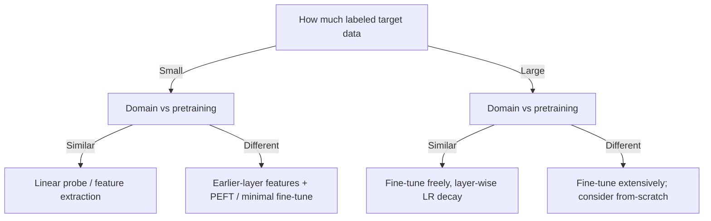

# Lecture 2 — Feature extraction vs. fine-tuning: a decision theory

There is a continuum between "use the pretrained network untouched as a feature extractor" and
"retrain every weight." Where you sit on it is not taste — it is a decision determined by your data size,
your domain distance, and your label budget. This lecture turns that decision from folklore into something you
can defend.

## The two ends, precisely

**Feature extraction (freeze the backbone).** Set `requires_grad = False` on all pretrained parameters so they
never update; train *only* the new head. The backbone is a fixed function `phi(x)`; you are fitting a linear
(or shallow) classifier on the fixed features `phi(x)`. Equivalently you can precompute `phi(x)` for every
image once and then train a classifier on the cached vectors — dramatically faster, since the expensive
forward pass through the backbone runs a single time per image, not once per epoch.
- **Pros:** very fast; needs little data; the backbone *cannot* overfit because it does not move; caching makes
  training almost free.
- **Cons:** the features are frozen to what ImageNet found useful, so accuracy caps out lower whenever your
  domain wants features ImageNet never learned.

```python
for p in model.parameters():
    p.requires_grad = False              # freeze backbone
model.fc = nn.Linear(in_feats, num_classes)   # only the head has requires_grad=True
```

**Fine-tuning (unfreeze some or all).** Let backbone weights update too, with a **small** learning rate so you
*nudge* the good features rather than destroy them.
- **Pros:** adapts features to your domain; strictly higher ceiling given enough data.
- **Cons:** needs more data; slower; can overfit; can **catastrophically forget** the pretrained features if the
  learning rate is too large (Lecture 3).

## Linear probing is not a toy — and sometimes wins

Feature extraction with a linear head is called **linear probing**, and it is a serious method, not a
warm-up. On strong self-supervised or vision-language backbones (Lecture 5) a linear probe can match or beat
full fine-tuning, and it does so with a fraction of the compute and no risk of forgetting. Crucially, Kumar,
Raghunathan, Jones, Ma & Liang (2022, "Fine-Tuning can Distort Pretrained Features and Underperform
Out-of-Distribution", ICLR) showed that when the pretrained features are already good, *fine-tuning can
distort them and underperform a linear probe on distribution shift*, and proposed **LP-FT**: linear-probe
first to a good head, then fine-tune. This is the rigorous justification for the "train the head first"
recipe you were told to follow by rote.

## The middle ground: partial and staged fine-tuning

You rarely go all-or-nothing. A strong, standard recipe:
1. **Head-first.** Freeze the backbone and train the new head to convergence. A random head emits huge,
   noisy gradients; letting them flow into the pretrained layers on step one is exactly how you wreck good
   features. Training the head first eliminates that shock.
2. **Unfreeze from the top down.** Unfreeze the *last* backbone block(s) — the most task-specific and the ones
   Yosinski showed transfer worst — and fine-tune with a low LR. Early layers (universal edges) rarely need to
   move.
3. **Discriminative / layer-wise learning rates.** Give early layers a tiny LR and later layers a larger one,
   e.g. multiply the LR by a decay factor `xi < 1` per layer from the head down (layer-wise LR decay, used by
   BiT and by ViT/BEiT fine-tuning recipes). Early universal features barely change; task-specific layers
   adapt.

## The four quadrants — and their failure cases

The classic decision grid is **data size x domain similarity** to the pretraining set:

- **Small data, similar domain:** feature extraction / linear probing. Little data cannot safely fine-tune the
  whole backbone; the features already fit.
- **Large data, similar domain:** fine-tune freely — you have data to adapt without overfitting.
- **Small data, different domain:** the hardest quadrant. Feature-extract from *earlier* layers (later ImageNet
  features are too specialized), and fine-tune minimally and carefully. Consider parameter-efficient methods
  (see below).
- **Large data, different domain:** fine-tune extensively; if data is truly abundant, from-scratch can even be
  competitive — but pretrained initialization usually still converges faster.

The grid is a heuristic, and you should know where it lies. It treats "domain similarity" as one axis, but
*low-level* similarity (edge/texture statistics) and *high-level* similarity (object semantics) can diverge:
a domain can share low-level statistics yet want completely different semantics, favouring feature extraction
from mid layers plus a fresh head. And the "small data => freeze" rule breaks for parameter-efficient
fine-tuning.

## Parameter-efficient fine-tuning (a modern middle path)

You need not choose between "train 0% of the backbone" and "train 100%." **Adapters** (Houlsby et al., 2019),
**LoRA** (Hu et al., 2021 — small low-rank update matrices), **BitFit** (tune only bias terms), and **prompt/
prefix tuning** insert or unlock a *tiny* set of parameters, giving much of fine-tuning's ceiling at
feature-extraction's overfitting-resistance and storage cost. For small-data-different-domain problems these
are often the right answer, and they matter enormously when serving many tasks from one frozen backbone.


*Choosing your point on the spectrum; PEFT (adapters/LoRA/BitFit) softens the small-data corner.*

**Takeaway:** feature extraction / linear probing is fast, cache-able, and overfitting-proof but caps lower;
fine-tuning adapts features for a higher ceiling but needs more data and care, and can *distort* already-good
features on shift (Kumar et al., 2022 — hence LP-FT: probe then fine-tune). Train the head first, unfreeze
top-down with discriminative or layer-wise-decayed LRs, and place yourself on the data-size x domain-distance
grid — using parameter-efficient methods to soften the hard small-data-different-domain corner.
