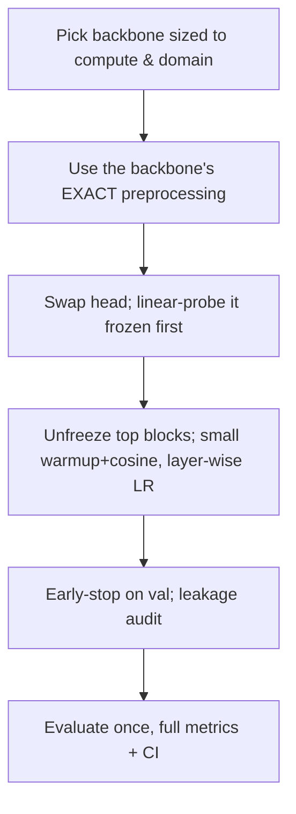

# Lecture 3 — Fine-tuning responsibly: preprocessing, schedules, and honest evaluation

Fine-tuning is easy to do and easy to do *badly*: a too-large learning rate wipes out the pretrained
knowledge, a mismatched normalization silently feeds the backbone garbage, and a leaky evaluation makes a
mediocre model look brilliant. This lecture is the discipline that keeps fine-tuning honest and effective —
the recipe most production image classifiers are actually built with.

## Match the preprocessing to the backbone, exactly

A pretrained model expects inputs normalized *exactly* as its training data were. For ImageNet backbones that
means a specific per-channel mean `[0.485, 0.456, 0.406]` and std `[0.229, 0.224, 0.225]`, a specific input
size (usually 224x224), and the same resize/crop convention. Feed differently-normalized images and every
feature is wrong — a silent, extremely common failure that produces a model that trains but never reaches the
accuracy it should. Newer torchvision weights bundle their own `transforms()`; use them and you cannot get it
wrong.

```python
weights = models.ResNet50_Weights.IMAGENET1K_V2
preprocess = weights.transforms()   # resize, center-crop, to-tensor, exact normalize
```

Two subtleties. (1) **Self-supervised and CLIP backbones use different statistics** — CLIP has its own mean/std
— so never assume ImageNet numbers for a non-ImageNet backbone. (2) **Train vs. eval preprocessing differ:**
augmentation (random crops, flips) at train time, deterministic center-crop at eval; mixing them corrupts your
metrics.

## Learning rates: warmup, magnitude, and schedule

The golden rule: **use a much smaller LR than training from scratch**, often 10-100x smaller, because you are
refining already-good weights. A too-large LR causes **catastrophic forgetting** — the pretrained features are
overwritten by the first noisy gradients and you end up *worse* than a frozen extractor. Three refinements
that strong recipes always include:

- **Warmup.** Ramp the LR linearly from ~0 over the first few hundred steps. The head starts random; warmup
  prevents its early large gradients from shocking the backbone (Goyal et al., 2017, "Accurate, Large
  Minibatch SGD").
- **Cosine decay.** Anneal the LR smoothly to near zero over training (Loshchilov & Hutter, 2017, SGDR); it
  reliably outperforms step schedules for fine-tuning.
- **Layer-wise LR decay / discriminative LRs.** As in Lecture 2: tiny LR for early layers, larger for late
  layers and the head. Early universal features should barely move.

## Regularization and augmentation still apply — more so

Everything from Week 4 carries over and matters *more*, because a large pretrained model is expressive and your
target set is small, so it overfits fast. Use augmentation (and consider strong policies — RandAugment,
Mixup/CutMix — though on very small sets over-augmentation can hurt), weight decay, and **early stopping** on a
real validation set. Watch the train/val gap every epoch: a widening gap with rising val loss is your signal to
stop.

## Honest evaluation, doubly important under pretraining

Transfer makes it *easy* to get suspiciously high numbers, for reasons that do not exist when training from
scratch. Guard hard:

- **Held-out test set, touched once.** With small datasets a single split is noisy; prefer **k-fold
  cross-validation** for a stabler estimate, and report a confidence interval, not a point number.
- **Pretraining-overlap / leakage audit.** If your target images might have appeared in the pretraining set
  (famous landmarks, stock photos, web-scraped classes — and web-scale sets like LAION make this rife), your
  test number is inflated by memorization, not transfer. Check for near-duplicates between your test set and,
  where possible, the pretraining source; at minimum, state the risk explicitly.
- **Per-class metrics and error analysis.** Report per-class precision/recall and a confusion matrix, as always
  — aggregate accuracy hides a class the model never learned.

## The practical recipe (memorize this)

1. Pick a backbone sized to your compute and domain (ResNet-50, ConvNeXt, EfficientNet; ViT if you have data
   and augmentation; MobileNet/EfficientNet-Lite for edge — a Week-11 preview).
2. Use the backbone's **exact** preprocessing.
3. Replace the head; **train it frozen (linear-probe) first** to convergence.
4. Unfreeze the top block(s); fine-tune with a **small, warmed-up, cosine-decayed, layer-wise-decayed** LR,
   augmentation, weight decay, and early stopping.
5. Evaluate **once** on held-out (or cross-validated) data with full metrics, after a leakage audit.


*The responsible fine-tuning recipe, step by step — the mainstream method, done properly.*

## Pitfalls

- **Wrong normalization for a non-ImageNet backbone.** Always read the weights' bundled transforms.
- **Unfreezing everything on step one with a from-scratch LR.** The classic catastrophic-forgetting recipe.
- **Reporting a single small-split number.** Noisy and often optimistic; cross-validate and give an interval.
- **Ignoring overlap.** On web-scale pretraining, test leakage is the default, not the exception, until you
  check.

**Takeaway:** fine-tune responsibly — the backbone's *exact* preprocessing, a much smaller (warmed-up, cosine,
layer-wise-decayed) LR to avoid catastrophic forgetting, the full Week-4 regularization toolbox, and
doubly-careful evaluation (cross-validate on small data; audit for pretraining overlap). Linear-probe the head
first, then unfreeze top-down. This is how real image classifiers get built.
