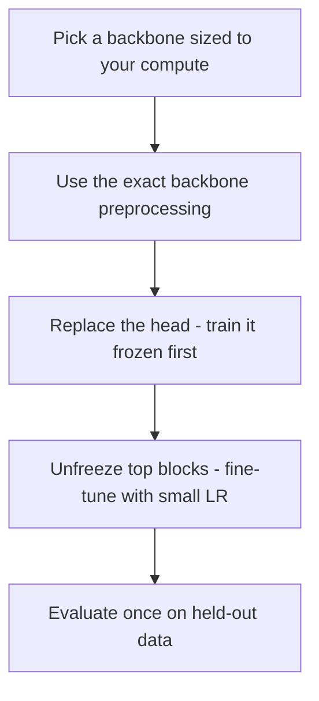

# Lecture 3 — Fine-tuning responsibly

Fine-tuning is easy to do and easy to do *badly* — a too-high LR wipes out the pretrained knowledge, and a leaky evaluation makes a mediocre model look brilliant. This lecture is the practice that keeps fine-tuning honest and effective.

## Match the preprocessing to the backbone

A pretrained model expects inputs normalized *exactly* as its training data were. For ImageNet backbones that's a specific per-channel mean and std, and a specific input size (usually 224×224). Feed differently-normalized images and the features are garbage — a silent, common failure.

```python
tf = transforms.Compose([
    transforms.Resize(256), transforms.CenterCrop(224),
    transforms.ToTensor(),
    transforms.Normalize(mean=[0.485,0.456,0.406], std=[0.229,0.224,0.225]),  # ImageNet
])
```

Torchvision's newer weights bundle their own `transforms()` — use them and you can't get the normalization wrong.

## Learning rates for fine-tuning

The golden rule: **use a much smaller LR than training from scratch** (often 10–100× smaller), because you're refining already-good weights. A too-large LR causes *catastrophic forgetting* — the pretrained features are overwritten by noisy early gradients and you're worse than a frozen extractor. Warmup helps. Discriminative LRs (lower for early layers) help more.

## Regularization still applies

Everything from Week 4 carries over: augment training data, use weight decay, watch the train/validation gap. Fine-tuning on small data overfits *fast* because the model is expressive — regularize accordingly, and lean on early stopping.

## Honest evaluation, doubly important

Transfer learning makes it *easy* to get suspiciously high numbers — sometimes because of leakage between pretraining and your test set, or because your small test set is noisy. Guard hard:
- **Held-out test set, touched once.** With small datasets, consider **cross-validation** for a stabler estimate.
- **Beware pretraining overlap.** If your test images might have been *in* ImageNet (e.g. you're classifying famous landmarks), your number is inflated — note it.
- **Report per-class metrics and an error analysis**, as always.

## The practical recipe

1. Pick a backbone sized to your compute (ResNet-18/50, EfficientNet, MobileNet for edge — a Week-11 preview).
2. Use the backbone's exact preprocessing.
3. Replace the head; train it frozen first.
4. Unfreeze the top block(s), fine-tune with a small (discriminative) LR, augmentation, and early stopping.
5. Evaluate once on held-out data with full metrics.


*The practical fine-tuning recipe, step by step.*

This recipe is how most production image classifiers are actually built. It is not a shortcut — it is the mainstream method, and doing it well is a core professional skill.

**Takeaway:** fine-tune responsibly — use the backbone's *exact* preprocessing, a much smaller LR than from-scratch (to avoid catastrophic forgetting), the full Week-4 regularization toolbox, and doubly-careful held-out evaluation (watch for pretraining overlap). Head-first, then unfreeze from the top. This recipe is how real image classifiers get built.
