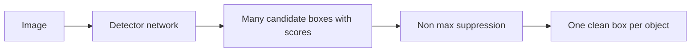

# Lecture 1 — Bounding boxes, IoU, and the detection task

Object detection outputs, for each object in an image, a **bounding box** (where) and a **class label** with a **confidence score** (what, how sure). This is fundamentally harder than classification: the number of objects varies per image, and you must both localize and classify. Everything starts with how we represent and compare boxes.

## Box representations

A box is four numbers. Two common encodings:
- **Corner form** `(x1, y1, x2, y2)` — top-left and bottom-right coordinates.
- **Center form** `(cx, cy, w, h)` — center point plus width and height.

Detectors and losses convert between them constantly; keep them straight. Coordinates are in pixels, or normalized to `[0,1]` of the image size (which survives resizing — often preferred).

## Intersection over Union: the core metric

To ask "do two boxes agree?" — a prediction vs. ground truth, or two predictions of the same object — we use **IoU**: the area of their overlap divided by the area of their union.

```python
def iou(a, b):   # boxes in (x1,y1,x2,y2)
    ix1, iy1 = max(a[0], b[0]), max(a[1], b[1])
    ix2, iy2 = min(a[2], b[2]), min(a[3], b[3])
    inter = max(0, ix2 - ix1) * max(0, iy2 - iy1)
    area_a = (a[2]-a[0]) * (a[3]-a[1])
    area_b = (b[2]-b[0]) * (b[3]-b[1])
    return inter / (area_a + area_b - inter)
```

IoU ranges from 0 (no overlap) to 1 (perfect). A prediction usually counts as "correct" if its IoU with a ground-truth box of the right class exceeds a threshold (commonly 0.5). IoU is the ruler for *everything* in detection — matching, NMS, and the mAP metric.

## Why detection is hard

- **Variable object count.** One image has 1 object, another has 40. The network's output must be flexible.
- **Scale variation.** Objects appear tiny (distant) or huge (close). Detectors need multi-scale features (feature pyramids).
- **Localization + classification jointly.** The loss combines a *classification* term (right label) and a *regression* term (right box coordinates).
- **Massive class imbalance.** The vast majority of image regions are background; only a few contain objects. Handling this imbalance is a central detector-design problem.

## The output, conceptually

Every detector, however it works internally, produces a list of candidate boxes each with a class and a score — usually *far too many*, with lots of overlapping duplicates around each real object. Turning that noisy pile into one clean box per object is the job of non-max suppression, next lecture.


*From raw image to a single clean box per object.*

**Takeaway:** detection = a variable-length list of (box, label, score). Boxes are four numbers (corner or center form); IoU — overlap ÷ union — is the universal ruler for comparing them, with 0.5 the classic 'correct' threshold. Detection is hard because object count and scale vary and background dominates. Build IoU by hand; every later metric leans on it.
