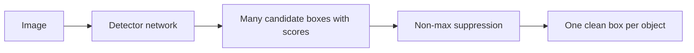

# Lecture 1 — Boxes, the IoU metric family, and why detection is hard

Object detection outputs, for each object instance in an image, a **bounding box** (where), a
**class label** (what), and a **confidence score** (how sure). This is categorically harder than
classification: the number of outputs is variable and unknown a priori, and every prediction must be both
localized and labeled. Everything in the week — matching, suppression, the loss, the metric — is built on
one primitive: how we represent boxes and measure their agreement. Get this lecture exactly right and the
rest is bookkeeping.

## Box representations and the conversions you will do constantly

A box is four numbers, in one of two encodings:

- **Corner form** `(x1, y1, x2, y2)` — top-left and bottom-right. Natural for computing overlaps.
- **Center form** `(cx, cy, w, h)` — center plus width and height. Natural for regression, because a
  network predicts *offsets* to a center and log-space scales to a size.

The conversions are exact and you must not fumble them:

    cx = (x1 + x2) / 2,  cy = (y1 + y2) / 2,  w = x2 - x1,  h = y2 - y1
    x1 = cx - w/2,  y1 = cy - h/2,  x2 = cx + w/2,  y2 = cy + h/2

Coordinates are either in pixels or **normalized to `[0,1]`** of image width/height. Normalized boxes survive
resizing — critical, because detectors resize inputs — so most training pipelines store normalized boxes and
convert to pixels only for drawing and evaluation. A subtle convention war: some datasets treat pixel indices
as inclusive (`w = x2 - x1 + 1`), others as continuous coordinates (`w = x2 - x1`). COCO uses the continuous
convention; Pascal VOC's original toolkit used the `+1`. This one-pixel discrepancy silently shifts IoU and
has caused real reproducibility gaps — always know which your dataset uses.

## Intersection over Union: the universal ruler

To ask "do two boxes agree?" — prediction vs. ground truth, or two predictions of the same object — we use
**Intersection over Union**: the area of overlap divided by the area of union.

```python
def iou(a, b):   # boxes in (x1, y1, x2, y2)
    ix1, iy1 = max(a[0], b[0]), max(a[1], b[1])
    ix2, iy2 = min(a[2], b[2]), min(a[3], b[3])
    iw, ih = max(0.0, ix2 - ix1), max(0.0, iy2 - iy1)   # clamp: no negative overlap
    inter = iw * ih
    area_a = (a[2] - a[0]) * (a[3] - a[1])
    area_b = (b[2] - b[0]) * (b[3] - b[1])
    union = area_a + area_b - inter
    return inter / union if union > 0 else 0.0
```

The `max(0, ...)` clamps are not optional — without them, disjoint boxes produce a spurious positive
"intersection" from two negative side lengths multiplying to a positive number, a classic bug. IoU ranges from
0 (disjoint) to 1 (identical), is scale-invariant, and is symmetric. A prediction usually counts as *correct*
when its IoU with a ground-truth box of the right class exceeds a threshold — classically 0.5 (Everingham et
al., *The PASCAL VOC Challenge*, IJCV 2010).

## Why IoU is a great metric but a poor loss

Here is the subtlety graduate students must internalize. IoU is the right thing to *report*, but if you use
`1 - IoU` directly as a *regression loss*, it fails: when two boxes are **disjoint**, IoU is 0 for *every*
disjoint configuration, so the gradient is zero and the loss cannot tell a box that is slightly off from one
that is wildly off. Optimization stalls. This motivates the **generalized IoU** family (Lecture covered in the
loss lecture): GIoU subtracts a penalty for the area of the smallest enclosing box not covered by the union,
restoring a gradient even when boxes do not overlap. Hold this distinction: **IoU = metric; GIoU/DIoU/CIoU =
losses that agree with the metric at overlap but stay informative when it is zero.**

## Why detection is genuinely hard — four structural problems

- **Variable, unknown object count.** One image has 1 object, another has 60. A fixed-size output vector
  cannot express this directly; detectors emit *many* candidates and prune, or (DETR) predict a fixed-size set
  with a "no-object" class.
- **Extreme scale variation.** The same class appears 10 px tall (distant) or 1000 px tall (close). A single
  feature map cannot see both; **feature pyramids** (FPN; Lin et al., CVPR 2017) fuse coarse-semantic and
  fine-spatial features so small and large objects are each handled at an appropriate resolution.
- **Joint localization + classification.** The loss is inherently multi-task: a classification term (right
  label / background) plus a regression term (right coordinates), and the two must be balanced.
- **Overwhelming background.** In a dense predictor, well over 99% of candidate locations are background. This
  foreground/background imbalance is *the* central training pathology and drives focal loss, hard-negative
  mining, and sampling — the subject of a later lecture.

## The output, conceptually

Every detector, whatever its internals, produces a list of candidate boxes each with a class and score —
usually *far too many*, clustered in noisy duplicates around each real object. Turning that pile into one
clean box per object is non-maximum suppression, next lecture.


*From raw image to one clean box per object.*

## Worked micro-example

Box A = (0, 0, 2, 2), area 4. Box B = (1, 1, 3, 3), area 4. Intersection = (1,1,2,2) → area 1. Union =
4 + 4 − 1 = 7. IoU = 1/7 ≈ 0.143. Now shift B far away to (10,10,12,12): the clamped intersection is 0, IoU
= 0 — and it stays 0 whether B is at 10 or 100, which is exactly why `1−IoU` gives no gradient to pull it
back. That single observation is the seed of the whole GIoU literature.

**Takeaway:** a detection is a variable-length set of (box, label, score). Boxes live in corner or center form
(convert cleanly; know your dataset's `+1` convention); IoU — overlap ÷ union, with clamped intersection — is
the scale-invariant ruler for comparing them, with 0.5 the classic "correct" threshold. IoU is the right
metric but a poor loss because it vanishes for disjoint boxes. Detection is hard because object count and scale
vary, the task is joint localize+classify, and background dominates. Build IoU by hand; everything later leans
on it.
