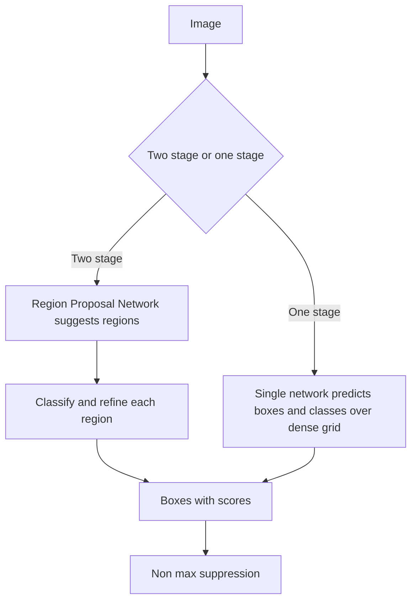

# Lecture 2 — Non-max suppression & detector architectures

A detector proposes many overlapping boxes per object. **Non-maximum suppression (NMS)** collapses them to one. Then we survey how detectors actually generate those boxes — the design space you'll navigate when choosing a model.

## Non-maximum suppression, by hand

You saw NMS thin edges in Canny (Week 2). Here it thins boxes. The greedy algorithm:

1. Sort all candidate boxes by confidence score, highest first.
2. Take the top box, add it to the kept list, and remove every remaining box whose IoU with it exceeds a threshold (e.g. 0.5) — those are duplicates of the same object.
3. Repeat with the next-highest surviving box until none remain.

```python
def nms(boxes, scores, iou_thresh=0.5):
    idxs = scores.argsort()[::-1].tolist()   # high score first
    keep = []
    while idxs:
        i = idxs.pop(0)
        keep.append(i)
        idxs = [j for j in idxs if iou(boxes[i], boxes[j]) < iou_thresh]
    return keep
```

NMS runs *per class* (you don't suppress a cat box because it overlaps a nearby dog). It's applied at inference to almost every detector. Its threshold trades duplicates against merged-together objects: too high keeps duplicates, too low erases two real adjacent objects.

## Two-stage detectors

**Two-stage** (R-CNN family, culminating in **Faster R-CNN**):
1. A **Region Proposal Network** suggests ~1000 class-agnostic regions likely to contain *something*.
2. A second stage classifies each region and refines its box.

Two stages are typically **more accurate** (especially for small objects) but **slower**. The workhorse when accuracy matters more than speed.

## One-stage detectors

**One-stage** (YOLO, SSD, RetinaNet) skip proposals: a single network directly predicts boxes and classes over a dense grid in one forward pass.
- **Much faster** — real-time capable, which is why YOLO dominates live/video and edge use.
- Historically slightly less accurate, but modern one-stage detectors have closed much of the gap.
- RetinaNet's **focal loss** specifically fixed one-stage detectors' background-imbalance problem by down-weighting easy background examples.


*Two-stage propose-then-classify versus one-stage dense prediction, both feeding into NMS.*

## Anchors vs. anchor-free

- **Anchor-based** detectors predefine a set of reference boxes ("anchors") of various sizes/aspect ratios at each location, and predict *offsets* from them. Anchors give the network a starting shape to refine, but add hyperparameters (which anchor sizes?).
- **Anchor-free** detectors (FCOS, CenterNet, newer YOLOs) predict boxes directly — e.g. from object centers — removing anchor tuning. The modern trend leans anchor-free.

## Choosing

Real-time or edge → one-stage (YOLO). Maximum accuracy, small objects, offline → two-stage (Faster R-CNN). You'll rarely implement these from scratch; you'll *choose* one, fine-tune it (transfer learning applies here too), and evaluate it.

**Takeaway:** NMS greedily keeps the highest-scoring box and deletes its high-IoU duplicates, per class — build it by hand. Detectors split into two-stage (propose-then-classify: accurate, slower) and one-stage (dense single-pass: fast, real-time), and into anchor-based (refine reference boxes) vs. anchor-free (predict directly). Pick by your speed/accuracy budget.
