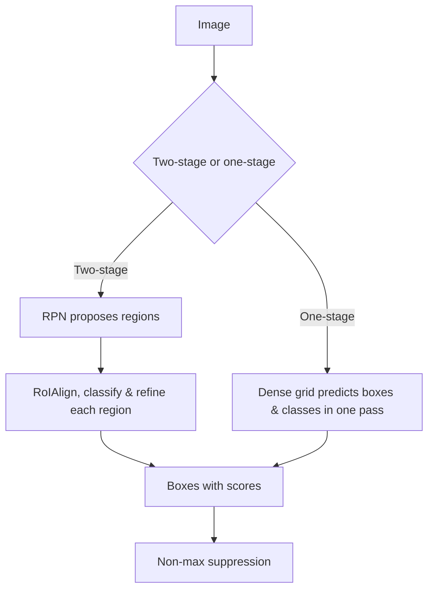

# Lecture 2 — Non-max suppression (greedy and soft) & the detector design map

A detector proposes many overlapping boxes per object. **Non-maximum suppression (NMS)** collapses
them to one. Then we survey how detectors actually *generate* those boxes — the design map you navigate when
choosing or fine-tuning a model. Two ideas do the heavy lifting: suppression as a greedy approximation to a
combinatorial cleanup, and the axes (stage count, anchor policy, set-vs-dense) along which every architecture
sits.

## Greedy non-maximum suppression, by hand

You saw NMS thin edges in Canny (Week 2); here it thins boxes. The greedy algorithm, run **per class**:

1. Sort all candidate boxes by confidence score, highest first.
2. Take the top box, add it to the kept list, and delete every remaining box whose IoU with it exceeds a
   threshold `N_t` (e.g. 0.5) — those are duplicate detections of the same object.
3. Repeat with the next-highest survivor until none remain.

```python
def nms(boxes, scores, iou_thresh=0.5):
    idxs = scores.argsort()[::-1].tolist()   # high score first
    keep = []
    while idxs:
        i = idxs.pop(0)
        keep.append(i)
        idxs = [j for j in idxs if iou(boxes[i], boxes[j]) < iou_thresh]
    return keep
```

NMS is **per class** — you do not suppress a cat box because it overlaps a nearby dog. It is applied at
inference to nearly every classical detector. Its threshold trades duplicates against merged objects: too
**high** keeps duplicates; too **low** erases one of two genuinely adjacent objects (two people hugging).

## Greedy NMS as an approximation — and Soft-NMS

Greedy NMS makes a hard decision: a lower-scoring box overlapping the winner by more than `N_t` is *deleted
outright*. That is brutal when two real objects overlap heavily — the correct second box is discarded because
it overlaps the first. **Soft-NMS** (Bodla et al., "Soft-NMS — Improving Object Detection With One Line of
Code," ICCV 2017) replaces deletion with **score decay**: instead of removing an overlapping box, multiply its
score by a factor that falls as IoU rises (a linear `1 − IoU` or a Gaussian `exp(−IoU²/σ)`), then re-sort and
continue. A box that overlaps the winner a lot is demoted but survives, so if it is actually a second object it
can still be kept at a lower rank. Soft-NMS costs one line and reliably lifts AP on crowded scenes. The lesson
is conceptual: NMS is a **greedy approximation** to a set-cleanup objective (keep a high-scoring subset with
low mutual overlap), and softening the greedy rule buys recall on crowds.

## Two-stage detectors: propose, then classify

The **R-CNN family**, culminating in **Faster R-CNN** (Ren et al., "Faster R-CNN: Towards Real-Time Object
Detection with Region Proposal Networks," NeurIPS 2015):

1. A **Region Proposal Network (RPN)** slides over a feature map and emits ~1000 class-agnostic proposals —
   regions likely to contain *something* — each with an objectness score, by regressing offsets from anchors.
2. **RoI pooling / RoIAlign** crops a fixed-size feature for each proposal, and a second head classifies it and
   refines its box.

Two stages are typically **more accurate**, especially for small objects, because proposals concentrate
computation on promising regions and the second head sees a tighter feature. The cost is **speed** — two
passes of heads. This is the workhorse when accuracy outranks latency.

## One-stage detectors: dense prediction in a single pass

**One-stage** detectors (YOLO, Redmon et al., CVPR 2016; SSD, Liu et al., ECCV 2016; RetinaNet, Lin et al.,
ICCV 2017) skip proposals: a single network densely predicts boxes and class scores over a grid of locations
in one forward pass.

- **Much faster** — real-time capable, which is why YOLO dominates live video and edge deployment (Week 11).
- Historically slightly less accurate, chiefly because the dense grid drowns in easy background; modern
  one-stage detectors closed most of the gap.
- **RetinaNet's focal loss** specifically fixed the one-stage background-imbalance problem by down-weighting
  easy negatives (derived in the loss lecture), letting a one-stage detector match two-stage accuracy.


*Two-stage propose-then-classify vs. one-stage dense prediction, both feeding NMS.*

## Anchors vs. anchor-free

- **Anchor-based** detectors predefine reference boxes ("anchors") of several sizes and aspect ratios at every
  location and predict *offsets* from them. Anchors give the regressor a sensible starting shape, but add
  hyperparameters (which sizes? which ratios? how many?) that must be tuned to the dataset's object statistics.
- **Anchor-free** detectors (FCOS, Tian et al., ICCV 2019; CenterNet, Zhou et al., 2019; newer YOLOs) predict
  boxes directly — e.g. from each foreground location predict distances to the four box sides, or predict object
  *centers* as keypoints. This removes anchor tuning and the anchor-matching heuristics. The modern trend leans
  anchor-free, and DETR (next-lecture set prediction) removes anchors *and* NMS.

## Choosing — the engineering judgment

Real-time / edge / video → one-stage (YOLO). Maximum accuracy, many small objects, offline batch → two-stage
(Faster R-CNN). You will rarely implement these from scratch; you will *choose* one, fine-tune it (transfer
learning from Week 5 applies directly), and evaluate it — which is why the metric lecture matters as much as
the architecture.

**Takeaway:** greedy NMS keeps the top-scoring box and deletes its high-IoU duplicates, per class — build it by
hand — and Soft-NMS softens the delete into a score decay to save recall in crowds. Detectors split by stage
count (two-stage propose-then-classify: accurate, slower; one-stage dense: fast, real-time) and anchor policy
(anchor-based: refine reference boxes; anchor-free: predict directly). Pick on your speed/accuracy budget; the
next lecture removes both anchors and NMS entirely.
