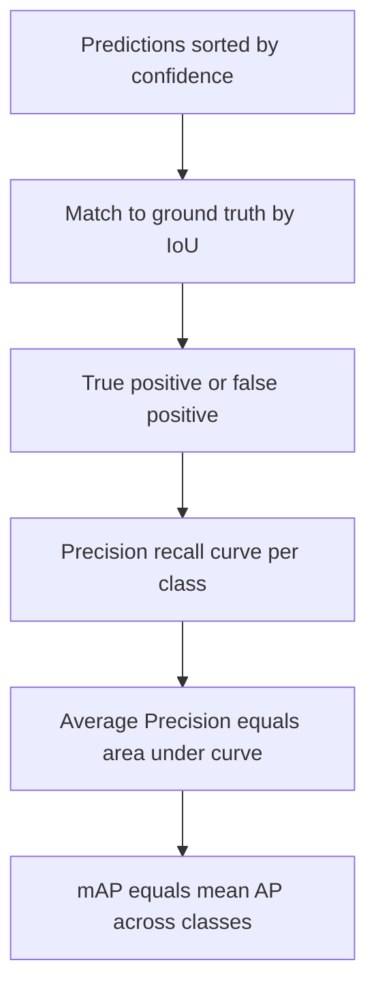

# Lecture 3 — Training detectors & measuring mAP

How do you *train* something that outputs a variable-length list of boxes, and how do you put a single honest number on its quality? The answers — a matched multi-part loss, and **mean Average Precision** — are what you need to use and evaluate detectors responsibly.

## The detection loss

During training, each predicted box (or anchor) is **matched** to a ground-truth box by IoU: high-IoU predictions are "responsible" for that object (positives), low-IoU ones are background (negatives). The loss then has two parts:
- **Classification loss** — is the label (or background) right? Often focal loss in one-stage detectors to combat background dominance.
- **Localization (regression) loss** — are the box coordinates right? Smooth-L1 or an IoU-based loss (GIoU/DIoU) on the positives only.

The background/foreground imbalance (thousands of background boxes per object) is *the* central training difficulty, handled by focal loss, hard-negative mining, or sampling.

## Data and transfer learning

Detection datasets (COCO, Pascal VOC) annotate every object's box and class — expensive to label. You almost always **start from a detector pretrained on COCO** and fine-tune on your classes: transfer learning (Week 5) applies directly, and for the same reasons.

## mean Average Precision (mAP): the metric

Detection needs a metric combining *localization* and *classification* over *all* objects. Building it up:

1. Fix an IoU threshold (say 0.5). A prediction is a **true positive** if it matches an unmatched ground-truth box of the right class at IoU ≥ threshold; otherwise a **false positive**. Unmatched ground truths are **false negatives**.
2. Sort predictions by confidence and sweep the threshold to trace a **precision–recall curve** for each class.
3. **Average Precision (AP)** is the area under that PR curve — one number per class summarizing the precision/recall trade-off.
4. **mAP** is the mean of AP across all classes.

*Building mAP from matched predictions up to one summary number.*

**COCO mAP** averages further over IoU thresholds from 0.5 to 0.95 (written **mAP@[.5:.95]**), rewarding tighter localization; **mAP@0.5** (Pascal VOC style) is looser. Always state *which* mAP you mean — they aren't comparable.

## Reading mAP honestly

- A high mAP@0.5 with low mAP@0.75 means the detector *finds* objects but localizes loosely.
- Report **per-class AP**, not just the mean — a detector can be great on common classes and useless on rare ones.
- Watch small-object AP separately; it's usually the weak spot.
- As always: evaluate on held-out images, and beware label errors in your ground truth (they cap measurable mAP).

**Takeaway:** detectors train with a matched two-part loss — classification (often focal, to fight background dominance) plus box regression on positives — usually fine-tuned from a COCO-pretrained model. Evaluate with mAP: per-class area under the precision–recall curve, averaged, at a stated IoU threshold (mAP@0.5 vs. COCO mAP@[.5:.95]). Report per-class and small-object AP, not just the headline mean.
