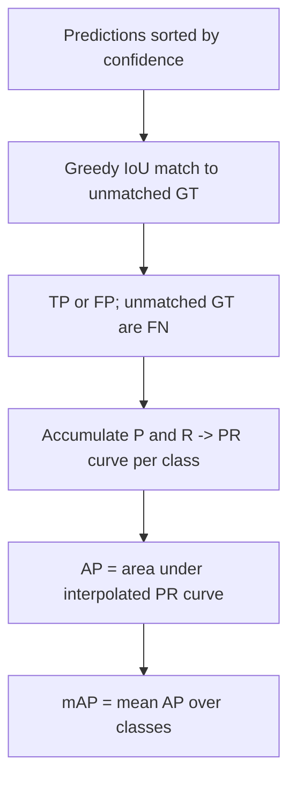

# Lecture 3 — Training detectors, and computing COCO mAP correctly by hand

How do you *train* something whose output is a variable-length list of boxes, and how do you put a
single honest number on its quality? The answers — a matched multi-part loss and **mean Average Precision** —
are what you need to use and evaluate detectors responsibly. This lecture makes both exact; sloppiness here is
the most common way detection results become non-reproducible.

## The detection loss: assignment, then a two-part objective

Training first solves **label assignment**: each predicted box (or anchor) is matched to a ground-truth box.
The classic rule is IoU-based — a prediction with IoU ≥ 0.5 to a ground truth is a **positive** (responsible
for that object); IoU < 0.4 is a **negative** (background); the gap is ignored to avoid ambiguous supervision
(the Faster R-CNN / RetinaNet convention). Given the assignment, the loss has two parts:

- **Classification loss** — is the predicted label (or "background") correct? Cross-entropy in two-stage
  detectors; **focal loss** in dense one-stage detectors to combat background dominance.
- **Localization (regression) loss** — are the coordinates right? Smooth-L1 on encoded offsets, or an
  IoU-based loss (**GIoU/DIoU/CIoU**) that optimizes the metric directly — applied **only to positives**, since
  background boxes have no target to regress to.

The foreground/background imbalance — thousands of background candidates per object — is *the* central training
difficulty, handled by focal loss (derived next lecture), hard-negative mining (SSD keeps the hardest negatives
at a fixed 3:1 ratio), or balanced sampling (Faster R-CNN samples 256 anchors per image at ~1:1).

## Data and transfer learning

Detection datasets — **COCO** (Lin et al., "Microsoft COCO," ECCV 2014; 80 classes, ~118k train images) and
Pascal VOC (20 classes) — annotate every object's box and class, which is expensive to label. You almost always
**start from a COCO-pretrained detector** and fine-tune on your classes: transfer learning (Week 5) applies
directly and for the same reasons — the backbone's features are reusable and your labeled set is small.

## mean Average Precision (mAP): the metric, built up exactly

Detection needs one number combining localization *and* classification over *all* objects. Build it in five
precise steps, per class:

1. **Fix an IoU threshold** `t` (say 0.5). Sort all predictions for the class by confidence, high to low.
2. **Greedily match** each prediction, in score order, to the highest-IoU *unmatched* ground-truth box of the
   same class. A match with IoU ≥ `t` is a **true positive (TP)**; otherwise (no unmatched GT at IoU ≥ `t`) it
   is a **false positive (FP)**. Each ground truth can be matched **at most once** — a second prediction on the
   same object is a duplicate FP, which is exactly how the metric punishes missing NMS. Ground truths never
   matched are **false negatives (FN)**.
3. **Sweep the confidence threshold** from high to low, accumulating TP and FP, and at each step compute
   `precision = TP/(TP+FP)` and `recall = TP/(TP+FN) = TP/(#GT)`. This traces a **precision-recall curve**.
4. **Average Precision (AP)** is the area under that (interpolated) PR curve. Two interpolation conventions
   exist and are *not* interchangeable: Pascal VOC 2007 used **11-point** interpolation (average of max
   precision at recall ∈ {0, 0.1, …, 1.0}); COCO and VOC 2010+ use **all-point** interpolation (integrate the
   monotonized precision envelope over all recall levels). State which you use.
5. **mAP** is the mean of AP across all classes.

*Building mAP from matched predictions up to one summary number.*

## COCO mAP: averaging over IoU thresholds

**COCO's primary metric** goes further: it averages AP over **ten IoU thresholds** from 0.50 to 0.95 in steps
of 0.05, written **mAP@[.5:.95]** (and reports mAP@0.5 and mAP@0.75 separately). Averaging over stricter
thresholds *rewards tight localization* — a box that is merely "on the object" scores well at 0.5 but poorly at
0.9. COCO also reports **AP_S / AP_M / AP_L** for small/medium/large objects and **AR** (average recall at
fixed detection budgets). Because these definitions differ, **mAP@0.5 and mAP@[.5:.95] are not comparable** —
always say which you mean. Quoting "mAP = 0.62" without the protocol is meaningless.

## Reading mAP honestly

- **High mAP@0.5, low mAP@0.75** ⇒ the detector *finds* objects but localizes loosely — a box-regression or
  anchor-scale problem, not a recognition problem.
- **Report per-class AP**, not just the mean: a detector can ace common classes and be useless on rare ones,
  and the mean hides it.
- **Watch AP_S separately** — small objects are almost always the weak spot; feature-pyramid depth and input
  resolution are the usual levers.
- **Evaluate on held-out images**, and beware **label errors** in your ground truth: mislabeled or missing GT
  boxes cap the measurable mAP no matter how good the detector is (a genuinely correct detection on an unlabeled
  object is scored as a false positive).

**Takeaway:** detectors train with an assignment step (match predictions to GT by IoU) followed by a matched
two-part loss — classification (often focal, to fight background dominance) plus box regression on positives —
usually fine-tuned from a COCO-pretrained model. Evaluate with mAP: per-class area under the interpolated
precision-recall curve, averaged, at a *stated* IoU threshold — mAP@0.5 (loose) vs. COCO mAP@[.5:.95] (rewards
tight boxes). Match greedily, one GT per prediction, and report per-class and small-object AP, never just the
headline mean.
