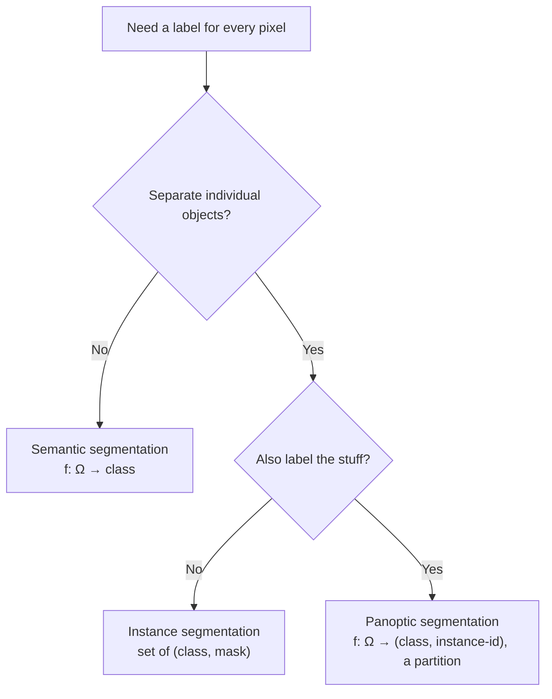

# Lecture 1 — Semantic, instance & panoptic: dense prediction as a structured problem

Classification emits one label per image; detection emits a set of boxes; **segmentation** emits a
label for *every pixel*. But "label every pixel" hides three genuinely different problems, and the differences
are not cosmetic — they change what output space you are predicting over, and therefore what network, loss, and
metric are even well-posed.

## Three tasks, precisely

Let an image have pixel set `Ω` (the H×W grid) and a label vocabulary `L`. Partition `L` into **"stuff"** classes
(amorphous, uncountable: sky, road, grass) and **"things"** classes (countable objects: car, person, dog).

- **Semantic segmentation.** Learn `f : Ω → L`. Every pixel gets a *class*; all cars collapse to the single "car"
  label. The output is one integer map. This is per-pixel classification — nothing separates car #1 from car #2.
- **Instance segmentation.** Learn a set of `(class, binary-mask)` pairs, one per *object*. Now car #1 and car #2 are
  distinct masks with distinct IDs. Stuff is usually ignored — you only segment countable things. Note the output is
  a *variable-length set*, exactly like detection, which is why instance segmentation inherits detection's machinery.
- **Panoptic segmentation.** The unification (Kirillov et al., *Panoptic Segmentation*, CVPR 2019): learn
  `f : Ω → L × ℕ` where every pixel gets a class *and*, if it is a thing, an instance ID; stuff pixels get a class and
  a null/shared ID. Crucially, the output is a **non-overlapping** partition — no pixel has two labels, no pixel is
  unlabeled. Panoptic is the most complete scene description and forced the field to define a single coherent metric
  (Panoptic Quality, Lecture 3) rather than bolting semantic mIoU next to instance mask-AP.

*Picking the task from what the pixels must represent — and note the output space changes with each branch.*

## Why the choice is a requirements decision, not a preference

Ask: *do I need to count / separate individual objects?* "How much of this field is planted?" is **semantic** — a
class map suffices, and instance IDs are wasted effort. "How many cars are in the lot?" needs **instance**. "Give me a
complete, gap-free scene layout for a planner" needs **panoptic**. Getting this wrong is a real project error: teams
routinely reach for Mask R-CNN (heavy, box-mediated) when a lightweight semantic U-Net would answer the actual
question, or run semantic segmentation and then discover downstream they cannot tell two touching cells apart.

## Why dense prediction is genuinely harder than classification

1. **The output is high-dimensional and structured.** You predict `|Ω|` coupled labels, not one. Neighboring pixels
   are highly correlated (a spatial Markov structure); a good model exploits that (CRFs historically did so
   explicitly; modern nets do so implicitly through large receptive fields). Treating pixels as independent — which the
   naive per-pixel cross-entropy loss does — is a modeling approximation you should be aware of.
2. **Error concentrates at boundaries.** Interior pixels are easy; the hard, ambiguous, and disproportionately
   error-prone pixels are the O(√area) boundary pixels. A metric that averages over all pixels can be dominated by
   easy interior and never "see" a systematically wrong boundary. This is why boundary-aware metrics exist (Lecture 3).
3. **Labels are expensive and noisy.** A per-pixel mask costs far more to annotate than an image label or even a box —
   Cityscapes reports ~1.5 hours per image for fine annotation (Cordts et al., CVPR 2016). And annotators genuinely
   *disagree* at boundaries, so the ground truth itself has irreducible noise: there is a ceiling on any achievable
   score, and "the model is wrong" and "the label is wrong" are not always separable.
4. **Class imbalance is severe.** A tumor may be <1% of pixels; a lane marking a fraction of a percent. A loss that
   averages per-pixel is dominated by background, so the network can score well by ignoring the very thing you care
   about (the pixel-scale version of the accuracy trap from Weeks 2 and 4). This motivates the specialized losses of
   Lecture 4.

## The crisp distinction to carry forward

- **Semantic:** "what class is this pixel?" — same-class objects merge into one blob.
- **Instance:** "which object is this pixel, and what class?" — each object separated; stuff ignored.
- **Panoptic:** both, as a gap-free non-overlapping partition of the whole image.

Everything else this week — encoder-decoders, atrous convolution, mask branches, query-based prediction, IoU/Dice/PQ,
and the loss zoo — exists to make one of these three well-posed predictions accurate, and to measure it honestly.

**Takeaway:** segmentation is structured per-pixel prediction, and the three tasks differ in *output space*, not just
resolution: semantic maps pixels to classes (objects merge), instance maps to a variable-length set of masks (stuff
ignored), panoptic to a gap-free labeled+instanced partition. It is harder than classification because the output is
high-dimensional and spatially coupled, error lives at thin boundaries, labels are costly and noisy, and class
imbalance is severe — each of which drives an architecture or loss choice in the rest of the week.
