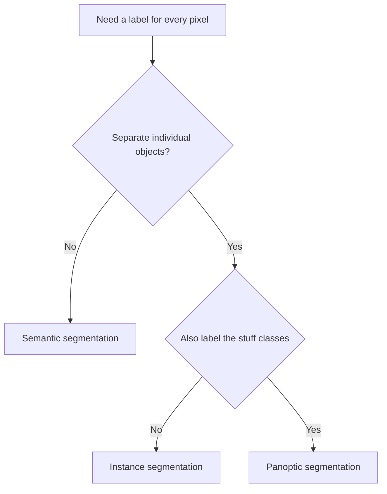

# Lecture 1 — Semantic, instance & panoptic segmentation

Segmentation is *dense prediction*: instead of one label per image (classification) or a box per object (detection), you predict a label for **every pixel**. But "label every pixel" means different things, and the differences define the task.

## Semantic segmentation

Every pixel is assigned a **class** — road, car, person, sky. All cars are the same "car" label; the model does **not** separate one car from another. The output is a label map the same height and width as the image, with an integer class per pixel. Think of it as per-pixel classification.

Uses: scene understanding for self-driving (drivable area), land-cover mapping from satellites, medical organ delineation.

## Instance segmentation

Every pixel belonging to an **object** gets both a class *and* an instance ID — car #1, car #2, car #3 are distinct masks. It combines detection (find each object) with a per-object mask (its exact pixels). Background/"stuff" (sky, road) is usually *not* segmented — only countable "things."

Uses: counting objects, robotic grasping (which exact object to pick), photo editing (cut out *this* person).

## Panoptic segmentation

The unifying task: **every** pixel gets a label, and countable "things" also get instance IDs while amorphous "stuff" (sky, grass) just gets a class. Semantic + instance in one coherent output, with no overlaps or gaps. It's the most complete scene description and the current research frontier.

## The key distinction, crisply

- **Semantic:** "what class is this pixel?" — cars are one blob.
- **Instance:** "which object is this pixel, and what class?" — each car separate, stuff ignored.
- **Panoptic:** both, for every pixel.

Choosing the task is a *requirements* decision: do you need to separate individual objects (instance/panoptic) or is a class map enough (semantic)? Counting cars needs instance; "how much of this field is crop?" needs only semantic.

*Picking a segmentation task from what the pixels need to represent.*

## Why it's harder than classification

- **Output is high-dimensional** — a full-resolution label map, not a single number.
- **Boundaries are hard** — pixels at object edges are ambiguous and dominate the error.
- **Labels are expensive** — annotating per-pixel masks is far costlier than image labels or even boxes, which shapes what data you'll have.

**Takeaway:** segmentation predicts a label per pixel. Semantic = per-pixel class (objects of a class merge); instance = separate each object with a mask (stuff ignored); panoptic = both, everywhere. Pick the task from whether you must separate individual objects. Dense prediction is harder — boundaries are ambiguous and masks are expensive to label.
