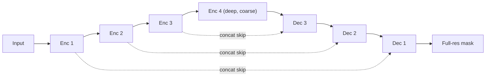

# Lecture 2 — The resolution tension: FCN, U-Net, DeepLab, and Mask R-CNN

To output a full-resolution label map, a network faces a genuine conflict. To know *what* is in a region it
needs a **large receptive field**, which classification CNNs buy by downsampling — five stride-2 stages take a
224×224 image down to 7×7, a 32× reduction. But to place a boundary *where* it belongs it needs **high spatial
resolution**, which downsampling destroys. This single tension — receptive field versus resolution — is the axis on
which every segmentation architecture is designed. This lecture derives the three canonical escapes.

## Quantifying the tension: receptive field vs. resolution

Stack convolutions and strides and the theoretical receptive field grows, while resolution shrinks. For a chain of
layers with kernel sizes `k_i`, strides `s_i`, and cumulative stride `S_i = Π_{j<i} s_j`, the receptive field grows as

    RF_out = RF_in + (k − 1)·S,     applied layer by layer.

A ResNet-50 backbone reaches a receptive field of hundreds of pixels but at 1/32 resolution: a single output cell
"sees" a wide context but *is* a 32×32 patch of the input. You cannot recover a pixel-precise boundary from a 7×7
grid — the information was thrown away. The escapes below each restore either resolution or receptive field without
paying the other's price.

## Escape 1 — Fully-convolutional nets and learned upsampling (FCN)

Long, Shelhamer & Darrell (*Fully Convolutional Networks for Semantic Segmentation*, CVPR 2015) made the key move:
replace the classifier's final fully-connected layers with 1×1 convolutions, so the network outputs a coarse *class
map* instead of a vector, then **upsample** it back to full resolution with learned **transposed convolutions**
(a.k.a. deconvolution — a convolution whose forward pass is the backward pass of a strided conv). FCN also added
**skip connections** from earlier, higher-resolution stages (FCN-8s fuses the 1/8, 1/16, 1/32 predictions), because
the 1/32 prediction alone is hopelessly coarse. This is the birth of the *encoder–decoder*: an encoder that
downsamples to build semantics, a decoder that upsamples to recover space.

Pitfall: naive transposed convolution produces **checkerboard artifacts** (Odena et al., 2016) because kernel windows
overlap unevenly. The common fix is *resize (bilinear/nearest) then convolve*, which most modern decoders use.

## Escape 2 — U-Net: symmetric decoder with dense skips

Ronneberger, Fischer & Brox (*U-Net*, MICCAI 2015), designed for biomedical microscopy with *tiny* training sets,
made skips the centerpiece. The architecture is a symmetric "U": a contracting encoder and an expansive decoder, with
a skip connection at **every** resolution level that *concatenates* the encoder's high-resolution feature map onto the
decoder's upsampled feature map before the next conv block.

The argument for why skips are decisive: the encoder's deep features know *what* (semantics) but have lost *where*
(they are coarse); the shallow encoder features still hold *where* (sharp edges) but not *what*. Concatenation lets
the decoder's conv learn to fuse both — semantic context from the deep path, precise localization from the skip.
Ablate the skips and masks degrade to blurry blobs; add them and masks hug edges (you will verify this in Challenge 1).

*U-Net: a skip at every level fuses deep 'what' with shallow high-resolution 'where'.*

U-Net remains the default for medical and small-data segmentation; the self-configuring **nnU-Net** (Isensee et al.,
*Nature Methods* 2021) showed a well-tuned U-Net still beats most fancier architectures on medical benchmarks — a
sobering reminder that data and configuration often dominate architecture.

## Escape 3 — DeepLab: atrous convolution enlarges the receptive field *without* downsampling

Chen et al. (*DeepLab*, TPAMI 2018) took the opposite tack: instead of downsampling and then fighting to upsample, keep
resolution high and enlarge the receptive field directly with **atrous (dilated) convolution**. An atrous conv with
dilation rate `r` inserts `r−1` zeros between kernel taps, so a 3×3 kernel covers a `(2r+1)×(2r+1)` field but uses only
9 weights and no extra compute — its effective stride is 1, so resolution is preserved.

Two more DeepLab ideas: **Atrous Spatial Pyramid Pooling (ASPP)** runs several atrous convs at different rates in
parallel (plus image-level pooling) to capture objects at multiple scales in one layer — a wide multi-rate receptive
field with full resolution. DeepLabV3+ adds a light decoder to sharpen boundaries. DeepLab trades the memory of
high-resolution feature maps for the boundary fidelity FCN had to reconstruct.

## Instance segmentation: Mask R-CNN and the RoIAlign argument

Instance masks reuse detection. He et al. (*Mask R-CNN*, ICCV 2017) extend Faster R-CNN (Week 6) with a third head: a
small FCN **mask branch** that, for each detected RoI, predicts a per-class binary mask (typically 28×28) inside the
box. "Detect then mask." The subtle, prize-winning contribution is **RoIAlign**. Faster R-CNN's RoIPool *quantizes*
RoI coordinates twice (to the feature grid, then into pooling bins), misaligning features by up to a pixel or two —
tolerable for a box, ruinous for a pixel-precise mask. RoIAlign removes both quantizations: it samples feature values
at exact fractional RoI coordinates with **bilinear interpolation**, keeping the mask branch spatially faithful. This
single fix gave a large mask-AP jump — a clean lesson that sub-pixel alignment matters enormously for dense outputs.

## Choosing among them

- Semantic, medical/satellite, limited data → **U-Net** (often nnU-Net), the designed-for-this default.
- Semantic, complex multi-scale scenes → **DeepLabV3+** (atrous + ASPP + decoder).
- Instance (separate objects) → **Mask R-CNN** or a one-stage instance segmenter (YOLO-seg, SOLOv2).
- Panoptic / state of the art → query-based unified models (Lecture 5).
- You will almost always fine-tune a pretrained backbone rather than train from scratch — the encoder is exactly the
  transfer-learning backbone from Weeks 4–5.

**Takeaway:** segmentation is a fight between receptive field and resolution. FCN/U-Net *downsample then learn to
upsample*, with skip connections fusing deep semantics and shallow detail (the reason masks hug boundaries); DeepLab
*keeps resolution and dilates* with atrous convolution + ASPP for multi-scale context at full resolution; Mask R-CNN
gets instance masks by adding an FCN mask head to a detector, with RoIAlign's bilinear sub-pixel sampling as the
decisive fix that box-based detectors could ignore but pixel masks cannot.
