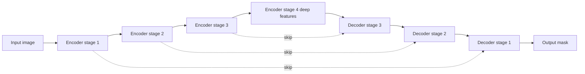

# Lecture 2 — Encoder–decoders, U-Net & Mask R-CNN

To output a full-resolution label map, a network must first *understand* the image (which needs coarse, deep features) and then *recover spatial detail* (to place labels precisely). The **encoder–decoder** architecture does exactly this, and it dominates segmentation.

## The problem with a plain CNN

A classification CNN downsamples aggressively (Week 3) — great for "what," terrible for "where." By the final layer, spatial resolution is tiny; you can't recover pixel-precise boundaries from a 7×7 feature grid. Segmentation needs both semantic depth *and* spatial precision.

## The encoder–decoder solution

- **Encoder** (downsampling path) — a standard CNN backbone that reduces resolution while building rich, deep features. Captures *what* is in the image. Often a pretrained backbone (transfer learning again).
- **Decoder** (upsampling path) — progressively *upsamples* the deep features back to full resolution (via transposed convolutions or interpolation + conv), refining the coarse "what" into a dense "where."

The output is a per-pixel class map at input resolution.

## U-Net and skip connections

The decisive trick, from **U-Net** (born in biomedical imaging): **skip connections** that copy high-resolution features from each encoder stage directly to the matching decoder stage. Why it matters: the encoder's deep features know *what* but have lost *where*; the early encoder features still hold *where* (sharp edges) but not *what*. Skips let the decoder combine both — semantic context from deep layers, precise boundaries from shallow ones. Without skips, masks are blurry blobs; with them, they hug object edges.


*Skip connections carry shallow, high-resolution features across to the matching decoder stage.*

```
encoder: img -> f1 -> f2 -> f3 -> f4 (deep, coarse)
decoder: f4 -> up + skip(f3) -> up + skip(f2) -> up + skip(f1) -> mask
```

U-Net and its descendants (DeepLab with atrous/dilated convolutions and a pyramid pooling module for multi-scale context) are the semantic-segmentation workhorses.

## Mask R-CNN for instance segmentation

Instance segmentation reuses detection: **Mask R-CNN** extends Faster R-CNN (Week 6) by adding a small **mask branch** that predicts a binary mask for *each detected box*. So it detects each object (box + class, with NMS) and then segments the pixels *inside* each box. This "detect then mask" design is why instance segmentation inherits detection's machinery — and its metrics blend detection's mAP with mask IoU.

## Choosing an architecture

- Semantic, medical/satellite, limited data → **U-Net** (it was designed for exactly this).
- Semantic, complex scenes, multi-scale → **DeepLab**.
- Instance (separate objects) → **Mask R-CNN** or a modern one-stage instance segmenter (YOLO-seg).
- You'll typically fine-tune a pretrained one, not build from scratch.

**Takeaway:** segmentation needs semantic depth *and* spatial precision, so it uses an encoder (downsample, understand 'what') plus a decoder (upsample, recover 'where'). U-Net's skip connections fuse deep semantics with shallow high-resolution detail — the reason masks hug boundaries. Mask R-CNN gets instance masks by adding a per-object mask branch to a detector.
