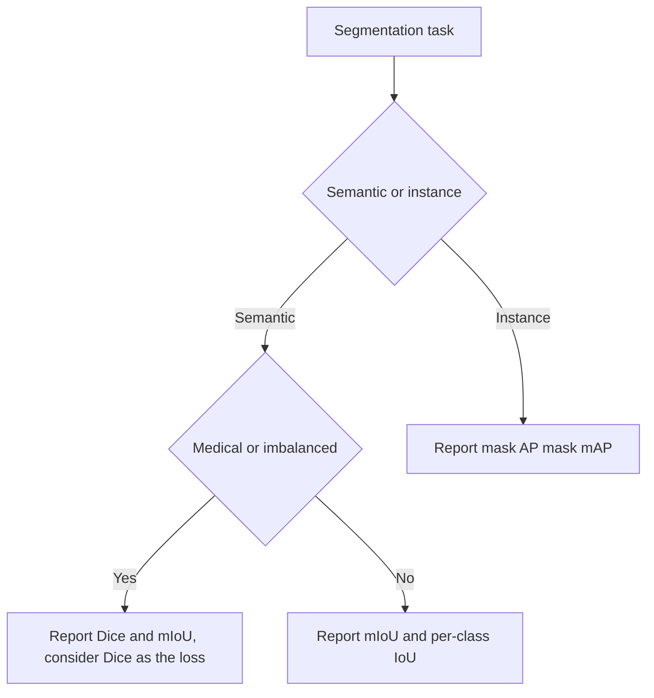

# Lecture 3 — Measuring segmentation honestly

A segmentation model that's "99% pixel-accurate" can be worthless. The right metrics — IoU and Dice, averaged properly — expose what pixel accuracy hides. Measuring masks honestly is this lecture.

## Why pixel accuracy lies

Pixel accuracy is the fraction of correctly-labeled pixels. On a typical image, most pixels are background/majority class (sky, road). A model that labels *everything* the majority class scores high pixel accuracy while completely missing every small object — the accuracy trap (Weeks 2, 4) at pixel scale. Never report pixel accuracy alone.

## IoU (Jaccard) for masks

The honest core metric, and IoU again (Week 6) — now over pixels. For a predicted mask and a ground-truth mask of a class:

```
IoU = (pixels in both) / (pixels in either) = |P ∩ G| / |P ∪ G|
```

- **Per-class IoU** — computed for each class separately.
- **Mean IoU (mIoU)** — averaged over classes. The standard semantic-segmentation metric (Pascal VOC, Cityscapes). It weights every class equally, so a rare, poorly-segmented class *can't* hide behind common ones.

## Dice coefficient

**Dice** (a.k.a. F1 for masks) is closely related:

```
Dice = 2|P ∩ G| / (|P| + |G|) = 2·IoU / (1 + IoU)
```

Dice and IoU rank models the same way, but Dice is the standard in **medical imaging** and is often used *as a loss* (differentiable, and it handles class imbalance better than pixel cross-entropy — important when the object of interest is a tiny fraction of pixels, like a tumor).

## Boundary-aware and instance metrics

- **Boundary F1** measures how well predicted edges align with true edges — because most segmentation error lives at boundaries, and mIoU can under-weight thin structures.
- **Instance segmentation** uses **mask AP / mask mAP** — like detection's mAP (Week 6) but matching by *mask* IoU instead of box IoU. It combines detection quality with mask quality.

## Evaluating honestly

- Report **mIoU and per-class IoU**, not pixel accuracy.
- Use **Dice** for medical/imbalanced tasks and consider it as the loss.
- **Look at the masks.** Overlay predictions on images and study failures — segmentation errors (leaky boundaries, missed thin objects, merged instances) are visual and obvious once you look. A number without a picture is not an evaluation in this field.
- Held-out data only, and beware imperfect ground-truth masks (human annotators disagree at boundaries — there's an inherent ceiling).


*Which metric to report depends on the task and the class balance.*

**Takeaway:** pixel accuracy misleads because background dominates. Measure masks with IoU and mean IoU (per-class, equal-weighted) for semantic, Dice for medical/imbalanced tasks (and often as the loss), and mask mAP for instance segmentation. Always overlay predictions and look — segmentation failure is visual, and a metric without a picture isn't an honest evaluation.
