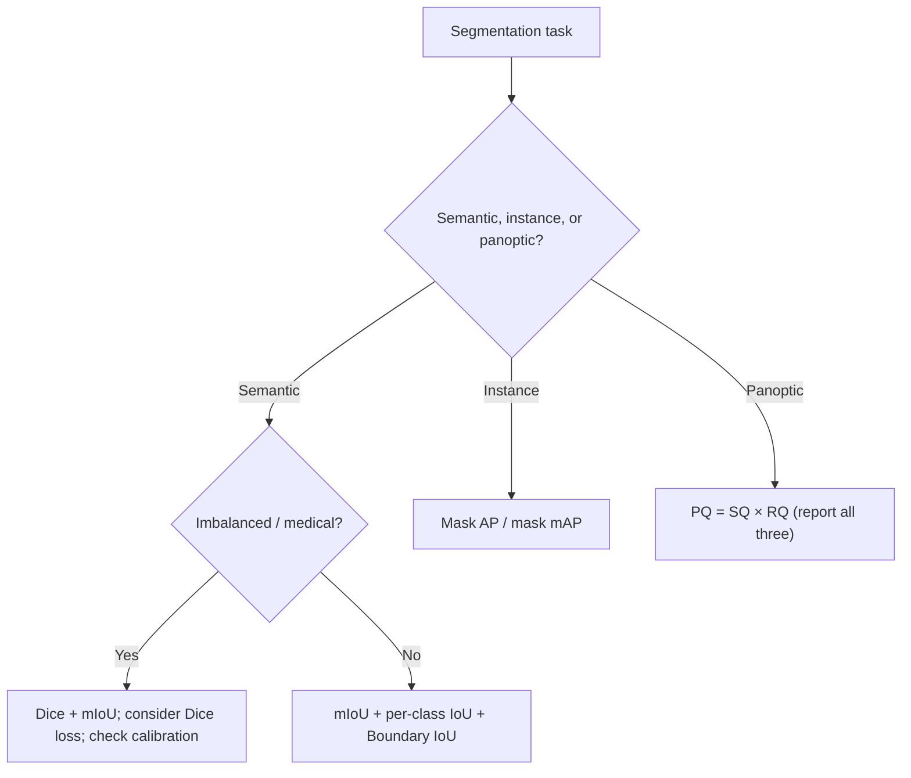

# Lecture 3 — Measuring masks honestly: IoU, Dice, PQ, boundaries, and calibration

A segmentation model that is "99% pixel-accurate" can be worthless. The right metrics — IoU, Dice, and
Panoptic Quality, averaged correctly — expose exactly what pixel accuracy hides, and each is derivable from set theory
in a way that tells you when it lies. This lecture derives the metrics and their pitfalls.

## Why pixel accuracy lies — quantified

Pixel accuracy is the fraction of correctly-labeled pixels. On a dashcam frame, road+sky+building may be 90%+ of
pixels; a degenerate model that predicts the majority class everywhere scores ~0.9 while missing *every* pedestrian and
sign. Formally, accuracy weights each pixel equally, and the pixel distribution is dominated by large stuff regions, so
the score is nearly insensitive to small things — the accuracy trap at pixel scale. **Never report pixel accuracy
alone.**

## IoU (Jaccard) from set theory

For a predicted pixel set `P` and a ground-truth set `G` for one class,

    IoU(P, G) = |P ∩ G| / |P ∪ G| = TP / (TP + FP + FN),

where TP = |P∩G|, FP = |P\G|, FN = |G\P|. IoU lives in [0,1], is 1 iff `P = G`, and — crucially — it symmetrically
penalizes both over-segmentation (FP) and under-segmentation (FN). Because the union is in the denominator, adding a
few correct pixels to an already-large correct region barely moves IoU, but the *first* correct pixels of a small
object move it a lot — the property that makes IoU sensitive to the objects accuracy ignores.

- **Per-class IoU** — computed per class over the whole dataset (accumulate TP/FP/FN across images, then divide;
  do *not* average per-image IoU, which is unstable when a class is absent).
- **Mean IoU (mIoU)** — the arithmetic mean of per-class IoU. This is the Pascal VOC / Cityscapes standard. It weights
  every class **equally on purpose**, so a rare, poorly-segmented class *cannot* hide behind common ones. That is a
  feature, but be aware of its cost: a class that occupies a handful of pixels gets the same weight as the sky, so a few
  mislabeled pixels can swing its IoU wildly and dominate the mean. Report per-class IoU alongside the mean, always.

## Dice, and the proof it ranks like IoU

The **Dice coefficient** (Sørensen–Dice; F1 for masks) is

    Dice(P, G) = 2|P ∩ G| / (|P| + |G|) = 2·TP / (2·TP + FP + FN).

**Claim:** `Dice = 2·IoU / (1 + IoU)`. *Proof.* Let `i = |P∩G|`, `u = |P∪G|`. Then
`|P| + |G| = |P∩G| + |P∪G| = i + u` (inclusion–exclusion). So `Dice = 2i/(i+u)`. Divide numerator and denominator by
`u`: `Dice = 2(i/u)/((i/u)+1) = 2·IoU/(1+IoU)`, using `IoU = i/u`. ∎ The map `x ↦ 2x/(1+x)` is strictly increasing on
[0,1], so **Dice and IoU order any two models identically** — they never disagree on which is better. They differ in
*value* (Dice ≥ IoU, since 2x/(1+x) ≥ x on [0,1]) and in gradient behavior when used as a loss (Lecture 4). Dice is the
standard in **medical imaging** and, being differentiable in soft form, is widely used *as a loss* for imbalanced
targets — a tumor at <1% of pixels is drowned by cross-entropy but not by Dice.

## Panoptic Quality (PQ): one metric for the unified task

Panoptic segmentation needed a single number rather than "mIoU for stuff, mask-AP for things." Kirillov et al. (CVPR
2019) define, per class, a matching between predicted and ground-truth segments where a match requires IoU > 0.5
(which, they prove, yields a *unique* match — no greedy ambiguity), then

    PQ = [ Σ_{(p,g)∈TP} IoU(p,g) ] / ( |TP| + ½|FP| + ½|FN| )
       = ( Σ IoU / |TP| ) · ( |TP| / (|TP| + ½|FP| + ½|FN|) )
       =        SQ         ·         RQ.

The factorization is the elegant part: **PQ = SQ × RQ**, where **Segmentation Quality** (average IoU of matched
segments) measures *how good the matched masks are*, and **Recognition Quality** (an F1-like term) measures *how many
segments were found and not hallucinated*. A model can have high SQ but low RQ (tight masks but misses/duplicates
objects) or vice versa — PQ makes that decomposition visible.

## Boundary and instance metrics

- **Boundary F1 (BF) / Trimap IoU** — evaluate only pixels within a few pixels of a boundary, because most error lives
  there and mIoU under-weights thin structures. A model can win on mIoU yet have visibly ragged edges; boundary metrics
  catch it. **Boundary IoU** (Cheng et al., CVPR 2021) is the modern, size-agnostic version.
- **Mask AP / mask mAP** — instance segmentation's metric: exactly detection's mAP (Week 6) but matching predicted to
  ground-truth objects by *mask* IoU instead of box IoU, averaged over IoU thresholds (COCO's AP@[.5:.95]). It blends
  detection quality (did you find the object?) with mask quality (are its pixels right?).

## Calibration and honest evaluation

Beyond overlap, a deployable segmenter should be **calibrated**: when it says a pixel is class `c` with probability
0.8, it should be right ~80% of the time. Modern nets are systematically overconfident (Guo et al., *On Calibration of
Modern Neural Networks*, ICML 2017); for safety-critical masks (a surgical margin, a drivable-area boundary) you must
measure calibration (reliability diagrams, ECE) and often temperature-scale, because a downstream planner will trust the
probabilities. Finally, three non-negotiables: (1) evaluate on **held-out** data only; (2) **overlay predictions and
look** — segmentation failure (leaky boundaries, merged instances, missed thin objects) is visual and obvious once you
look, and a number without a picture is not an evaluation in this field; (3) remember the **ground-truth ceiling** —
annotators disagree at boundaries (inter-annotator IoU is often well below 1.0), so a "perfect" score is neither
achievable nor meaningful.

*Which metric to report depends on the task and the class balance — and you report more than one.*

**Takeaway:** pixel accuracy misleads because background dominates. Measure overlap with IoU (per-class, then mIoU,
equal-weighted on purpose) and Dice (medical/imbalanced, and often the loss); note Dice = 2·IoU/(1+IoU) so they rank
models identically but Dice reads higher. Use Panoptic Quality (PQ = SQ × RQ) for the unified task, boundary metrics
for thin structures, and mask AP for instances. Then check calibration, overlay every prediction, and remember the
inherent ceiling set by annotator disagreement — a metric without a picture, and without its per-class breakdown, is not
an honest evaluation.
