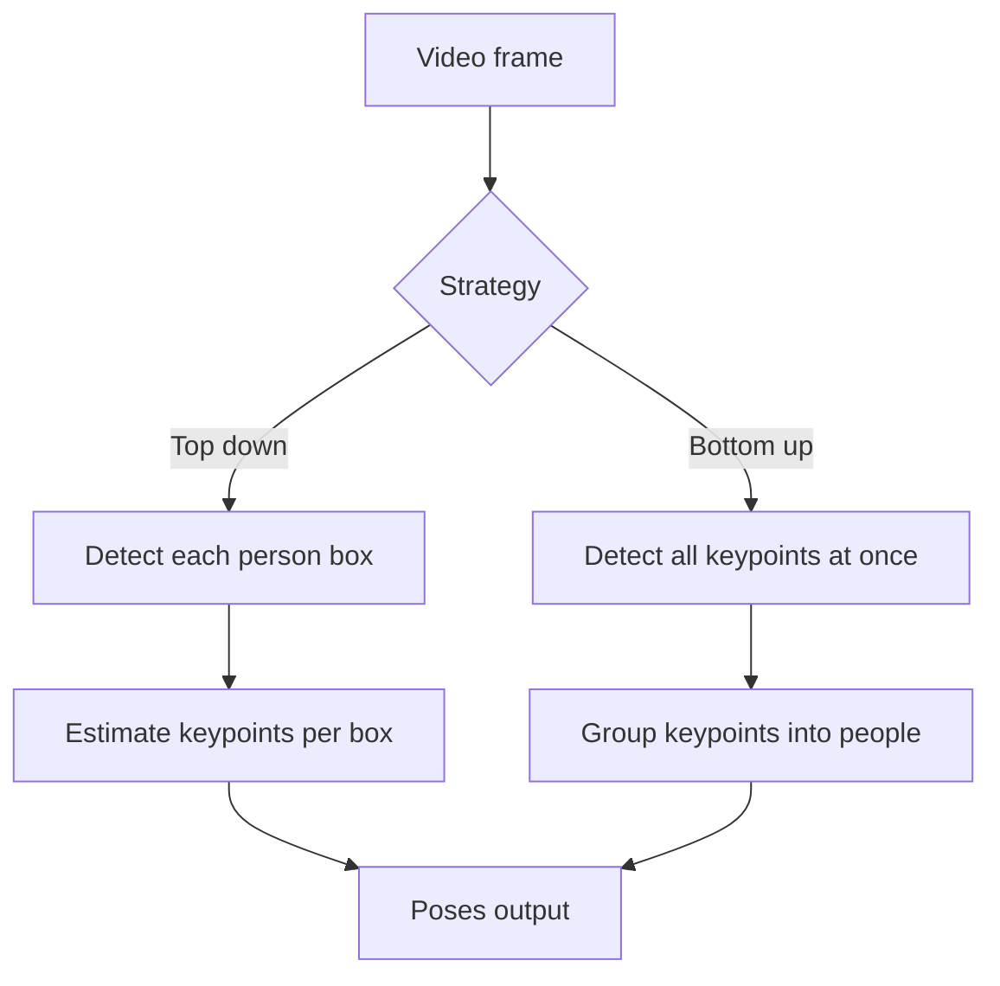

# Lecture 1 — Keypoints and pose estimation

A **keypoint** is a specific, semantically meaningful point to locate: a person's left elbow, the corner of an eye, the tip of a tool. **Pose estimation** finds a *set* of keypoints and their connections — for a human, the skeleton of joints. It's localization at a finer grain than boxes or masks: exact coordinates for named points.

## Keypoints as heatmaps

You could regress keypoint coordinates directly (output two numbers per keypoint), but that trains poorly. The dominant approach is **heatmap regression**: for each keypoint, the network outputs a full-resolution **heatmap** whose bright spot marks the predicted location. The keypoint is the heatmap's argmax (peak).

Why heatmaps beat direct coordinate regression:
- **Spatial and dense** — it's a per-pixel prediction, which convolutions are naturally good at (like segmentation).
- **Represents uncertainty** — a diffuse peak signals low confidence; a sharp peak, high.
- **Handles ambiguity** gracefully and trains more stably than forcing exact coordinates.

The network (often an encoder–decoder, like Week 7) outputs `K` heatmaps for `K` keypoints; you take each peak and, optionally, refine sub-pixel.

## From keypoints to pose

Human pose = keypoints (joints) + a **skeleton** (which joints connect: shoulder–elbow–wrist). Drawing the skeleton turns a scatter of points into a readable posture. Standard formats define a fixed keypoint set (COCO uses 17 body keypoints).

## Top-down vs. bottom-up

For *multiple* people, two strategies:

- **Top-down:** first *detect* each person (a box, Week 6), then estimate keypoints inside each box independently. Accurate (each person gets a clean crop), but cost grows with the number of people, and it fails if detection fails.
- **Bottom-up:** detect *all* keypoints in the image at once, then *group* them into individuals (which elbow belongs to which person?). Constant cost regardless of crowd size — better for crowded scenes — but the grouping step is hard. OpenPose's part-affinity fields are the classic grouping mechanism.

*Top-down detects then poses each person; bottom-up detects all keypoints then groups them into people.*

Top-down dominates when people are few and accuracy matters; bottom-up wins in dense crowds and real-time.

## Beyond human pose

The same heatmap machinery locates **facial landmarks** (for AR filters, gaze, expression), **hand keypoints** (for gesture and sign language), **animal pose** (for behavioral science, e.g. DeepLabCut), and **object keypoints/corners** (for 6-DoF pose estimation in robotics and AR — where's the object in 3-D?). Keypoints are a general tool, not just for people.

**Takeaway:** keypoint estimation locates named points via per-keypoint heatmap regression (the peak is the location; the peak's sharpness is confidence). Pose adds a skeleton connecting keypoints. For multiple people, top-down (detect then pose each) is accurate for few people; bottom-up (all keypoints then group) scales to crowds. The same tool does faces, hands, and object 6-DoF pose.
