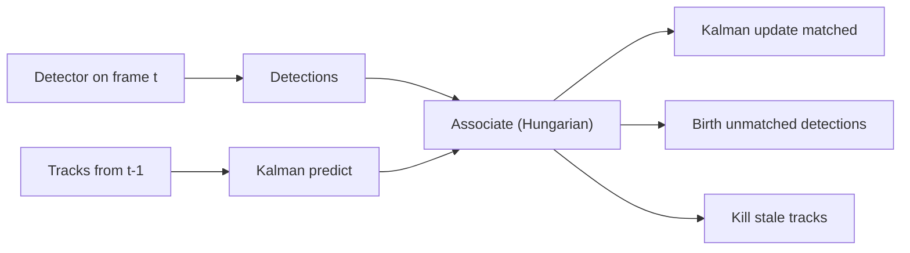
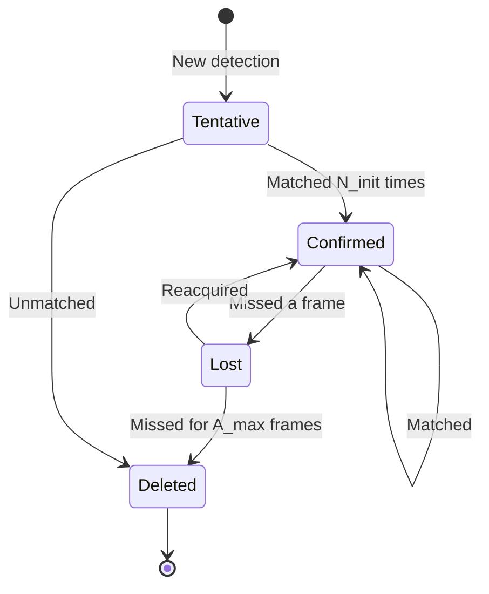

# Lecture 2 — Tracking-by-detection: the Kalman filter and data association

A detector run per frame gives boxes with *no memory*: it does not know the car in frame 2 is the
*same* car as in frame 1. **Tracking** adds that identity — a stable ID that persists across frames — which
is what lets you count unique objects, measure speed, and analyse behaviour over time. This lecture builds
the dominant paradigm and introduces the two machines it runs on: a motion filter and an assignment solver.

## The tracking-by-detection loop

The dominant, practical approach: **detect every frame, then associate.**
1. Run the object detector (Week 6) on frame `t` -> a set of detections (boxes, scores, optional embeddings).
2. **Predict** where each existing track should be at `t` (motion model).
3. **Associate** predictions with detections — decide which detection continues which track.
4. **Update** matched tracks with their detections; **birth** tracks for unmatched detections; **kill**
   tracks unmatched for too long.


*The loop: predict, associate, then update / birth / kill. Everything hard lives in the associate step.*

## Motion prediction: the Kalman filter, intuitively (derived in Lecture 4)

To associate well you must predict where each track *should* be. **SORT** (Bewley et al., 2016, ICIP)
models each object's state as `x = [u, v, s, r, u_dot, v_dot, s_dot]` — box centre, scale, aspect ratio,
and their velocities — under a constant-velocity model, and runs a **Kalman filter** (Kalman, 1960). Two
steps alternate:

- **Predict:** propagate the state forward with the linear motion model, inflating uncertainty (covariance
  grows) because the future is less certain than the present.
- **Update:** when a detection arrives, blend prediction and measurement, weighting each by its inverse
  variance (the **Kalman gain**), shrinking uncertainty.

You do not need the full algebra to *use* it — "predict, then correct, weighting by confidence" — but
Lecture 4 proves it is the *optimal* estimator for a linear-Gaussian model, not a heuristic.

## Association: the assignment problem

Given predicted track boxes and new detections, matching is a **linear assignment problem**. Build a cost
matrix and find the one-to-one matching minimizing total cost:

```
cost[i][j] = 1 - IoU(track_i_predicted, detection_j)   # SORT's cost
matches = hungarian(cost)                                # optimal assignment
```

- **IoU association** matches a detection to the track whose predicted box it most overlaps. Simple and
  effective when objects move modestly between frames — this is the heart of **SORT**.
- **The Hungarian algorithm** (Kuhn, 1955) solves the assignment *optimally* in O(n^3), not greedily. It
  finds the globally best pairing, which matters when several tracks and detections compete. (Derivation and
  the LP-duality view are in Lecture 4.)
- **Gating:** reject matches whose cost exceeds a threshold (IoU too low, or Mahalanobis distance from the
  Kalman prediction too large) *before* solving, so the optimizer cannot force an absurd pairing.

## Appearance: why Deep SORT beats SORT

IoU alone fails when two same-class objects **cross or occlude**: their boxes overlap, and position-only
association swaps the identities. **Deep SORT** (Wojke et al., 2017, ICIP) adds a learned **appearance
descriptor** — a re-identification embedding of each object's look (à la Week 5 features), matched by cosine
distance. The association cost fuses motion (Mahalanobis gating on the Kalman prediction) and appearance
(cosine distance in embedding space). Because appearance survives brief occlusion, identities re-attach
correctly when the object reappears, dramatically cutting identity switches.

## Track lifecycle


*Tentative -> Confirmed avoids spawning tracks from single-frame false positives; Lost -> Deleted after
`A_max` missed frames handles departure and long occlusion.*

## Common pitfalls

- **Greedy nearest-box matching.** It is not optimal; with crowded scenes it strands the globally better
  pairing. Use the Hungarian solution.
- **No gating.** Without a cost ceiling the optimizer will match a track to a far-away detection just to
  minimize total cost — a guaranteed ID error.
- **IoU-only in crowds.** Overlapping same-class objects need an appearance cue. Position is not identity.

**Takeaway:** tracking-by-detection = detect each frame, predict track state with a Kalman filter,
gate and solve an optimal assignment (Hungarian) on an IoU (SORT) or IoU-plus-appearance (Deep SORT) cost,
then update / birth / kill tracks. Appearance embeddings are what stop identities swapping when objects
cross — the single most important upgrade from SORT to Deep SORT.
