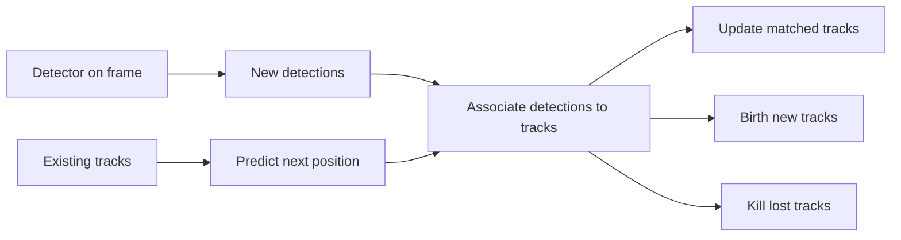
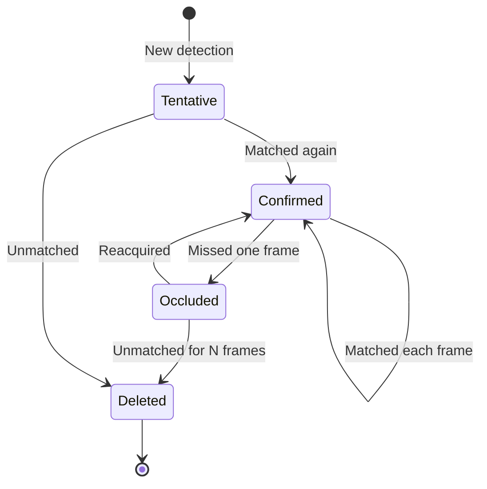

# Lecture 2 — Object tracking across frames

A detector run on each video frame gives boxes, but with *no memory* — it doesn't know that the car in frame 2 is the *same* car as in frame 1. **Tracking** adds that identity: it assigns each object a stable ID that persists across frames. This is what lets you count objects, measure speeds, and analyze behavior over time.

## The tracking-by-detection paradigm

The dominant, practical approach: **detect every frame, then associate.**
1. Run your object detector (Week 6) on each frame → boxes with classes.
2. **Associate** this frame's detections with the tracked objects (identities) from previous frames — decide which new box continues which existing track.
3. Update tracks, birth new ones for unmatched detections, and kill tracks that have gone unseen for too long.


*The tracking-by-detection loop: detect, predict, associate, then update, birth, or kill each track.*

The whole problem reduces to step 2: **data association**.

## Motion prediction: the Kalman filter

To associate well, predict where each existing track *should* be in the new frame. A **Kalman filter** models each object's state (position, velocity) and predicts its next box, then corrects with the actual detection. It smooths noisy detections and bridges brief gaps. You don't need its full math to use it — the idea is "predict, then correct."

## Association: matching detections to tracks

Given predicted track positions and new detections, match them:
- **IoU association** — match a detection to the track whose predicted box it most overlaps (IoU, again). Simple and effective when objects move modestly between frames. This is the core of **SORT**.
- **The assignment problem** — with many tracks and detections, find the optimal one-to-one matching that maximizes total IoU (or minimizes cost). The **Hungarian algorithm** solves this optimally; you'll use a library, but understand it's picking the best global matching, not greedy per-box.

```
cost[i][j] = 1 - IoU(track_i_predicted, detection_j)
matches = hungarian(cost)   # optimal assignment
```

- **Appearance association** — IoU alone fails when objects cross or occlude each other (two boxes swap). **Deep SORT** adds an **appearance descriptor** (a learned embedding of each object's look, à la Week 5 features) so identities are matched by *appearance* too, not just position. This dramatically reduces ID swaps.

## Track lifecycle

- **Birth:** a detection unmatched for a few frames becomes a new track (avoids spawning tracks from single-frame false positives).
- **Death:** a track unmatched for N frames is deleted (the object left, or is occluded too long).
- **Occlusion handling:** the Kalman prediction and appearance embedding let a track survive brief occlusion and re-acquire the object when it reappears.


*A track moves from tentative to confirmed, survives brief occlusion, or is deleted after N missed frames.*

**Takeaway:** tracking = detect each frame, then associate detections to existing identities. Predict track positions (Kalman filter), match by IoU (SORT) or IoU + appearance embedding (Deep SORT), solve the assignment optimally (Hungarian), and manage track birth/death. Appearance features are what stop identities swapping when objects cross.
