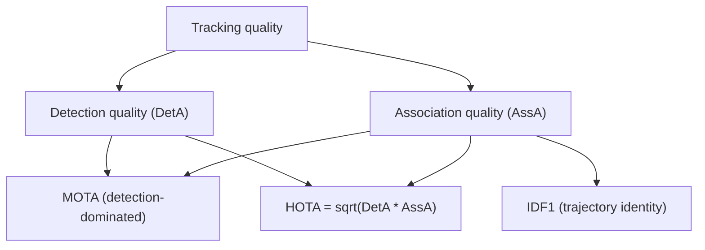

# Lecture 3 — Evaluating tracking honestly: MOTA, IDF1, and HOTA derived

Tracking has an evaluation problem detection does not: it is not enough to find objects in each
frame — you must keep their *identities consistent over time*. A tracker that finds everything but constantly
swaps IDs is useless for counting or trajectory analysis. Measuring that requires identity-aware metrics,
each of which is a precise construction, not an acronym.

## Why per-frame mAP is not enough

Per-frame detection accuracy (mAP) ignores identity entirely. A tracker could have perfect boxes every frame
yet relabel object #1 as #2 and back repeatedly — catastrophic for "count unique cars" or "how long did
person A stay?" Tracking metrics must explicitly penalize **identity switches**.

## MOTA (CLEAR-MOT)

**Multiple Object Tracking Accuracy** (Bernardin & Stiefelhagen, 2008, "Evaluating multiple object tracking
performance: the CLEAR MOT metrics") first performs a *per-frame* greedy matching of predictions to ground
truth at an IoU threshold, then counts three error types summed over all frames `t`:

    MOTA = 1 - ( sum_t (FP_t + FN_t + IDSW_t) ) / ( sum_t GT_t ),

where FP = false positives, FN = misses, IDSW = identity switches (a ground-truth object whose matched
prediction ID differs from the previous frame). MOTA is a single overall-error number, but it has two known
flaws: (1) it is **detection-dominated** — because typically FP + FN >> IDSW, a tracker can score high MOTA
while making many ID errors; and (2) it can go **negative** (more errors than objects). MOTA answers
"how many per-frame mistakes?", *not* "how consistent are identities?".

## IDF1

**IDF1** (Ristani et al., 2016, "Performance Measures and a Data Set for Multi-Target, Multi-Camera
Tracking", ECCV) fixes MOTA's identity blindness by matching at the *trajectory* level. It solves a **single
global bipartite matching** between ground-truth identities and predicted identities that maximizes the total
overlap in *frames-with-correct-identity*, then reports an F1 over identity true/false positives/negatives:

    IDF1 = 2 * IDTP / ( 2 * IDTP + IDFP + IDFN ).

Because the matching is over whole trajectories, IDF1 rewards keeping one predicted ID glued to one
ground-truth object for its *entire* life and punishes fragmentation and swaps hard. It is the more telling
metric when the application cares *who is who*. Its weakness is the mirror of MOTA's: it can over-emphasize
association at the expense of detection.

## HOTA: balancing detection and association

**HOTA** (Higher Order Tracking Accuracy; Luiten et al., 2021, "HOTA: A Higher Order Metric for Evaluating
Multi-Object Tracking", IJCV) is the modern standard because it *explicitly and separably* balances the two.
For a matching threshold alpha it defines detection accuracy `DetA` and association accuracy `AssA` and takes
their geometric mean, then integrates over thresholds:

    HOTA_alpha = sqrt( DetA_alpha * AssA_alpha ),   HOTA = integral over alpha of HOTA_alpha.

The geometric mean means a tracker must be good at *both* detecting and associating — you cannot hide a weak
association behind a strong detector (as in MOTA) or vice versa. HOTA also decomposes, so you can report
DetA and AssA separately and see *which half* is failing. This diagnostic separability is why MOTChallenge
and KITTI adopted it.

*MOTA blends errors but is detection-heavy; IDF1 isolates trajectory identity; HOTA balances the two and
decomposes for diagnosis.*

## Failure modes and which metric exposes them

- **ID switches** — objects cross/occlude and swap identity. Depresses AssA and IDF1 sharply; barely dents
  MOTA. The signature tracking failure.
- **Fragmentation** — a track breaks and the object re-acquires a *new* ID. Hurts IDF1 and AssA.
- **Drift** — the predicted box lags a fast object, dropping below the IoU threshold. Shows up as FN/FP in
  MOTA and lowers DetA.
- **Phantom tracks** — a detector false positive persists as a ghost. Pure FP in MOTA.

Report DetA/AssA (HOTA) *and* IDF1, then **watch the video** — overlay IDs and look. ID swaps and drift are
obvious on playback and invisible in a single scalar.

## Bridge to Week 9

Tracking answers *which* object moved where; **optical flow** (next week) computes the dense per-pixel motion
field between two frames. Keep the granularities distinct: tracking = object-level identity over time; flow =
pixel-level motion between two frames. Some trackers use flow to predict motion; they are complementary.

## Ethics and law (non-negotiable)

Tracking people is powerful and sensitive, and increasingly *regulated*. Under the EU GDPR, a persistent
identifier attached to a person is personal data and requires a lawful basis; under the EU AI Act, remote
biometric identification is a high-risk (and, for real-time public use, largely prohibited) category. Track
people only with consent and a lawful, documented purpose, minimize retained data, and never build
people-following surveillance you would not accept aimed at you. Evaluate honestly on realistic clips —
crowds, occlusion, camera motion — because a tracker that shines on a clean demo can collapse in the wild,
and deploying it on people makes that failure a harm, not a bug.

**Takeaway:** evaluate tracking with identity-aware metrics: MOTA (overall per-frame error, but detection-
dominated and identity-blind), IDF1 (trajectory-level identity consistency), and HOTA (the geometric mean of
detection and association accuracy, decomposable for diagnosis). ID switches are the signature failure —
they crush AssA/IDF1 while barely moving MOTA — so report all three, watch the video, and treat tracking
people as a regulated activity.
