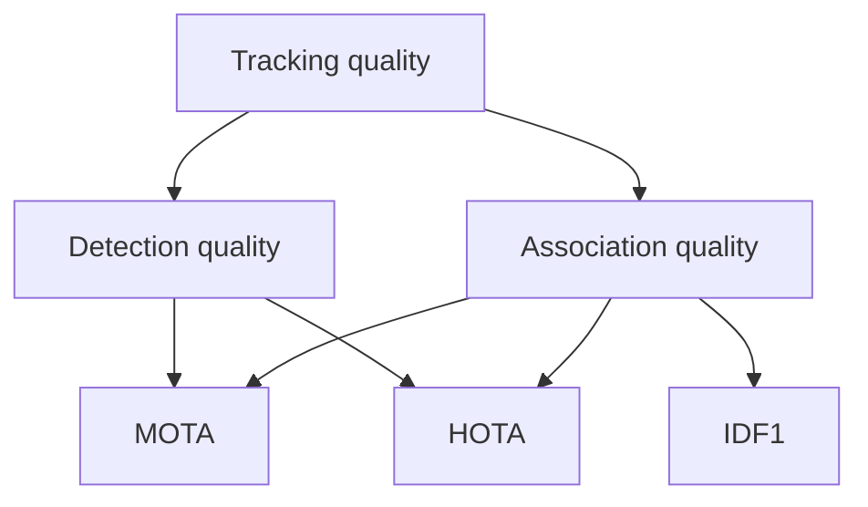

# Lecture 3 — Evaluating tracking & motion honestly

Tracking has a subtle evaluation problem detection doesn't: it's not enough to find objects in each frame — you must keep their *identities consistent over time*. A tracker that finds every object but constantly swaps their IDs is useless for counting or analysis. Measuring that requires identity-aware metrics.

## Why per-frame metrics aren't enough

Per-frame detection accuracy (mAP) ignores identity. A tracker could have perfect per-frame boxes yet relabel object #1 as #2 and back every few frames — catastrophic for "count unique cars" or "how long did person A stay?" Tracking metrics must penalize **identity switches**.

## The core tracking metrics

- **MOTA (Multiple Object Tracking Accuracy)** combines three error types across all frames: **false positives**, **misses** (false negatives), and **identity switches**. One number for overall tracking error — but it under-weights identity.
- **IDF1** focuses on **identity**: how consistently each ground-truth object keeps a single predicted ID over its whole trajectory. It rewards long, correct identities and is often the more telling metric for applications that care about *who is who*.
- **HOTA (Higher Order Tracking Accuracy)** is the modern metric that explicitly balances *detection* quality and *association* (identity) quality, and is increasingly the standard because MOTA and IDF1 each emphasize only part of the story.

*MOTA blends both error types, IDF1 isolates identity consistency, HOTA explicitly balances detection and association.*

Report identity-aware metrics — not just per-frame detection — whenever identity matters.

## Common failure modes

- **ID switches** — two objects cross or occlude and swap identities. The #1 tracking failure; appearance features (Deep SORT) mitigate it.
- **Fragmentation** — a track breaks into pieces when the object is briefly lost, then re-acquired as a *new* ID.
- **Drift** — the predicted box lags a fast or erratically-moving object.
- **False tracks** — a detector false positive persists as a phantom object.

Diagnosing which failure dominates tells you what to fix (better detector? appearance model? longer track memory?).

## Motion and optical flow (a bridge to Week 9)

Tracking cares *which* object moved where; **optical flow** (next week) computes the per-pixel motion field between frames — a lower-level, denser view of motion. Some trackers use flow to predict object movement. Keep the distinction: tracking = object-level identity over time; optical flow = pixel-level motion between two frames. Both are "motion," at different granularities.

## Evaluating honestly

- Use identity-aware metrics (IDF1/HOTA), not just per-frame mAP.
- **Watch the video** — like segmentation, tracking failures (ID swaps, drift) are obvious on playback and invisible in a single number. Overlay track IDs and *look*.
- Test on realistic clips: crowds, occlusion, camera motion. A tracker that shines on a clean clip may collapse in the wild.
- Privacy note: tracking people is powerful and sensitive. The course's ethics rules apply hard here — track only with consent and lawful purpose, and never build people-following surveillance you wouldn't accept aimed at you.

**Takeaway:** tracking must keep identities consistent over time, so evaluate with identity-aware metrics — MOTA (overall error incl. ID switches), IDF1 (identity consistency), and HOTA (balances detection and association) — not just per-frame mAP. ID switches are the signature failure; watch the video to see them. And tracking people carries real privacy weight — apply the ethics rules.
