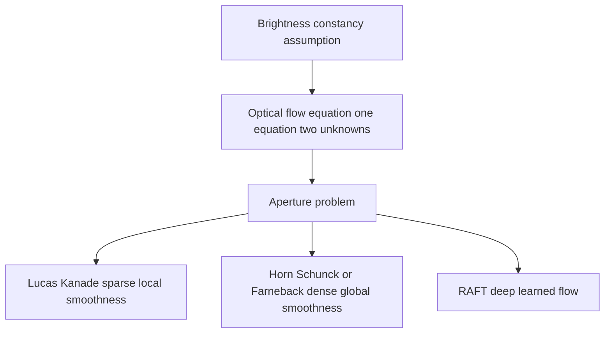

# Lecture 1 — Optical flow: the motion field

**Optical flow** is the apparent motion of each pixel between two consecutive frames — a dense field of little arrows saying "this pixel moved *here*." It's the lowest-level description of motion, and it underpins video compression, stabilization, slow-motion interpolation, and motion-based recognition.

## The brightness-constancy assumption

Flow rests on one assumption: a physical point keeps roughly the **same brightness** as it moves from frame to frame. If a pixel at `(x, y)` with intensity `I` moves by `(u, v)` in time `dt`:

```
I(x, y, t) = I(x + u, y + v, t + dt)
```

Expanding this (Taylor series) gives the **optical flow equation**:

```
Ix·u + Iy·v + It = 0
```

where `Ix, Iy` are spatial gradients (Week 1's Sobel!) and `It` is the temporal gradient (frame difference). This is *one* equation with *two* unknowns (`u, v`) per pixel — underdetermined. That's the **aperture problem**: looking through a small window, you can only sense motion *perpendicular* to an edge, not along it. Extra assumptions are needed to solve it.

## Classical methods

- **Lucas–Kanade** (sparse) — assume flow is constant in a small neighborhood, giving enough equations to solve for `(u, v)` at good keypoints (corners, Week 2). Fast; used to track features across frames.
- **Horn–Schunck** / **Farnebäck** (dense) — add a global smoothness assumption (neighboring pixels move similarly) to get flow at *every* pixel.

```python
import cv2
flow = cv2.calcOpticalFlowFarneback(prev_gray, next_gray, None,
                                     0.5, 3, 15, 3, 5, 1.2, 0)  # (H, W, 2): u, v per pixel
```

## Deep optical flow

Modern flow is learned: **FlowNet**, **PWC-Net**, and **RAFT** (the current standard) train CNNs to predict dense flow, handling large motions and occlusions far better than classical methods — at the cost of needing training data (often synthetic, since ground-truth flow is nearly impossible to label by hand).


*The aperture problem and the three families of assumptions used to resolve it.*

## Visualizing flow

Flow is 2-D per pixel, so it's shown as **color**: hue = motion direction, saturation/brightness = motion magnitude. A person walking right glows one hue; the still background is dark. Reading these color-coded flow fields is how you *see* motion.

## Where flow is used

Video compression (encode motion, not every pixel), video stabilization, frame interpolation (slow-mo), and as a **motion input** to action-recognition networks (the two-stream idea, next lecture). Flow is a building block, not usually an end goal.

**Takeaway:** optical flow is the per-pixel motion field between two frames, built on brightness constancy — which gives one equation for two unknowns (the aperture problem), resolved by local (Lucas–Kanade) or global (dense) smoothness, or learned (RAFT). Visualize it as color (hue=direction, brightness=magnitude). It's a foundational motion building block for compression, stabilization, and recognition.
