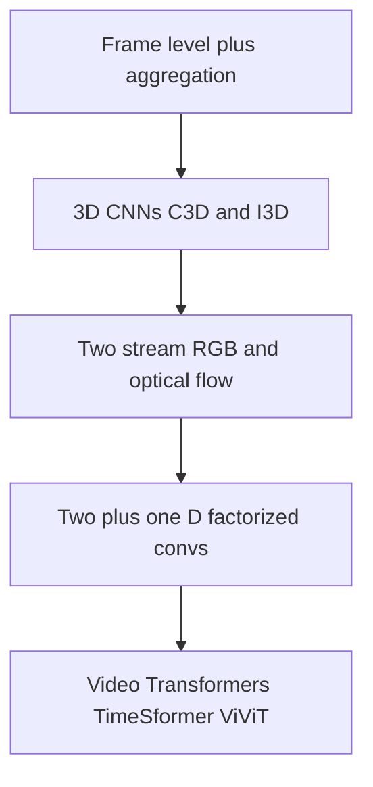

# Lecture 2 — Architectures for video understanding

A single-frame CNN throws away time. Video understanding — recognizing *actions*, not just objects — needs architectures that reason across frames. There's a ladder of approaches, each adding more temporal modeling at more cost.

## Why a single frame isn't enough

Many actions are defined by *change over time*: 'opening' vs. 'closing' a door, 'sitting down' vs. 'standing up', 'picking up' vs. 'putting down'. A single frame is ambiguous or identical between them. The temporal dimension carries the signal — so the model must see multiple frames and model their *order* and *motion*.

## The ladder of temporal modeling

**1. Frame-level + aggregation.** Run a 2D CNN on each frame independently, then pool predictions (average, or a small temporal model on top). Cheap, and a *surprisingly strong baseline* for actions that a single frame nearly reveals — but blind to fine motion and order.

**2. 3D CNNs.** Extend convolution to *time*: a 3D kernel `(t, h, w)` slides over a stack of frames, learning spatiotemporal features directly (**C3D**, **I3D** — which "inflates" 2D ImageNet kernels into 3D, transfer learning for video). Powerful, but 3D convolutions are **expensive** in compute and memory — the central cost of video.

**3. Two-stream networks.** Two parallel CNNs: a **spatial stream** on RGB frames (appearance — *what* objects) and a **temporal stream** on **optical flow** (motion — *how* things move), fused at the end. Explicitly feeding flow (Lecture 1) as motion input was a breakthrough, since the network doesn't have to learn motion from scratch.

**4. (2+1)D and factorized convs.** Split a 3D convolution into a 2D spatial conv followed by a 1D temporal conv — nearly the power of full 3D at much lower cost. A practical sweet spot.

**5. Video Transformers.** Extend the Vision Transformer (Week 10) to spacetime: **TimeSformer**, **ViViT**, and **Video Swin** apply attention across both space *and* time. Attention naturally models long-range temporal dependencies (an action spanning many frames) that convolutions capture only locally — now state of the art, at a steep compute price.

*The ladder of temporal modeling, each rung adding more temporal power at more compute cost.*

## The recurring trade-off

More temporal modeling → better on motion-heavy actions → more compute, memory, and data. The right rung depends on your task (does it need fine motion?), budget, and data. A frame-aggregation baseline is always worth trying first — sometimes the action is mostly visible in one frame, and you save enormously.

**Takeaway:** video understanding needs temporal modeling, and there's a ladder: frame aggregation (cheap baseline) → 3D CNNs (spatiotemporal kernels, expensive) → two-stream (RGB + optical-flow motion) → (2+1)D (factorized, efficient) → video Transformers (spacetime attention, SOTA and costly). Each rung adds temporal power at more cost. Try the cheap baseline first; climb only as the task demands.
