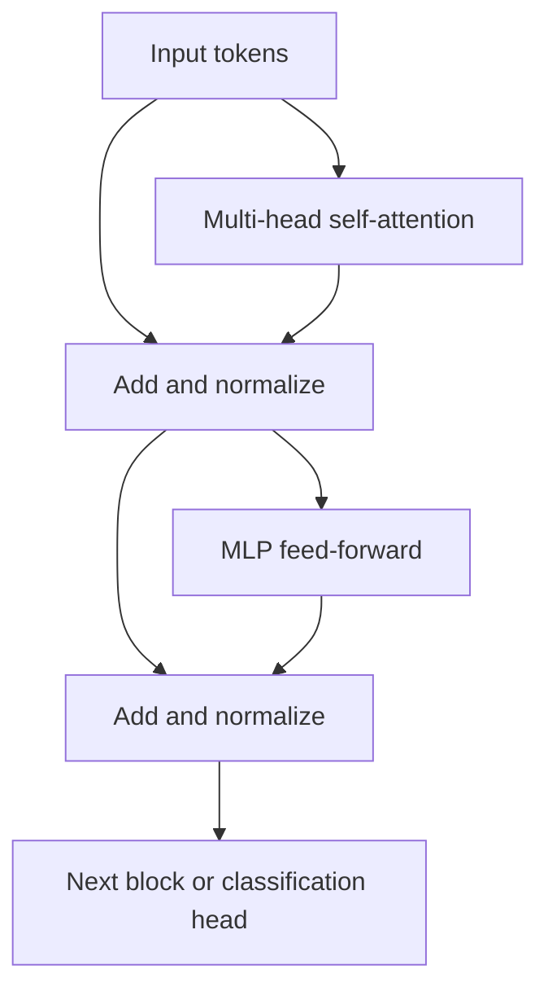

# Lecture 2 — Self-attention over patches

**Self-attention** is the engine of the Transformer, and it does something convolution cannot: let every patch directly gather information from every other patch, weighted by relevance. This is the source of both the ViT's power and its cost.

## What attention computes

For each token, self-attention produces three vectors via learned projections: a **query** (what am I looking for?), a **key** (what do I offer?), and a **value** (what I'll contribute). Each token's output is a weighted sum of *all* tokens' values, where the weights come from how well its query matches each key:

```
Attention(Q, K, V) = softmax(Q Kᵀ / √d) V
```

The `Q Kᵀ` term computes, for every pair of patches, how relevant they are to each other. Softmax turns those into weights; the output blends the values accordingly. A patch showing a dog's ear can attend strongly to the patch showing its other ear, across the whole image, in *one* layer — no matter how far apart. That global mixing is what convolution's local kernels can't do directly.

## Multi-head attention

Instead of one attention, run several **heads** in parallel, each with its own Q/K/V projections, then concatenate. Different heads learn to attend to different relationships (edges, texture, distant parts). It's the same multi-head mechanism as language Transformers — your C53 knowledge transfers exactly.

## The Transformer block

A ViT stacks identical blocks, each: **multi-head self-attention** → add & normalize → **MLP** (a small feed-forward net per token) → add & normalize. Residual connections and layer normalization keep deep stacks trainable (the C53 lessons on training deep nets apply). Stack 12+ of these and add the classification head.


*One Transformer block: attention and the MLP each wrapped in a residual connection.*

## The quadratic-cost problem

Attention compares *every* pair of tokens: with `N` patches, `Q Kᵀ` is an `N×N` matrix. Cost grows as **N²**. For 196 patches it's fine; but halve the patch size (more detail) and `N` quadruples, so cost rises 16×. For high-resolution images or dense tasks (detection, segmentation), naive global attention becomes infeasible. This single fact drives most ViT engineering.

## Efficient and hierarchical variants

- **Swin Transformer** computes attention within *local windows* that shift between layers, restoring locality and linear-ish cost — and builds a *hierarchy* like a CNN (great for detection/segmentation backbones).
- **Hierarchical/pyramid ViTs** downsample tokens through depth, mirroring CNN feature pyramids.
- **Efficient attention** approximations (linear attention, etc.) reduce the N² cost.

These make Transformers practical beyond classification, and blur the ViT/CNN line — modern architectures borrow from both.

**Takeaway:** self-attention lets every patch attend to every other via query-key-value matching (softmax(QKᵀ/√d)V), giving a global receptive field in one layer — multi-head to capture varied relationships. Its cost is quadratic in the number of patches (N²), which drives efficient/hierarchical variants like Swin. It's the same Transformer you know from language, operating on image patches.
