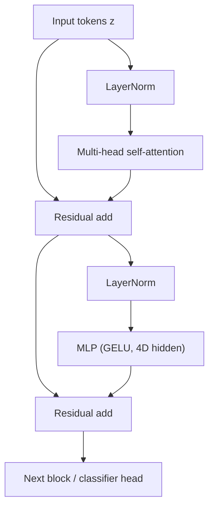

# Lecture 2 — Self-attention over patches: the algebra, the sqrt(d), and the N^2 cost

**Self-attention** is the engine of the Transformer, and it does something convolution cannot:
let every patch directly gather information from every other patch, weighted by learned relevance. This is
the source of both the ViT's power and its cost. This lecture derives the operation, explains the details
that are usually waved away (the `1/sqrt(d)` scale, the permutation equivariance), and counts the compute.

## Scaled dot-product attention, from the definition

Let the input be `X in R^{N x D}` (N tokens, dimension D). Three learned linear maps produce **queries**,
**keys**, and **values**:

    Q = X W_Q,   K = X W_K,   V = X W_V,   with W_Q, W_K in R^{D x d_k},  W_V in R^{D x d_v}.

Intuitively: a query is "what am I looking for?", a key is "what do I offer?", a value is "what I contribute."
The output of self-attention is

    Attention(Q, K, V) = softmax( Q K^T / sqrt(d_k) ) V.

Read it in pieces. `Q K^T in R^{N x N}`: entry `(i, j)` is the dot product `q_i · k_j` — how relevant patch
`j` is to patch `i`. Divide by `sqrt(d_k)` (below). Softmax over each row turns the scores into a probability
distribution `alpha_i` — attention weights summing to 1. The output for token `i` is `sum_j alpha_{ij} v_j`,
a relevance-weighted blend of *all* value vectors. A patch showing a dog's left ear can, in one layer,
attend strongly to the patch showing its right ear across the whole image — global mixing convolution's
local kernels cannot do directly.

## Why divide by sqrt(d_k)? A variance argument

This scale is not cosmetic. Suppose the entries of `q_i` and `k_j` are independent, zero-mean, unit-variance.
The dot product `q_i · k_j = sum_{m=1}^{d_k} q_{im} k_{jm}` is a sum of `d_k` independent products, each with
mean 0 and variance 1, so `Var(q_i · k_j) = d_k` and its standard deviation is `sqrt(d_k)`. As `d_k` grows,
the logits fed to softmax grow like `sqrt(d_k)`; large logits push softmax into a near-one-hot regime where
its gradient vanishes (the Jacobian `diag(p) - p p^T` collapses). Dividing by `sqrt(d_k)` **renormalizes the
logit variance back to ~1**, keeping softmax in a well-conditioned range and gradients healthy (Vaswani et
al., 2017, footnote in Section 3.2.1). Skipping the scale is a classic cause of training instability at
large `d_k`.

## Permutation equivariance, proved

Let `Pi` be a permutation matrix acting on the token axis. Then `Q -> Pi Q`, `K -> Pi K`, `V -> Pi V`, so
`Q K^T -> Pi (Q K^T) Pi^T`, softmax is applied row-wise and commutes with the row/column permutation, and
`(Pi (QK^T) Pi^T) (Pi V) = Pi (QK^T) V` after cancellation `Pi^T Pi = I`. Hence
`Attention(Pi X) = Pi Attention(X)`: permuting inputs permutes outputs with identical values. Self-attention
has **no** intrinsic notion of position — the mathematical justification for Lecture 1's positional codes.

## Multi-head attention

Instead of one attention, run `h` **heads** in parallel, each with its own `W_Q^{(i)}, W_K^{(i)}, W_V^{(i)}`
projecting to `d_k = D/h`, then concatenate the `h` outputs and mix with `W_O`:

    MHA(X) = Concat(head_1, ..., head_h) W_O,   head_i = Attention(X W_Q^i, X W_K^i, X W_V^i).

Different heads specialize — some attend to local texture, some to distant object parts, some act nearly
positionally. It is the same multi-head mechanism as language Transformers; your C53 knowledge transfers
exactly. Splitting `D` into `h` heads keeps total cost the same as single-head at width `D` while enabling
multiple relation types.

## The Transformer encoder block

A ViT stacks identical **pre-norm** blocks (Dosovitskiy et al. use LayerNorm *before* each sublayer, which
stabilizes deep stacks — Xiong et al., 2020, "On Layer Normalization in the Transformer Architecture"):

    z' = z + MHA(LN(z))
    z  = z' + MLP(LN(z'))

where the MLP is a two-layer per-token feed-forward net (GELU activation, hidden dim `4D` typically).
Residual connections and LayerNorm keep 12–32 blocks trainable (the C53 lessons apply directly). Stack them,
take the CLS output (or GAP), attach a linear head.

*One pre-norm Transformer block: attention and MLP each wrapped in a residual connection.*

## The quadratic-cost problem, counted

Attention compares *every* pair of tokens: `Q K^T` is an `N x N` matrix costing `Theta(N^2 d_k)` FLOPs to
form and another `Theta(N^2 d_v)` to apply to `V`, plus `Theta(N^2)` memory to store the scores. Total
attention cost is **Theta(N^2 D)** time and **Theta(N^2)** memory. For `N = 196` this is fine. But halve the
patch size for more detail: `N` quadruples (from 196 to 784), so `N^2` rises **16x**. For high-resolution
inputs or dense tasks (detection, segmentation) naive global attention becomes infeasible — the single fact
that drives most ViT engineering. Note the MLP by contrast is `Theta(N D^2)`: for small `N` the MLP
dominates, but as `N` grows attention's `N^2` overtakes it. **FlashAttention** (Dao et al., 2022) does not
change the `N^2` FLOP count but tiles the computation to avoid materializing the `N x N` matrix in HBM,
cutting memory to `O(N)` and giving large wall-clock wins — a must-know for practical ViT training.

## Worked micro-example

Two tokens, `d_k = 2`, `q_1 = [1, 0]`, keys `k_1 = [1, 0]`, `k_2 = [0, 1]`. Scores before scaling:
`q_1·k_1 = 1`, `q_1·k_2 = 0`. Scale by `1/sqrt(2)`: `[0.707, 0]`. Softmax: `[0.670, 0.330]`. So token 1
draws 67% of its output from `v_1` and 33% from `v_2` — it attends mostly to the matching key, exactly the
content-addressed read attention is meant to be.

**Takeaway:** self-attention is `softmax(QK^T/sqrt(d))V` — a content-addressed, relevance-weighted read that
gives a global receptive field in one layer and is permutation-equivariant (hence needs position codes). The
`1/sqrt(d)` keeps softmax well-conditioned. Multi-head captures multiple relation types at fixed cost. The
whole thing is `Theta(N^2 D)` time and `Theta(N^2)` memory — quadratic in patch count, the constraint behind
FlashAttention and every efficient variant.
