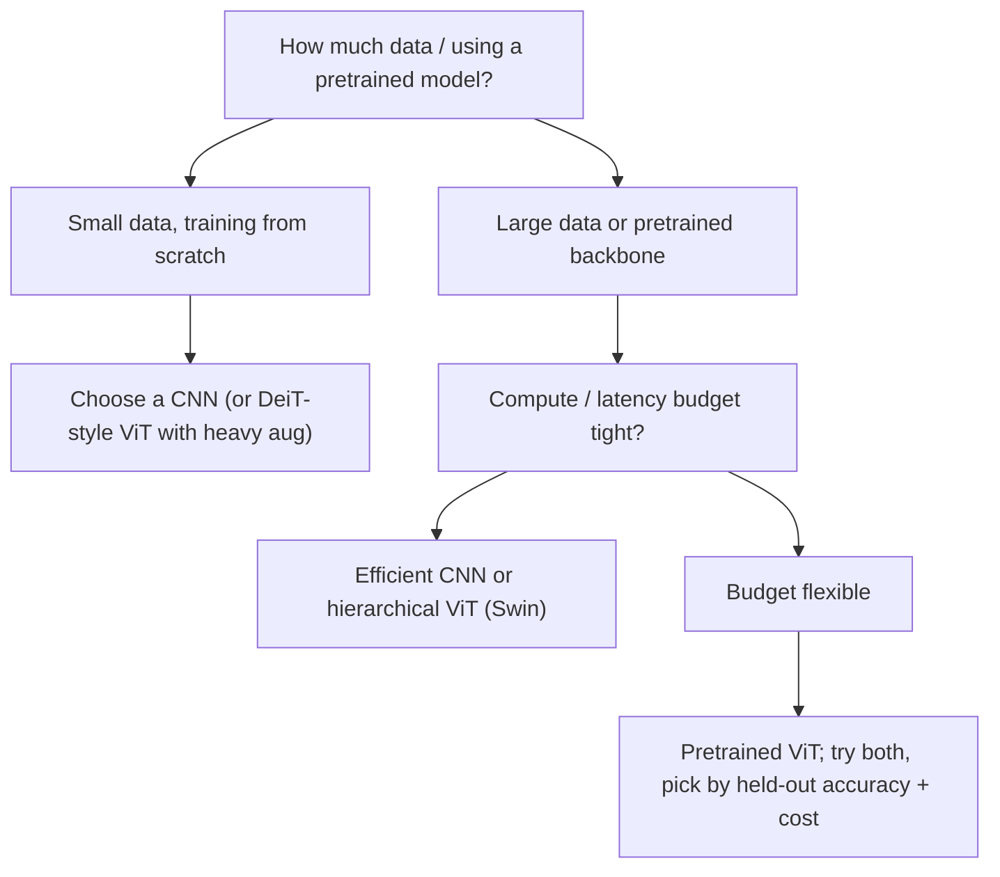

# Lecture 3 — ViT vs. CNN: inductive bias, data-hunger, and the scaling laws

Is the Vision Transformer "better" than the CNN? The honest answer is *it depends* — on data
scale, task, resolution, and compute. Cutting through the hype to know *when* each wins is the professional
skill this lecture builds, and it rests on a precise idea: **inductive bias**.

## Inductive bias, defined

An inductive bias is the set of assumptions a model makes about the target function before seeing data — the
prior encoded in its architecture. A CNN hard-wires two:

- **Locality**: a unit's output depends only on a small spatial neighborhood (the kernel).
- **Translation equivariance**: shifting the input shifts the feature map identically, because weights are
  shared across positions.

These are *correct* priors for natural images (nearby pixels are related; a cat is a cat wherever it
appears), so a CNN needs fewer examples to generalize. A ViT hard-wires almost none of this — only the patch
grid. Self-attention is global and, absent position codes, permutation-invariant. The ViT must therefore
*learn* locality and equivariance from data if they help. Dosovitskiy et al. (2021) state it plainly: ViTs
"do not generalize well when trained on insufficient amounts of data" precisely because they "lack some of
the inductive biases inherent to CNNs."

## The data-hunger result, quantified

The original ViT's central finding: **ViTs need a lot of data.** Trained from scratch on ImageNet-1k (1.3M
images), ViT-B *underperforms* a comparable ResNet. Pretrained on ImageNet-21k (14M) it becomes competitive;
pretrained on the in-house JFT-300M (300M images) it *matches or exceeds* strong CNNs and, crucially, keeps
improving as data and model grow while CNNs plateau. The prior a CNN builds in, a ViT *learns* — if given
enough data. This is the architectural bias-variance trade made empirical: high bias / low variance (CNN)
vs. low bias / high variance (ViT), and variance is bought down with data.

## Closing the gap without 300M images: DeiT

You rarely have JFT-300M. Touvron et al.'s **DeiT** ("Training data-efficient image transformers," ICML 2021)
trained a competitive ViT on ImageNet-1k *alone* using heavy augmentation (RandAugment, Mixup, CutMix),
strong regularization, and a **distillation token** that learns from a CNN teacher. The distillation token is
telling: the ViT recovers CNN-like performance partly by *importing the CNN's inductive bias through the
teacher's soft labels*. Data-efficiency and inductive bias are two views of the same coin.

## What this means in practice

- **Small/medium data, from scratch:** CNNs usually win — their biases are a gift when data is scarce.
- **Transfer learning (the common case):** a ViT pretrained on huge data, fine-tuned on your task, is
  competitive-to-superior. Since you will almost always use pretrained models (Week 5), ViTs are very much
  in play — just download one.
- **High resolution / dense tasks on a budget:** the ViT's `N^2` cost bites; an efficient CNN or a
  hierarchical Transformer (Swin, Lecture 4) is often better.

## The scaling laws

Zhai et al. ("Scaling Vision Transformers," 2022) fit the compute/data/parameter scaling of ViTs and found
smooth power-law improvements — the same regime that drove LLMs. This scalability, not raw single-point
accuracy, is the ViT's structural advantage: give it more data and compute and it keeps paying off, whereas
CNN gains saturate. It is also why the frontier (multimodal, self-supervised — Lecture 5) is ViT-shaped.

## The convergence: ConvNeXt and the training-recipe confound

The field is *merging*, not replacing. Liu et al.'s **ConvNeXt** ("A ConvNet for the 2020s," CVPR 2022) took
a plain ResNet and applied Transformer-era training recipes (AdamW, longer schedules, heavy augmentation,
LayerNorm, GELU, large kernels, inverted bottlenecks) — and matched ViTs on ImageNet with a *pure CNN*. The
lesson is sobering: much of the apparent "ViT win" was a **better training recipe**, not the attention
mechanism. Any honest ViT-vs-CNN comparison must hold the recipe constant, or it measures the recipe, not
the architecture.

## Strengths, side by side

**ViTs:** global context from layer one; scale beautifully with data/model (scaling laws); the natural
substrate for self-supervised (MAE, DINO) and multimodal (CLIP, SAM) pretraining — the frontier.
**CNNs:** data-efficient without giant pretraining; cheap at high resolution (no `N^2`); mature and
excellent for edge deployment (Week 11) — MobileNet-class CNNs still dominate constrained hardware.

*A decision path for CNN vs. ViT on a real project.*

## Choosing honestly

Ask: How much data? Am I using a pretrained model (yes, usually)? What is my compute/latency budget at my
target resolution? For a typical applied project — moderate data, a pretrained backbone, reasonable compute —
*try both*, fine-tune under an identical recipe, and pick by held-out accuracy and cost. Don't choose by
fashion; choose by measurement. That empirical, unhyped stance separates an engineer from a trend-follower.

**Takeaway:** ViTs trade the CNN's hard-wired locality/equivariance for flexibility, so they are data-hungry
— from scratch on small data CNNs win; pretrained on massive data (or DeiT-distilled) and fine-tuned, ViTs
match or beat CNNs and keep scaling. CNNs stay strong for limited data, high resolution, and edge. The field
converges (ConvNeXt shows much of the gap was the training recipe), so hold the recipe constant and choose
by measured accuracy and cost for *your* data and budget.
