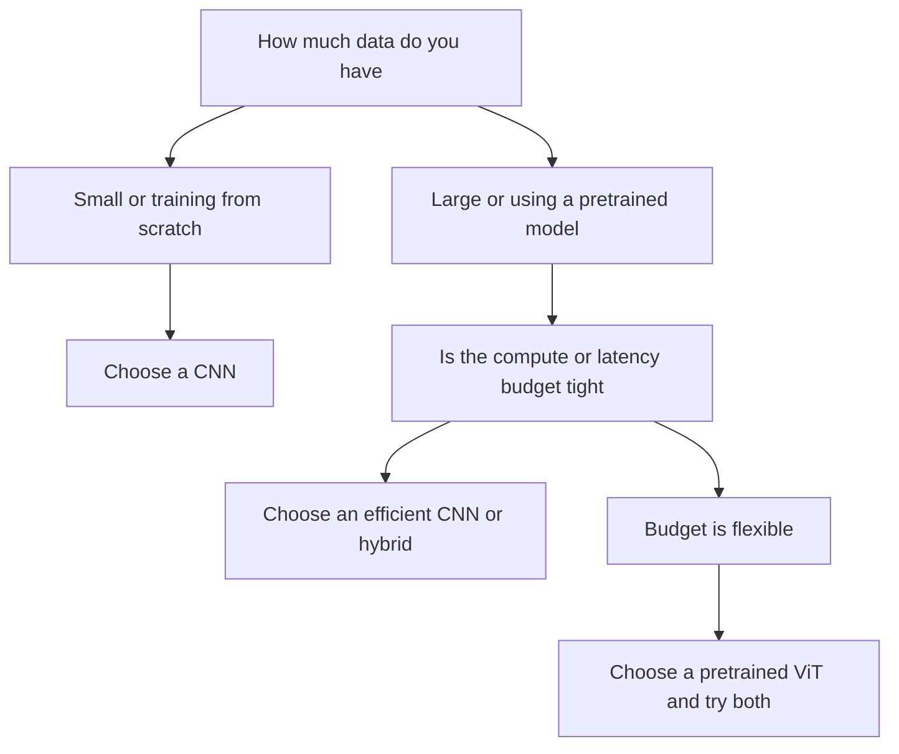

# Lecture 3 — ViT vs. CNN: an honest comparison

Is the Vision Transformer 'better' than the CNN? The honest answer is *it depends* — on data scale, task, and compute. Cutting through the hype to know *when* each wins is the professional skill this lecture builds.

## The data-hunger of ViTs

The original ViT's central finding: **ViTs need a lot of data.** With fewer built-in assumptions than CNNs (no locality or translation-equivariance priors), a ViT must *learn* spatial structure from examples. Trained from scratch on ImageNet-1k (1.3M images), ViTs *underperform* comparable CNNs. But pretrained on *much* larger datasets (JFT-300M, or with strong self-supervised pretraining), they *match or exceed* CNNs. The prior a CNN builds in, a ViT learns — if given enough data.

## What this means in practice

- **Small/medium data, from scratch:** CNNs usually win — their inductive biases are a gift when data is limited.
- **Transfer learning (the common case):** a ViT pretrained on huge data, fine-tuned on your task, is competitive-to-superior. Since you'll almost always use pretrained models (Week 5), ViTs are very much in play — just download a pretrained one.
- **Data-efficient ViTs** (DeiT, with distillation and strong augmentation) narrowed the gap, training well on ImageNet-1k alone.

## Strengths of each

**ViTs:**
- Global context from layer one — better at relating distant image parts.
- Scale beautifully with data and model size (the scaling laws that drove LLMs apply).
- Unify with multimodal models (CLIP, image+text) and self-supervised pretraining (MAE, DINO) — the frontier.

**CNNs:**
- Data-efficient — strong with limited data and no giant pretraining.
- Efficient at high resolution (no N² blowup) — often better for dense tasks on a budget.
- Mature, well-understood, and excellent for edge deployment (Week 11) — MobileNet-class CNNs still dominate constrained hardware.

## The convergence

The field is *merging*, not replacing. ConvNeXt showed a pure CNN, modernized with Transformer-era training tricks, matches ViTs — evidence that much of the ViT 'win' was better training recipes, not just architecture. Hybrid models (convolutions + attention) and hierarchical Transformers (Swin) borrow the best of both. The lesson: architecture is one factor among many (data, pretraining, augmentation, compute), and dogma about 'CNN vs. Transformer' is unserious.

## Choosing honestly

Ask: How much data do I have? Am I using a pretrained model (yes, usually)? What's my compute/latency budget? For a typical applied project — moderate data, a pretrained backbone, reasonable compute — *try both*, fine-tune, and pick by held-out accuracy and cost. Don't choose by fashion; choose by measurement. That empirical, unhyped stance is what separates an engineer from a trend-follower.

*A quick decision path for picking CNN versus ViT on a real project.*

**Takeaway:** ViTs are data-hungry (they learn the spatial priors CNNs build in) — from scratch on small data, CNNs win; pretrained on massive data and fine-tuned, ViTs match or beat CNNs. CNNs stay strong for limited data, high resolution, and edge deployment. The field is converging (ConvNeXt, hybrids, Swin), so choose by measuring held-out accuracy and cost for *your* data and budget — not by hype.
