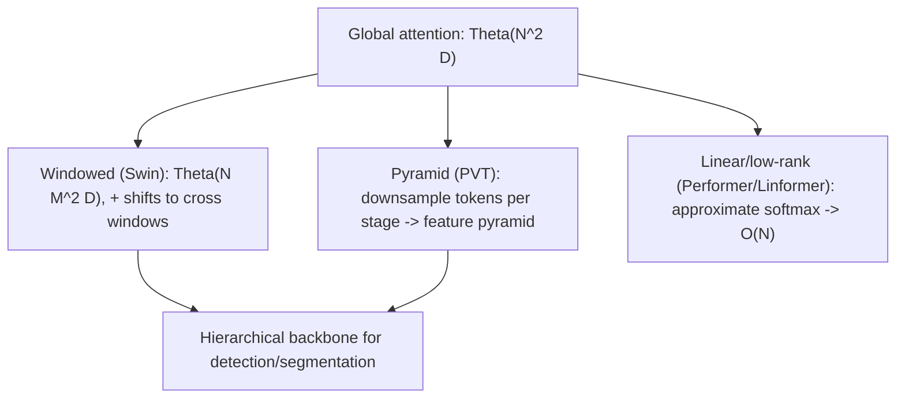

# Lecture 4 — The geometry of attention and the efficient/hierarchical zoo

Lecture 2 gave attention's algebra; this lecture asks what attention *learns to do* spatially,
why that makes it data-hungry, and how the field broke the `N^2` barrier to make Transformers practical for
dense, high-resolution vision. This is where ViTs stop being a single architecture and become a design space.

## Effective attention distance: does a ViT act local?

A natural diagnostic: for each head, compute the average spatial distance between a query patch and the
patches it attends to, weighted by attention — the **mean attention distance**. Dosovitskiy et al. (2021,
Appendix) measured this and found a revealing pattern: in *early* layers some heads attend locally (small
distance, CNN-like) while others already attend globally; in *late* layers nearly all heads are global. So a
well-trained ViT *learns* a locality prior in its lower heads — the very thing a CNN hard-wires — but only
when given enough data to discover it. When data is scarce, it fails to learn this structure and overfits,
which is the mechanistic story behind Lecture 3's data-hunger. Locality is not wrong for images; the ViT
just has to *earn* it.

## Attention rollout: reading what a ViT looks at

You cannot read a single attention layer and call it "the explanation" — information mixes across `L` layers
and through residual connections. **Attention rollout** (Abnar & Zuidema, "Quantifying Attention Flow in
Transformers," ACL 2020) approximates the total information flow by accounting for residuals and composing
layers. For layer `l` with attention matrix `A_l` (heads averaged), add the residual and renormalize,
`hat{A}_l = 0.5 A_l + 0.5 I` (row-normalized), then multiply down the stack:

    Rollout = hat{A}_L · hat{A}_{L-1} · ... · hat{A}_1.

The CLS row of `Rollout`, reshaped to the patch grid, is a saliency map over the image. It is an
approximation (it ignores value magnitudes and non-linearity), but it is the standard, cheap way to overlay
"where the model looked" and to sanity-check that a prediction rests on the object, not the background — you
will implement it in the exercises.

## Positional encoding, revisited as invariance design

Lecture 1 listed the schemes; here is the principle. Each choice injects a different symmetry:

- **Learned absolute** breaks translation invariance (position 5 is a specific learned vector) and is tied
  to the training grid — new resolutions need bicubic **interpolation** of the position table (the standard
  fix for fine-tuning ViTs at higher resolution; Touvron et al., 2021).
- **Relative position bias** (Shaw et al., 2018; used by Swin) adds a learned scalar `b_{i-j}` to the
  attention logit for offset `i - j`, so the model sees *relative* geometry — translation-friendly and
  resolution-robust.
- **Rotary position embedding (RoPE)** (Su et al., 2021), now common in ViTs, rotates Q and K by a
  position-dependent angle so that `q_i · k_j` depends only on `i - j` — encoding relative position
  *multiplicatively* inside the dot product, with clean extrapolation. Choosing an encoding *is* choosing
  which spatial symmetry you assume.

## Breaking N^2: the efficient-attention landscape

The `Theta(N^2)` cost (Lecture 2) is the central engineering constraint. Three families attack it:

**1. Windowed / local attention — Swin.** Liu et al.'s **Swin Transformer** (ICCV 2021, best-paper) computes
attention only within non-overlapping local windows of `M x M` patches, making cost **linear** in `N` for
fixed `M`: `Theta(N M^2 D)` instead of `Theta(N^2 D)`. But pure windows never exchange information across
window borders, so Swin **shifts** the window partition by `M/2` every other layer, letting adjacent windows
communicate — the "shifted window" that names the model. Swin also builds a **hierarchy**: it merges patches
(2x2 -> 1) between stages, halving resolution and doubling channels, producing a CNN-like feature pyramid.
That pyramid is why Swin is the go-to Transformer *backbone* for detection and segmentation, where a single
196-token feature map (plain ViT) is too coarse.

**2. Pyramid / hierarchical ViTs — PVT.** Wang et al.'s **Pyramid Vision Transformer** (ICCV 2021)
progressively downsamples the token grid through stages and uses spatial-reduction attention (pooling keys
and values) to cut cost — another route to multi-scale features for dense prediction.

**3. Linear / low-rank attention.** A family — Linformer (low-rank projection of K, V), Performer (random
feature approximation of softmax, Choromanski et al., 2021), and others — approximates `softmax(QK^T)V` in
`O(N)` time. These trade exactness for scale and matter most at very long sequences; for standard ViT
classification, exact attention with FlashAttention's IO-aware kernel is usually preferred.

*Three routes past the quadratic barrier; windowed + hierarchical is dominant for dense tasks.*

## The convergence, again

Notice what Swin does: it *re-introduces* locality (windows) and hierarchy (patch merging) — the two CNN
inductive biases — into a Transformer. Meanwhile ConvNeXt imports Transformer training recipes into a CNN.
The architectures are meeting in the middle. The honest modern stance is not "attention vs. convolution" but
"how much locality prior does my data budget justify, and at what resolution?"

## Common pitfalls

- **Treating one attention layer as the explanation.** Use rollout (or better, attribution methods); a raw
  layer ignores residual mixing.
- **Feeding a plain ViT to a detector.** A single coarse feature map lacks the pyramid dense tasks need;
  reach for Swin/PVT-style hierarchical backbones.
- **Forgetting to interpolate positions when upscaling resolution.** Higher-res fine-tuning silently breaks
  without it.

**Takeaway:** a trained ViT *learns* a locality prior in its lower heads (mean attention distance shows it),
which is why it needs data — and attention rollout lets you read where it looks. Positional encodings are
invariance choices (absolute vs. relative vs. rotary). The `N^2` cost is beaten by windowed attention (Swin,
linear cost + shifted windows + hierarchy), pyramid downsampling (PVT), and linear/low-rank approximations —
and in doing so the efficient ViTs quietly reabsorb the CNN's locality and hierarchy.
