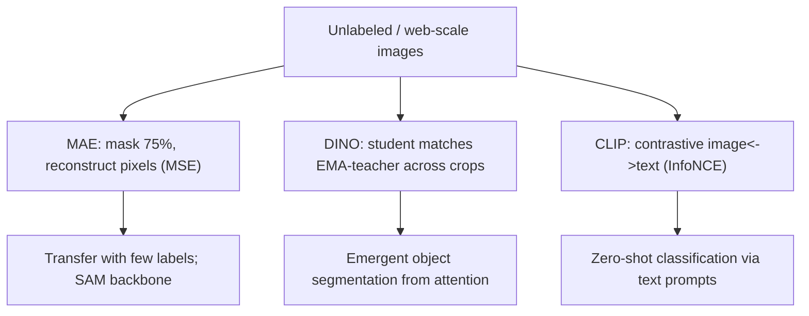

# Lecture 5 — Self-supervised and multimodal ViTs: MAE, DINO, CLIP, and SAM

Supervised classification is not where the ViT changed vision most. Its deepest impact is that
its architecture is the natural substrate for **learning from data without human labels** and for **joining
vision with language**. This lecture covers the frontier: what each pretraining objective actually optimizes,
and why the resulting representations behave the way they do.

## Why self-supervision, and why ViTs suit it

Labels are expensive; the internet's images are nearly free but unlabeled. **Self-supervised learning (SSL)**
builds a pretext task whose "labels" come from the data itself, learning a representation that transfers to
downstream tasks with little labeled data. ViTs suit SSL because attention over tokens makes masking and
cross-view matching natural, and because the same architecture scales smoothly with data (Lecture 3).

## MAE: masked patch reconstruction

He et al.'s **Masked Autoencoders** ("Masked Autoencoders Are Scalable Vision Learners," CVPR 2022) adapt
BERT's masked-language-modeling to pixels. Randomly mask a **large** fraction of patches — 75%, far higher
than BERT's 15%, because image patches are highly redundant — and train an asymmetric encoder-decoder to
**reconstruct the missing pixels**. Two design choices are load-bearing:

- The **encoder sees only the visible 25%** of patches, so pretraining is ~3x cheaper and fits large models.
- A **lightweight decoder** reconstructs the full image from encoded visible tokens plus mask tokens; it is
  discarded after pretraining.

The objective is simply mean-squared error on the masked patches' (normalized) pixels. Why does predicting
pixels teach semantics? Because reconstructing a masked object from context forces the encoder to model
object shape, part relations, and scene structure. MAE-pretrained ViTs fine-tune to state-of-the-art with
far fewer labels, and the high mask ratio is the key insight — low masking makes the task trivially solvable
by interpolation, learning little.

## DINO: self-distillation and emergent segmentation

Caron et al.'s **DINO** ("Emerging Properties in Self-Supervised Vision Transformers," ICCV 2021) takes a
different route: **self-distillation with no labels**. A student and a teacher network (the teacher is an
exponential moving average of the student — a momentum encoder) see different augmented **views/crops** of
the same image. The student is trained so its output distribution matches the teacher's on the shared image,
with a **centering + sharpening** trick on the teacher outputs to prevent collapse (the degenerate solution
where every image maps to the same vector). Formally, minimize the cross-entropy `H(P_teacher, P_student)`
over crops, stop-gradient through the teacher, and update the teacher as `theta_t <- m theta_t + (1-m)
theta_s`.

The striking empirical result: **the [CLS]-token attention maps of a DINO-trained ViT segment the salient
object with no segmentation labels at all**. Self-supervision on crops teaches the model *what belongs
together* so well that attention localizes objects for free — a property that does not emerge in supervised
ViTs or ConvNets. DINOv2 (Oquab et al., 2023) scaled this to a general-purpose visual feature usable
off-the-shelf for many dense tasks without fine-tuning.

## Register tokens: a bug found by looking at attention

A cautionary, recent result: Darcet et al. ("Vision Transformers Need Registers," ICLR 2024) noticed
high-norm **artifact tokens** in the attention maps of large ViTs — a few patch tokens hijacked to store
global information, corrupting interpretability and dense features. The fix is elegant: add a handful of
extra learnable **register tokens** to the sequence (like spare CLS tokens) that the model uses as scratch
space, cleaning up the patch attention. It is a reminder that reading attention maps (Lecture 4) is not just
interpretation — it surfaces real architectural defects.

## CLIP: contrastive vision-language pretraining

Radford et al.'s **CLIP** ("Learning Transferable Visual Models From Natural Language Supervision," ICML
2021) trains an image encoder (a ViT) and a text encoder jointly on ~400M image-text pairs scraped from the
web. The objective is **contrastive**: in a batch of `N` pairs, embed all images and all texts, and maximize
the cosine similarity of the `N` matching image-text pairs while minimizing the `N^2 - N` non-matching ones
(a symmetric InfoNCE / cross-entropy over the similarity matrix, scaled by a learned temperature). No
categorical labels — the *text* is the supervision. The payoff is **zero-shot classification**: to classify
an image among arbitrary classes, embed the prompts "a photo of a {class}" and pick the nearest text
embedding. CLIP transfers to hundreds of datasets it never trained on, because natural language is an
open-ended label space. It is the bridge from vision to the multimodal LLMs of the frontier.

## SAM: promptable segmentation at scale

Kirillov et al.'s **Segment Anything** (ICCV 2023) pairs a heavy MAE-pretrained ViT image encoder with a
lightweight promptable decoder, trained on 1.1B masks, to segment *any* object given a point, box, or text
prompt — zero-shot. It exemplifies the modern pattern: a large ViT backbone pretrained once (here MAE-style),
then a cheap task head, giving a foundation model for segmentation.

*Four pretraining objectives and the capabilities each yields.*

## Common pitfalls

- **Assuming reconstruction quality equals representation quality.** MAE's decoder makes blurry pixels; the
  *encoder* is what transfers. Judge SSL by downstream accuracy, not by how sharp the reconstruction looks.
- **Ignoring collapse.** DINO/contrastive methods have degenerate constant solutions; centering/sharpening,
  momentum teachers, and large negatives exist to prevent it — remove them and the model collapses.
- **Reading raw attention on large ViTs without registers.** Artifact tokens can dominate; use a
  register-equipped model or interpret with care.

**Takeaway:** the ViT's real revolution is label-free and multimodal learning. MAE reconstructs 75%-masked
patches (cheap encoder, semantics from context); DINO self-distills across crops and *emergently segments
objects*; CLIP contrastively aligns images with web text for zero-shot recognition; SAM stacks a promptable
head on an MAE-pretrained ViT for segment-anything. Each is defined by *what its objective optimizes* — mask
reconstruction, view agreement, or image-text contrast — and that objective, not the architecture alone,
determines the representation you get.
