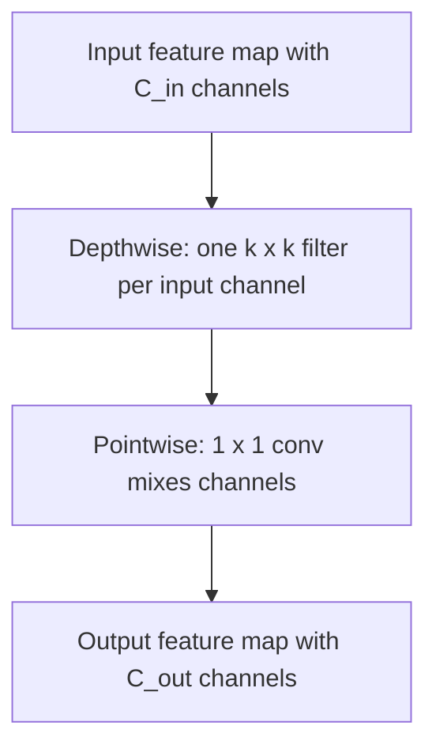

# Lecture 1 — Edge constraints, the roofline, & efficient architectures

Deployment on the edge — phones, cameras, drones, microcontrollers — operates under constraints a
training GPU never feels. The undergraduate summary is "edge chips are slow, so use small models." The
graduate statement is sharper: **edge inference is a constrained optimization whose feasible region is set
by a hardware roofline, and the right model is the most accurate one inside that region.** This lecture
makes both the constraints and the efficient-architecture toolkit quantitative.

## The four constraints, and why they are not interchangeable

- **Compute.** Peak throughput in FLOP/s. Edge chips deliver a tiny fraction of a datacenter GPU's. A
  network doing 4 GFLOP/image runs at 60 img/s on a 240 GFLOP/s mobile GPU only if it is compute-bound and
  perfectly utilized — rarely true.
- **Memory.** Two distinct budgets: **weight memory** (the parameters, ~size of the model file) and
  **activation memory** (intermediate feature maps, which for a high-resolution early layer can dwarf the
  weights). A microcontroller may have hundreds of KB of SRAM; a ResNet-50's first activation alone can
  exceed it. Peak activation memory, not parameter count, is often the binding constraint on tiny devices.
- **Power / heat.** Battery devices cannot sustain a hot model. Energy per inference (measured in mJ) is
  dominated by **DRAM traffic**, not arithmetic: moving a 32-bit word from off-chip DRAM costs orders of
  magnitude more energy than a MAC (Horowitz, 2014, ISSCC, "Computing's energy problem"). This is why
  reducing memory movement — quantization, fusion — saves battery even when FLOPs are unchanged.
- **Latency.** A 30 fps stream gives a 33 ms/frame budget. A 200 ms model cannot keep up regardless of
  average throughput; the *tail* latency must fit, not just the mean.

These push together toward small, memory-frugal models — but *which* pressure binds depends on the target,
and confusing them is the classic mistake.

## The roofline model: is your layer compute- or memory-bound?

For a given operation define **arithmetic intensity** `I = FLOPs / bytes moved` (FLOP per byte of memory
traffic). The hardware has two ceilings: peak compute `P` (FLOP/s) and peak memory bandwidth `B` (byte/s).
Achievable performance is

    attainable FLOP/s = min( P, B · I ).

Plotting this gives the **roofline** (Williams, Waterman & Patterson, 2009, CACM): a slanted
bandwidth-bound region for low `I` and a flat compute-bound plateau for high `I`, meeting at the **ridge
point** `I* = P/B`. The lesson for deployment: a `1x1` convolution or a depthwise conv has *low* arithmetic
intensity — few FLOPs per weight/activation byte — so it is often **memory-bound**, and cutting its FLOPs
buys nothing until you cut its memory traffic (e.g., via quantization). A dense `3x3` conv over many
channels has high intensity and lives on the compute plateau, where FLOP reduction pays off directly.
**Always ask which side of the ridge a layer sits on before optimizing it.**

## Depthwise-separable convolution: the arithmetic

A standard convolution mapping `C_in -> C_out` channels with a `k x k` kernel over an `H x W` output costs

    FLOPs_std = H · W · k² · C_in · C_out,     params_std = k² · C_in · C_out.

Depthwise-separable convolution (Sifre, 2014; popularized by Howard et al., 2017, "MobileNets") factorizes
this into (1) a **depthwise** step — one `k x k` filter per input channel, spatial filtering with no channel
mixing — and (2) a **pointwise** `1x1` conv that mixes channels:

    FLOPs_ds = H·W·k²·C_in  +  H·W·C_in·C_out,   params_ds = k²·C_in + C_in·C_out.

The ratio is `FLOPs_ds / FLOPs_std = 1/C_out + 1/k²`. For `k=3` and large `C_out`, that is ~`1/9` — an
**8-9x** reduction. The catch, from the roofline: the depthwise step has very low arithmetic intensity and
is memory-bound on most hardware, so the wall-clock speedup is smaller than the FLOP ratio suggests. FLOPs
are a proxy, not a promise.

*Depthwise-separable convolution splits spatial filtering from channel mixing, cutting cost by 1/C_out + 1/k².*

## The efficient-architecture families

- **MobileNetV1** (Howard et al., 2017) — depthwise-separable convs throughout, with a width multiplier.
- **MobileNetV2** (Sandler et al., 2018) — **inverted residuals** (expand channels with a 1x1, filter
  cheaply with a depthwise, project back down) and **linear bottlenecks** (no ReLU on the narrow layer, to
  avoid destroying information in low-dimensional space). The residual connects the *thin* ends.
- **MobileNetV3** (Howard et al., 2019) — adds squeeze-and-excite and hard-swish, and is partly the product
  of neural architecture search (Lecture 4).
- **EfficientNet** (Tan & Le, 2019, ICML) — **compound scaling**: scale depth `d = alpha^phi`, width
  `w = beta^phi`, and resolution `r = gamma^phi` together, under the constraint `alpha · beta² · gamma² ~ 2`
  so that each unit of `phi` roughly doubles FLOPs. Scaling all three in balance beats scaling any one, and
  gives the best accuracy per FLOP of its era.
- **ShuffleNet, GhostNet, SqueezeNet** — other efficiency-first designs; **MobileViT / EfficientViT** bring
  Week-10 Transformer benefits to edge budgets by hybridizing with convolutions.

## Design *for* the target, not against it

The crucial mindset shift: do not train a giant and hope to shrink it — **choose an architecture sized to the
target from the start**, then optimize. A MobileNet fine-tuned by transfer learning (Week 5) is usually the
right edge starting point, not a compressed ResNet, because the efficient design bakes in the memory and
compute frugality that post-hoc compression can only approximate.

**Takeaway:** edge inference is a roofline-constrained optimization. Read arithmetic intensity `I = FLOPs/bytes`
to know whether a layer is compute- or memory-bound before optimizing it, because energy and latency are often
dominated by memory traffic, not MACs. Depthwise-separable convolution cuts a 3x3 layer's cost to ~1/9 via the
ratio `1/C_out + 1/k²` (but its low intensity limits the real speedup); MobileNet's inverted residuals and
EfficientNet's `alpha·beta²·gamma² ~ 2` compound scaling maximize accuracy per FLOP. Size the architecture to
the target from the start.
