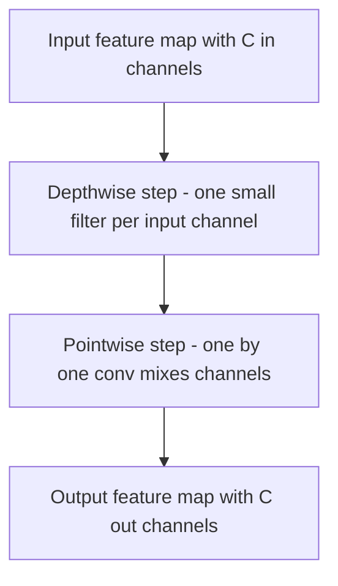

# Lecture 1 — Edge constraints & efficient architectures

Deployment on the edge — phones, cameras, drones, microcontrollers — operates under constraints that a training GPU never feels. Understanding those constraints, and the architectures designed for them, is where vision meets the real world.

## The four constraints

- **Compute.** Edge chips have a tiny fraction of a GPU's throughput. A model doing billions of operations per image may run at 30 fps on a GPU and 0.5 fps on a phone.
- **Memory.** A ResNet-50 is ~100 MB; a microcontroller may have *kilobytes* of RAM. Both model size (weights) and activation memory (intermediate tensors) matter.
- **Power / heat.** Battery devices can't run a hot model continuously. Efficiency is literally battery life.
- **Latency.** Real-time applications (a camera, AR) need results in milliseconds. A 200 ms model can't keep up with a 30 fps stream (33 ms/frame budget).

These push in one direction: **smaller, faster models**, ideally with minimal accuracy loss.

## Depthwise-separable convolutions: the key trick

Standard convolution is expensive: a `k×k` conv from `C_in` to `C_out` channels costs `k²·C_in·C_out` per output pixel. **Depthwise-separable convolution** factorizes it into two cheap steps:
1. **Depthwise:** one `k×k` filter *per input channel* (spatial filtering, no channel mixing) — cost `k²·C_in`.
2. **Pointwise:** a `1×1` conv mixing channels — cost `C_in·C_out`.

Total `k²·C_in + C_in·C_out` vs. `k²·C_in·C_out` — often an **8–9× reduction** for a 3×3 conv, with modest accuracy loss. This factorization is the engine of **MobileNet** and most efficient architectures.

*Depthwise-separable convolution splits spatial filtering from channel mixing, cutting standard convolution cost roughly 8 to 9 times.*

## The efficient architecture families

- **MobileNet** (v1–v3) — depthwise-separable convs, tuned for mobile; the workhorse of on-device vision.
- **EfficientNet** — *compound scaling*: scale depth, width, and resolution together in a principled ratio for the best accuracy per FLOP.
- **SqueezeNet, ShuffleNet, GhostNet** — other efficiency-focused designs.
- **MobileViT / efficient ViTs** — bringing Transformer benefits (Week 10) to edge budgets by hybridizing with convolutions.

## Design *for* the target

The crucial mindset shift: don't train a huge model and hope to shrink it later — **choose an architecture sized to the target from the start**, then optimize. A MobileNet fine-tuned with transfer learning (Week 5) is often the right starting point for edge, not a shrunk ResNet. Match the tool to the constraint.

**Takeaway:** edge hardware is constrained in compute, memory, power, and latency — all pushing toward small, fast models. Depthwise-separable convolutions (depthwise spatial + pointwise channel-mixing) cut convolution cost ~8–9×, powering MobileNet and friends; EfficientNet's compound scaling maximizes accuracy per FLOP. Choose an efficient architecture sized to the target from the start rather than shrinking a giant afterward.
